# ACAS System Call Graph

## Overview
This visualization shows the program call relationships across the ACAS system. Node sizes represent cyclomatic complexity, and colors indicate the module.

```mermaid
graph TB
    %% Define styles for different modules
    classDef sales fill:#ff9999,stroke:#333,stroke-width:2px
    classDef purchase fill:#99ccff,stroke:#333,stroke-width:2px
    classDef stock fill:#99ff99,stroke:#333,stroke-width:2px
    classDef general fill:#ffcc99,stroke:#333,stroke-width:2px
    classDef irs fill:#ff99ff,stroke:#333,stroke-width:2px
    classDef common fill:#cccccc,stroke:#333,stroke-width:2px
    
    %% Main entry points
    ACAS[ACAS<br/>Main Entry]:::common
    sales[sales<br/>Sales Module]:::sales
    purchase[purchase<br/>Purchase Module]:::purchase
    general[general<br/>GL Module]:::general
    
    %% Core system programs
    acas000[acas000<br/>System Init]:::common
    maps04[maps04<br/>Screen Handler]:::common
    maps09[maps09<br/>Screen Utils]:::common
    
    %% File handlers
    dfltMT[dfltMT<br/>Default Handler]:::common
    finalMT[finalMT<br/>Final Handler]:::common
    sys4MT[sys4MT<br/>System Handler]:::common
    systemMT[systemMT<br/>System Data]:::common
    fhlogger[fhlogger<br/>Logger]:::common
    
    %% Sales programs
    sl010[sl010<br/>Customer Maint<br/>Complexity: 288]:::sales
    sl020[sl020<br/>Sales Process<br/>Complexity: 133]:::sales
    sl910[sl910<br/>Reports<br/>Complexity: 555]:::sales
    sl920[sl920<br/>Analysis<br/>Complexity: 420]:::sales
    sl810[sl810<br/>Invoicing<br/>Complexity: 308]:::sales
    
    %% Purchase programs
    pl010[pl010<br/>Supplier Maint<br/>Complexity: 205]:::purchase
    pl020[pl020<br/>Purchase Process]:::purchase
    pl810[pl810<br/>Invoicing]:::purchase
    
    %% Stock programs
    st010[st010<br/>Stock Maint<br/>Complexity: 342]:::stock
    st020[st020<br/>Stock Process<br/>Complexity: 351]:::stock
    st030[st030<br/>Reports<br/>Complexity: 433]:::stock
    
    %% General Ledger programs
    gl010[gl010<br/>GL Maint]:::general
    gl030[gl030<br/>GL Reports<br/>Complexity: 377]:::general
    gl050[gl050<br/>GL Process<br/>Complexity: 252]:::general
    
    %% IRS programs
    irs030[irs030<br/>IRS Process<br/>Complexity: 225]:::irs
    irs050[irs050<br/>IRS Reports<br/>Complexity: 195]:::irs
    irs060[irs060<br/>IRS Analysis<br/>Complexity: 224]:::irs
    
    %% Main relationships
    ACAS --> acas000
    ACAS --> maps04
    
    %% System initialization
    acas000 --> dfltMT
    acas000 --> finalMT
    acas000 --> sys4MT
    acas000 --> systemMT
    acas000 --> fhlogger
    
    %% Module entry points
    sales --> sl010
    sales --> sl020
    sales --> sl910
    sales --> maps04
    
    purchase --> pl010
    purchase --> pl020
    purchase --> pl810
    purchase --> maps04
    
    general --> gl010
    general --> gl030
    general --> gl050
    general --> maps04
    
    %% Cross-module dependencies
    sl810 --> stockMT[stockMT<br/>Stock Data]:::common
    sl810 --> salesMT[salesMT<br/>Sales Data]:::common
    sl810 --> nominalMT[nominalMT<br/>GL Data]:::common
    
    pl810 --> stockMT
    pl810 --> nominalMT
    
    %% Common utilities used by many
    sl010 --> maps04
    sl010 --> maps09
    sl020 --> maps04
    sl020 --> maps09
    pl010 --> maps04
    pl010 --> maps09
    
    %% Data access patterns
    sl910 --> slledgerMT[slledgerMT<br/>SL Ledger]:::common
    sl910 --> slpostingMT[slpostingMT<br/>SL Posting]:::common
    sl920 --> slledgerMT
    sl920 --> slpostingMT
    
    gl030 --> nominalMT
    gl030 --> glpostingMT[glpostingMT<br/>GL Posting]:::common
    gl050 --> nominalMT
    gl050 --> glpostingMT
    
    st030 --> stockMT
    st030 --> valueMT[valueMT<br/>Stock Value]:::common
```

## Key Observations

1. **Highly Complex Programs** (Complexity > 300):
   - sl910 (Sales Reports): 555
   - st030 (Stock Reports): 433
   - sl920 (Sales Analysis): 420
   - gl030 (GL Reports): 377
   - st020 (Stock Process): 351
   - st010 (Stock Maintenance): 342

2. **Central Hub Programs**:
   - maps04: Screen handler used by all modules
   - fhlogger: Logging system used throughout
   - acas000: System initialization

3. **Data Access Layer**:
   - Programs ending in 'MT' serve as data access handlers
   - Clear separation between business logic and data access

4. **Module Boundaries**:
   - Sales (sl*), Purchase (pl*), Stock (st*), General (gl*), IRS modules
   - Common utilities provide shared functionality