# COPYBOOK Usage Map

## Overview
This visualization shows how COPYBOOK files are used across the ACAS system. COPYBOOKs provide shared data structures and are critical for understanding data dependencies.

```mermaid
graph LR
    %% Define styles
    classDef copybook fill:#ffcc99,stroke:#333,stroke-width:3px
    classDef program fill:#99ccff,stroke:#333,stroke-width:1px
    classDef highUsage fill:#ff9999,stroke:#333,stroke-width:3px
    
    %% File Description COPYBOOKs
    FDSL[FDSL<br/>Sales Ledger FD]:::copybook
    FDPL[FDPL<br/>Purchase Ledger FD]:::copybook
    FDSTOCK[FDSTOCK<br/>Stock File FD]:::copybook
    FDLEDGER[FDLEDGER<br/>GL Ledger FD]:::copybook
    FDPOST[FDPOST<br/>Posting File FD]:::copybook
    FDBATCH[FDBATCH<br/>Batch File FD]:::copybook
    FDSYS[FDSYS<br/>System File FD]:::copybook
    FDAUDIT[FDAUDIT<br/>Audit File FD]:::copybook
    
    %% Working Storage COPYBOOKs
    WSSTOCK[WSSTOCK<br/>Stock Record]:::highUsage
    WSSAL[WSSAL<br/>Sales Record]:::highUsage
    WSPURCH[WSPURCH<br/>Purchase Record]:::copybook
    WSNOM[WSNOM<br/>Nominal Record]:::highUsage
    WSPOST[WSPOST<br/>Posting Record]:::copybook
    WSBATCH[WSBATCH<br/>Batch Record]:::copybook
    
    %% Screen COPYBOOKs
    SCREENIO[SCREENIO<br/>Screen I/O]:::copybook
    SCREENDEFS[SCREENDEFS<br/>Screen Definitions]:::copybook
    
    %% Linkage COPYBOOKs
    LINKDATA[LINKDATA<br/>Program Linkage]:::copybook
    LINKPASS[LINKPASS<br/>Parameter Passing]:::copybook
    
    %% Sales programs using COPYBOOKs
    sl010[sl010<br/>Customer Maint]:::program
    sl020[sl020<br/>Sales Entry]:::program
    sl910[sl910<br/>Sales Reports]:::program
    sl810[sl810<br/>Sales Invoice]:::program
    
    %% Purchase programs
    pl010[pl010<br/>Supplier Maint]:::program
    pl020[pl020<br/>Purchase Entry]:::program
    pl810[pl810<br/>Purchase Invoice]:::program
    
    %% Stock programs
    st010[st010<br/>Stock Maint]:::program
    st020[st020<br/>Stock Entry]:::program
    st030[st030<br/>Stock Reports]:::program
    
    %% GL programs
    gl010[gl010<br/>GL Maint]:::program
    gl030[gl030<br/>GL Reports]:::program
    gl050[gl050<br/>GL Process]:::program
    
    %% Sales COPYBOOK usage
    sl010 --> FDSL
    sl010 --> WSSAL
    sl010 --> SCREENIO
    sl010 --> LINKDATA
    
    sl020 --> FDSL
    sl020 --> WSSAL
    sl020 --> FDPOST
    sl020 --> WSPOST
    
    sl910 --> FDSL
    sl910 --> FDPOST
    sl910 --> WSSAL
    sl910 --> WSPOST
    
    sl810 --> FDSL
    sl810 --> WSSAL
    sl810 --> WSSTOCK
    sl810 --> WSNOM
    sl810 --> FDSTOCK
    
    %% Purchase COPYBOOK usage
    pl010 --> FDPL
    pl010 --> WSPURCH
    pl010 --> SCREENIO
    pl010 --> LINKDATA
    
    pl020 --> FDPL
    pl020 --> WSPURCH
    pl020 --> FDPOST
    pl020 --> WSPOST
    
    pl810 --> FDPL
    pl810 --> WSPURCH
    pl810 --> WSSTOCK
    pl810 --> WSNOM
    pl810 --> FDSTOCK
    
    %% Stock COPYBOOK usage
    st010 --> FDSTOCK
    st010 --> WSSTOCK
    st010 --> SCREENIO
    st010 --> LINKDATA
    
    st020 --> FDSTOCK
    st020 --> WSSTOCK
    st020 --> FDPOST
    st020 --> WSPOST
    
    st030 --> FDSTOCK
    st030 --> WSSTOCK
    st030 --> FDAUDIT
    
    %% GL COPYBOOK usage
    gl010 --> FDLEDGER
    gl010 --> WSNOM
    gl010 --> SCREENIO
    
    gl030 --> FDLEDGER
    gl030 --> WSNOM
    gl030 --> FDPOST
    gl030 --> WSPOST
    
    gl050 --> FDLEDGER
    gl050 --> WSNOM
    gl050 --> FDBATCH
    gl050 --> WSBATCH
```

## COPYBOOK Categories

### 1. File Descriptions (FD*)
These COPYBOOKs define the physical file layouts:
- **FDSL**: Sales Ledger file structure
- **FDPL**: Purchase Ledger file structure
- **FDSTOCK**: Stock/Inventory file structure
- **FDLEDGER**: General Ledger file structure
- **FDPOST**: Posting transactions file structure
- **FDBATCH**: Batch processing file structure
- **FDSYS**: System control file structure
- **FDAUDIT**: Audit trail file structure

### 2. Working Storage (WS*)
These COPYBOOKs define in-memory data structures:
- **WSSTOCK**: Stock record working storage (high usage)
- **WSSAL**: Sales record working storage (high usage)
- **WSPURCH**: Purchase record working storage
- **WSNOM**: Nominal/GL record working storage (high usage)
- **WSPOST**: Posting record working storage
- **WSBATCH**: Batch record working storage

### 3. Screen I/O
- **SCREENIO**: Standard screen I/O routines
- **SCREENDEFS**: Screen layout definitions

### 4. Program Linkage
- **LINKDATA**: Standard linkage section data
- **LINKPASS**: Parameter passing structures

## Impact Analysis

### High-Impact COPYBOOKs
Changes to these COPYBOOKs would affect many programs:

1. **WSSTOCK** - Used by sales, purchase, and stock modules
2. **WSNOM** - Used by all modules for GL integration
3. **WSSAL** - Core to all sales processing
4. **SCREENIO** - Used by all interactive programs

### Migration Considerations

1. **Data Structure Consolidation**
   - FD* and WS* pairs could be consolidated
   - Consider object-oriented approach for related data

2. **Version Control**
   - High-impact COPYBOOKs need careful version management
   - Changes require regression testing across modules

3. **Modernization Opportunities**
   - Screen I/O COPYBOOKs → Modern UI framework
   - File descriptions → Database schemas
   - Working storage → Object/class definitions