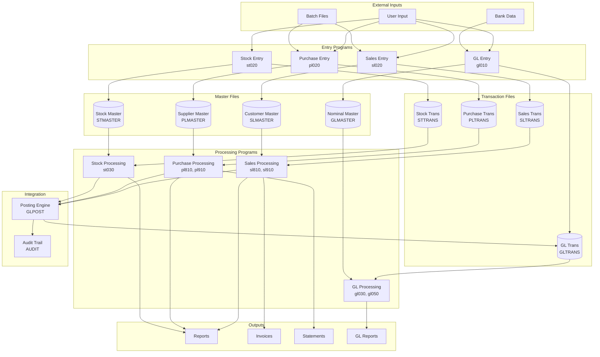
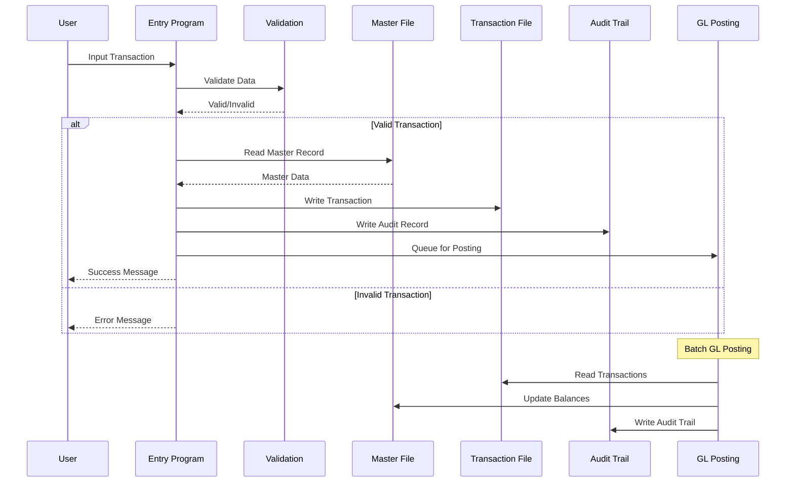
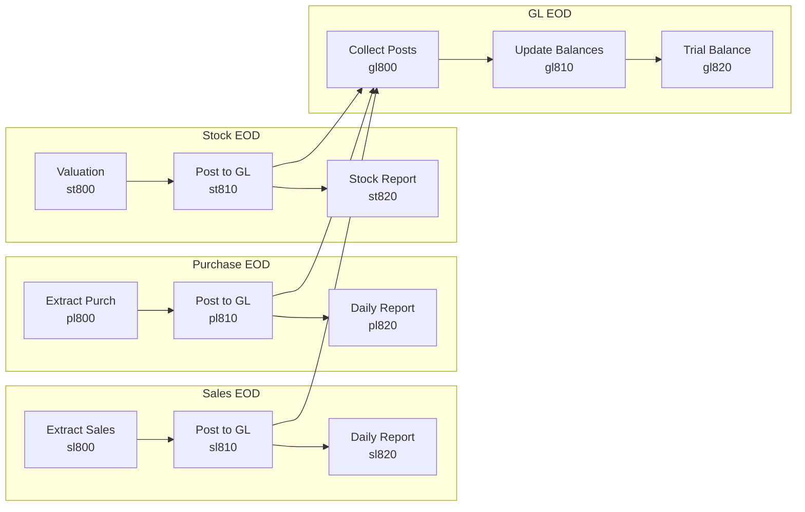
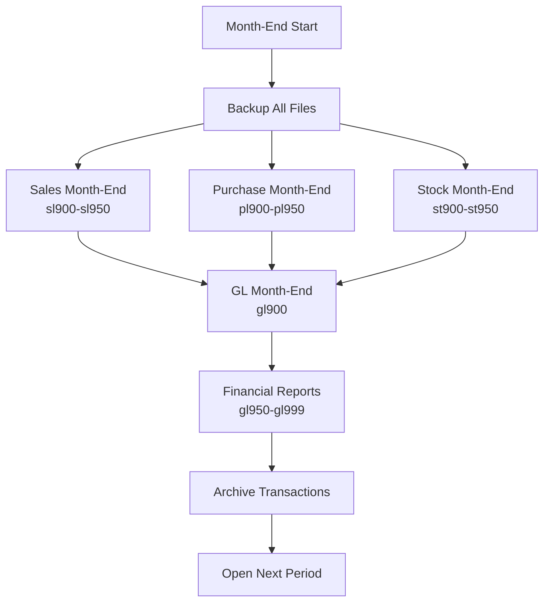

# Data Flow Visualization

## Overview
This visualization shows how data flows through the ACAS system, including file access patterns, data transformations, and transaction boundaries.

## System-Wide Data Flow

## File Access Patterns (CRUD Matrix)

| Program | Customer | Supplier | Stock | Nominal | Trans | Audit |
|---------|----------|----------|-------|---------|-------|-------|
| sl010   | CRUD     | -        | R     | R       | -     | W     |
| sl020   | RU       | -        | RU    | R       | CRU   | W     |
| sl810   | R        | -        | R     | RU      | RUD   | W     |
| sl910   | R        | -        | -     | R       | R     | -     |
| pl010   | -        | CRUD     | R     | R       | -     | W     |
| pl020   | -        | RU       | RU    | R       | CRU   | W     |
| pl810   | -        | R        | R     | RU      | RUD   | W     |
| st010   | -        | -        | CRUD  | R       | -     | W     |
| st020   | -        | -        | RU    | R       | CRU   | W     |
| st030   | -        | -        | R     | R       | R     | -     |
| gl010   | -        | -        | -     | CRUD    | -     | W     |
| gl030   | R        | R        | R     | R       | R     | -     |
| gl050   | -        | -        | -     | RU      | CRU   | W     |

*C=Create, R=Read, U=Update, D=Delete, W=Write-only*

## Transaction Boundaries

## Batch Processing Sequences

### 1. End-of-Day Processing

### 2. Month-End Processing

## Data Transformation Points

### Key Transformation Programs

1. **sl810** - Sales to GL Transformation
   - Sales transactions → GL journal entries
   - Customer balances → Debtors control account
   - Tax calculations → Tax liability accounts

2. **pl810** - Purchase to GL Transformation
   - Purchase transactions → GL journal entries
   - Supplier balances → Creditors control account
   - Input tax → Tax reclaim accounts

3. **st030** - Stock Valuation
   - Physical quantities → Financial values
   - FIFO/LIFO/Average cost calculations
   - Stock movements → GL stock accounts

4. **gl050** - GL Posting Engine
   - Individual journals → Account balances
   - Foreign currency → Base currency
   - Department/cost center allocation

## Critical Data Dependencies

### High-Risk Dependencies
1. **Customer/Supplier Codes** - Used across all modules
2. **GL Account Codes** - Central to all posting
3. **Stock Codes** - Links sales/purchase/inventory
4. **Period/Year Controls** - Affects all processing

### Data Integrity Controls
- Transaction numbering sequences
- Batch control totals
- Cross-module reconciliation
- Audit trail maintenance