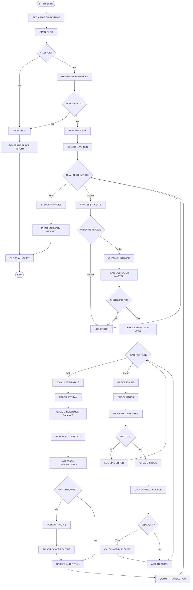
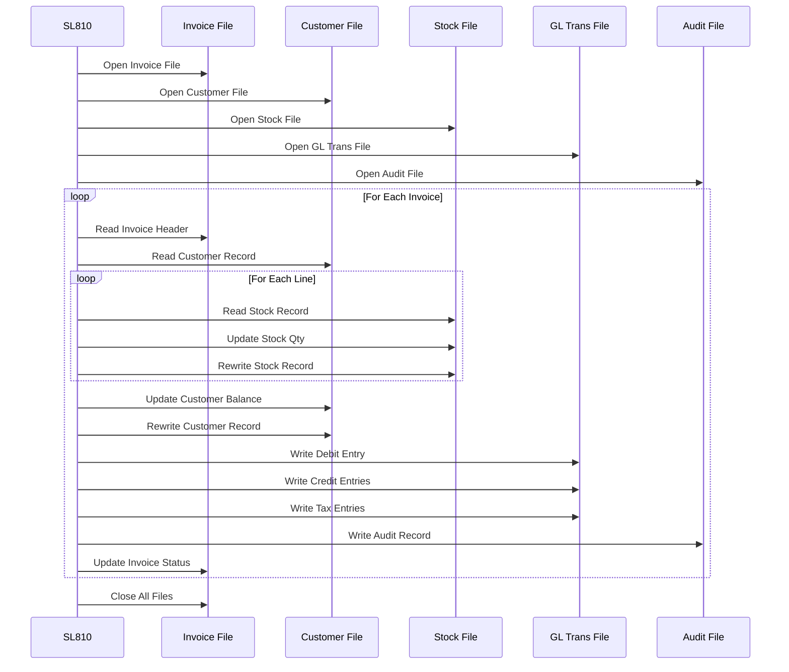
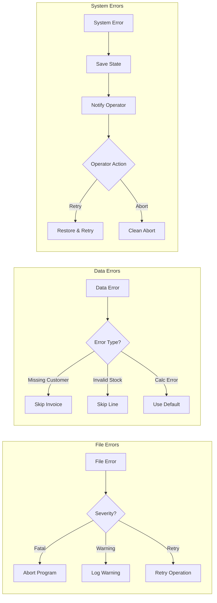

# SL810 - Sales Invoice Processing Flow

## Program Overview
SL810 is a critical sales invoice processing program with complexity score of 308. It handles invoice generation, stock updates, and GL posting preparation.

## Detailed Program Flow



## Data Access Sequence



## Error Handling Paths



## Business Logic Highlights

### Tax Calculation Logic
```
IF customer-tax-code = 'E' (Exempt)
    tax-amount = 0
ELSE IF customer-tax-code = 'Z' (Zero-rated)
    tax-amount = 0
    Generate tax-audit-record
ELSE
    tax-amount = goods-total * current-tax-rate
    IF customer-location = 'EXPORT'
        tax-amount = 0
        Generate export-documentation
    END-IF
END-IF
```

### Discount Application Rules
```
1. Customer discount rate (from master file)
2. Special promotion discount (if applicable)
3. Volume discount (based on quantity breaks)
4. Payment terms discount (for early payment)
5. Maximum combined discount = 25%
```

### GL Posting Logic
```
For each invoice:
- DR: Customer Control Account
- CR: Sales Account (by product category)
- CR: Tax Liability Account
- CR: Discount Account (if applicable)
- All entries include: Department code, Cost center, Transaction reference
```

## Performance Considerations

1. **File Access Optimization**
   - Customer records cached after first read
   - Stock records read with key access
   - GL transactions buffered before write

2. **Calculation Efficiency**
   - Running totals maintained
   - Tax rates cached at start
   - Discount calculations optimized

3. **Error Recovery**
   - Checkpoint after every 100 invoices
   - Restart capability from checkpoint
   - Partial run recovery supported