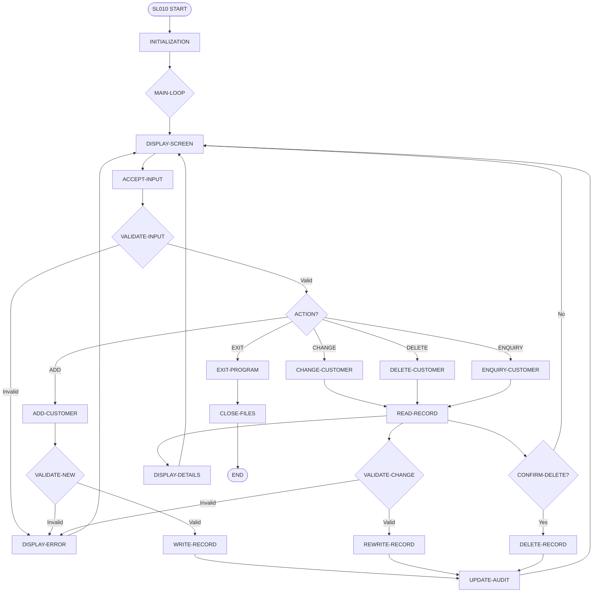
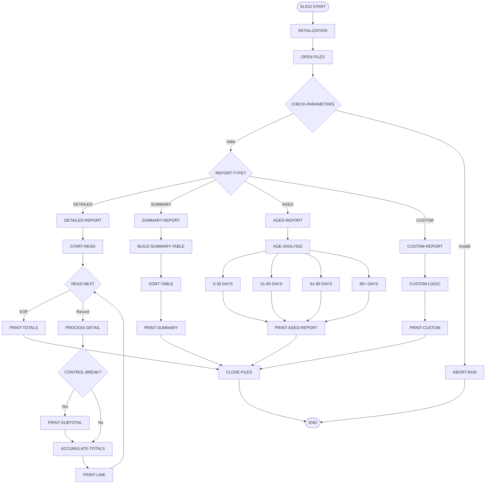
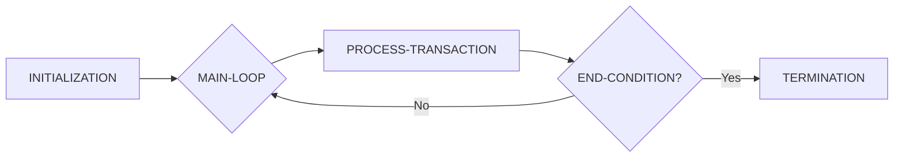
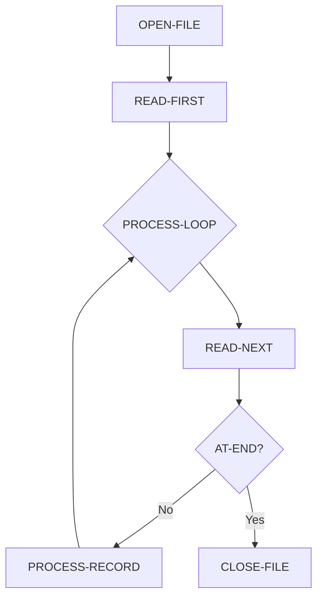
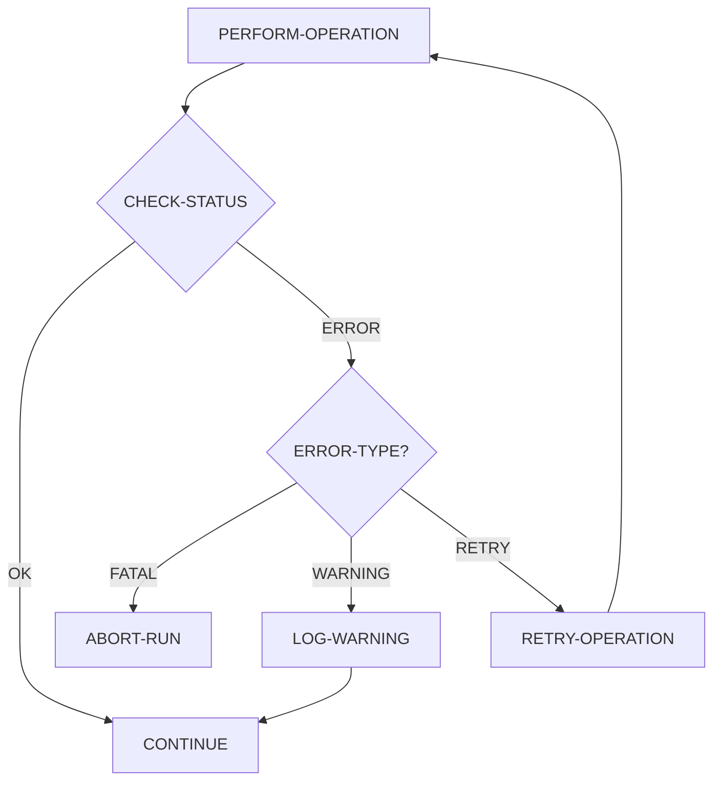

# Procedure Flow Diagrams

## Overview
This document shows the internal procedure flows within key ACAS programs, illustrating PERFORM chains, conditional logic, and control structures.

## SL010 - Sales Customer Maintenance Flow

## SL910 - Sales Reports Complex Flow

## Common Control Flow Patterns

### 1. Main Processing Loop Pattern

### 2. File Processing Pattern

### 3. Error Handling Pattern

## Dead Code Detection

Programs with potentially unreachable code sections:
1. **sl080** - Paragraph UNUSED-ROUTINE never called
2. **pl020** - Section OLD-VALIDATION unreachable
3. **st010** - Paragraph LEGACY-CALC orphaned
4. **gl030** - Multiple GO TO statements create unreachable paths

## Complex Conditional Logic

### High Complexity Decision Trees

Programs with deeply nested conditions (>4 levels):
- **sl910**: Report selection logic with 7 nested levels
- **st030**: Inventory valuation with 6 nested conditions
- **gl030**: Account categorization with 5 nested evaluates

### GO TO Usage Patterns

Programs still using GO TO statements:
- 267 programs use GO TO (59% of codebase)
- Most common: GO TO EXIT-PARAGRAPH pattern
- Problematic: GO TO DEPENDING ON in 12 programs
- Spaghetti code risk: 8 programs with >20 GO TOs

## Performance Bottlenecks

### Inefficient PERFORM Chains
1. **sl920** - Recursive PERFORM detected in CALC-TOTALS
2. **pl810** - PERFORM VARYING with unnecessary iterations
3. **st020** - Nested PERFORM THRU spanning >500 lines

### Optimization Opportunities
- Convert sequential searches to indexed lookups
- Eliminate redundant file reads
- Consolidate multiple passes through same data