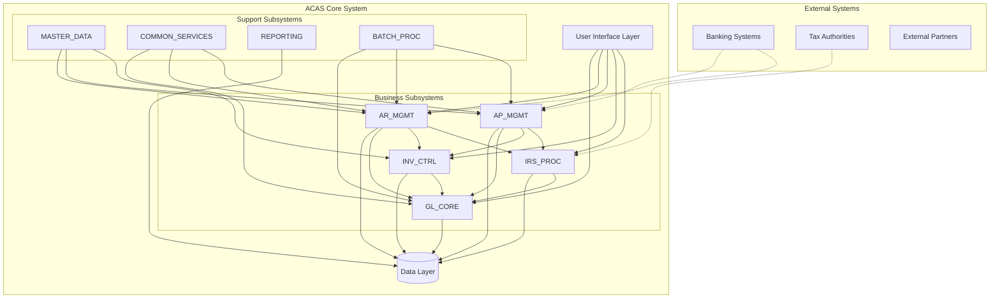
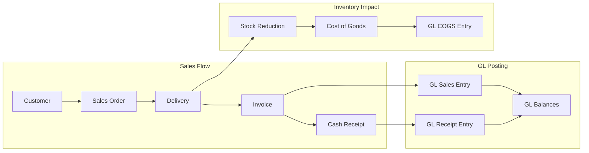

# ACAS Master Subsystem Architecture
## System Decomposition and Modernization Strategy

Generated: ${new Date().toISOString()}

## Executive Summary

This document presents the comprehensive subsystem architecture for the ACAS system, identifying nine primary subsystems based on functional cohesion, data ownership, and business domain alignment. The decomposition supports both understanding the current monolithic structure and planning for modernization into a microservices architecture.

### Identified Subsystems

1. **GL_CORE** - General Ledger Core Services
2. **AR_MGMT** - Accounts Receivable Management
3. **AP_MGMT** - Accounts Payable Management
4. **INV_CTRL** - Inventory Control Services
5. **IRS_PROC** - Tax Processing Engine
6. **MASTER_DATA** - Master Data Management
7. **COMMON_SERVICES** - Shared Business Services
8. **REPORTING** - Reporting and Analytics
9. **BATCH_PROC** - Batch Processing Framework

---

## System Context and Boundaries

### Overall System Architecture

---

## Subsystem Identification Methodology

### Criteria Applied

1. **Functional Cohesion**
   - Programs that work together to deliver specific business capability
   - Shared business rules and logic
   - Common processing patterns

2. **Data Ownership**
   - Clear ownership of master data entities
   - Transactional data boundaries
   - Minimal cross-subsystem data dependencies

3. **Business Domain Alignment**
   - Maps to recognized business functions
   - Aligns with organizational structure
   - Supports business process boundaries

4. **Coupling Analysis**
   - Minimize inter-subsystem dependencies
   - Clear interface definitions
   - Asynchronous communication where possible

5. **Evolution Potential**
   - Can be modernized independently
   - Clear migration path
   - Technology flexibility

---

## Subsystem Definitions

### 1. GL_CORE - General Ledger Core Services

**Purpose**: Financial accounting backbone providing chart of accounts management, journal processing, and financial reporting

**Key Responsibilities**:
- Chart of accounts maintenance
- Journal entry processing and validation
- Period management and closing
- Financial statement generation
- Multi-currency support
- Budget management

**Program Components**: 38 programs
- Core: general.cbl, GL000-GL120
- Data: glpostingLD/MT/RES/UNL, glbatchLD/MT/RES/UNL
- Utilities: nominalLD/MT, dfltLD/MT, finalLD/MT

**Data Ownership**:
- GL Master (Chart of Accounts)
- GL Transactions
- GL Balances
- Budget Data
- Period Control

---

### 2. AR_MGMT - Accounts Receivable Management

**Purpose**: Complete revenue cycle management from order to cash

**Key Responsibilities**:
- Customer master management
- Sales order processing
- Invoice generation
- Credit management
- Cash application
- Collections management
- Customer statements

**Program Components**: 79 programs
- Core: sales.cbl, SL000-SL200
- Batch: SL800-SL970
- Data: salesLD/MT/RES/UNL, slinvoiceLD/MT, slautogenLD/MT
- Support: deliveryLD/MT, slpostingLD/MT

**Data Ownership**:
- Customer Master
- Sales Orders
- Sales Invoices
- Cash Receipts
- Customer Balances

---

### 3. AP_MGMT - Accounts Payable Management

**Purpose**: Complete procurement cycle from purchase to payment

**Key Responsibilities**:
- Vendor master management
- Purchase order processing
- Invoice processing
- Three-way matching
- Payment processing
- Vendor statements
- 1099 processing

**Program Components**: 63 programs
- Core: purchase.cbl, PL000-PL190
- Batch: PL800-PL960
- Data: purchLD/MT/RES/UNL, plinvoiceLD/MT, plautogenLD/MT
- Support: paymentsLD/MT

**Data Ownership**:
- Vendor Master
- Purchase Orders
- Purchase Invoices
- Payments
- Vendor Balances

---

### 4. INV_CTRL - Inventory Control Services

**Purpose**: Complete inventory management and valuation

**Key Responsibilities**:
- Item master management
- Stock level tracking
- Inventory movements
- Physical counts
- Valuation
- Reorder management

**Program Components**: 26 programs
- Core: stock.cbl, ST000-ST060
- Data: stockLD/MT/RES/UNL, valueLD/MT
- Utilities: stockconvert2, stockconvert3

**Data Ownership**:
- Item Master
- Stock Levels
- Stock Movements
- Valuation Data
- Location Data

---

### 5. IRS_PROC - Tax Processing Engine

**Purpose**: Tax calculation, tracking, and compliance reporting

**Key Responsibilities**:
- Tax rate management
- Tax calculation
- Tax reporting
- Period processing
- Compliance filing
- Audit support

**Program Components**: 39 programs
- Core: irs.cbl, IRS000-IRS090
- Support: irsubp, acasirsub1-5
- Data: irsdfltLD/MT, irsfinalLD/MT, irspostingLD/MT, irsnominalLD/MT

**Data Ownership**:
- Tax Rates
- Tax Transactions
- Tax Balances
- Compliance Data

---

### 6. MASTER_DATA - Master Data Management

**Purpose**: Centralized management of shared reference data

**Key Responsibilities**:
- Code table management
- Cross-reference maintenance
- Data validation rules
- Default values
- System parameters

**Program Components**:
- Parameter management: acas-get-params, systemLD/MT
- Tables: sys4LD/MT
- Validation: Various validation routines

**Data Ownership**:
- System Parameters
- Code Tables
- Validation Rules
- Cross-References

---

### 7. COMMON_SERVICES - Shared Business Services

**Purpose**: Reusable business logic and technical services

**Key Components**:
- Security Services: security.cob, user authentication
- Audit Services: auditLD/MT, audit trail
- Utility Services: maps01/04/09, xl150/160
- File Services: fhlogger, file handling
- System Services: acas000, sys002

**No Direct Data Ownership** - Provides services to other subsystems

---

### 8. REPORTING - Reporting and Analytics

**Purpose**: All read-only reporting and analytics functions

**Key Components**:
- Financial Reports: Trial balance, statements
- Operational Reports: Aging, registers
- Management Reports: Analysis, KPIs
- Ad-hoc Reports: Custom queries

**Read-Only Access** to all subsystem data

---

### 9. BATCH_PROC - Batch Processing Framework

**Purpose**: Batch job scheduling and processing

**Key Components**:
- Job Scheduling: masterLD/RES/UNL.sh
- End-of-Day: SL800, PL800
- Period Processing: Month-end, year-end
- Interface Processing: Import/export
- Backup/Recovery: acasbkup scripts

---

## Subsystem Interaction Matrix

| From/To | GL | AR | AP | INV | IRS | MD | CS | RPT | BAT |
|---------|----|----|----|----|-----|----|----|-----|-----|
| GL_CORE | - | R | R | R | R | R | Y | N | Y |
| AR_MGMT | W | - | N | R/W | W | R | Y | N | Y |
| AP_MGMT | W | N | - | R/W | W | R | Y | N | Y |
| INV_CTRL | W | R | R | - | N | R | Y | N | Y |
| IRS_PROC | R | R | R | N | - | R | Y | N | Y |
| MASTER | N | N | N | N | N | - | Y | N | Y |
| COMMON | N | N | N | N | N | N | - | N | N |
| REPORTING | R | R | R | R | R | R | Y | - | Y |
| BATCH | Y | Y | Y | Y | Y | Y | Y | Y | - |

**Legend**: R=Read, W=Write, Y=Yes, N=No

---

## Data Flow Architecture

### Transaction Flow Patterns

### Integration Points

1. **Synchronous Integration**
   - Master data lookups
   - Validation services
   - Real-time posting

2. **Asynchronous Integration**
   - Batch GL posting
   - Report generation
   - Period processing

3. **Event-Driven Integration**
   - Inventory updates
   - Credit limit checks
   - Tax calculations

---

## Modernization Impact Analysis

### Subsystem Migration Difficulty

| Subsystem | Complexity | Dependencies | Risk | Priority | Effort |
|-----------|------------|--------------|------|----------|--------|
| REPORTING | Low | Read-only | Low | High | 3 months |
| MASTER_DATA | Low | Foundational | Medium | High | 4 months |
| IRS_PROC | Medium | Isolated | Low | Medium | 6 months |
| INV_CTRL | High | Integrated | High | Medium | 9 months |
| AR_MGMT | Very High | Complex | High | Low | 12 months |
| AP_MGMT | High | Complex | High | Low | 10 months |
| GL_CORE | Very High | Central | Very High | Very Low | 15 months |
| COMMON_SERVICES | Low | Distributed | Low | High | Ongoing |
| BATCH_PROC | Medium | Framework | Medium | Medium | 6 months |

### Recommended Migration Sequence

1. **Phase 1 - Foundation** (Months 1-6)
   - REPORTING (decouple read operations)
   - MASTER_DATA (centralize reference data)
   - COMMON_SERVICES (modernize utilities)

2. **Phase 2 - Isolation** (Months 7-12)
   - IRS_PROC (self-contained logic)
   - BATCH_PROC (framework modernization)

3. **Phase 3 - Integration** (Months 13-24)
   - INV_CTRL (with careful AR/AP coordination)
   - Begin AR_MGMT analysis

4. **Phase 4 - Core Business** (Months 25-36)
   - AR_MGMT (revenue cycle)
   - AP_MGMT (procurement cycle)

5. **Phase 5 - Financial Core** (Months 37-48)
   - GL_CORE (with full system coordination)

---

## Technology Mapping

### Current to Future State

| Subsystem | Current Technology | Target Technology | Rationale |
|-----------|-------------------|-------------------|-----------|
| GL_CORE | COBOL + ISAM | Java + PostgreSQL | Enterprise standards |
| AR_MGMT | COBOL + ISAM | Java + PostgreSQL | Complex business logic |
| AP_MGMT | COBOL + ISAM | Java + PostgreSQL | Integration needs |
| INV_CTRL | COBOL + ISAM | Go + PostgreSQL | Performance critical |
| IRS_PROC | COBOL + ISAM | Python + PostgreSQL | Calculation engine |
| MASTER_DATA | COBOL + ISAM | Node.js + MongoDB | Flexible schema |
| COMMON_SERVICES | COBOL | Mixed microservices | Best tool for job |
| REPORTING | COBOL + Sequential | Python + Analytics DB | Modern BI tools |
| BATCH_PROC | Shell + COBOL | Airflow + Kubernetes | Cloud native |

---

## Risk Mitigation Strategies

### Technical Risks

1. **Data Consistency**
   - Implement distributed transaction patterns
   - Use event sourcing for audit
   - Maintain data reconciliation

2. **Integration Complexity**
   - Define clear APIs early
   - Use integration patterns (Saga, CQRS)
   - Implement circuit breakers

3. **Performance Degradation**
   - Baseline current performance
   - Load test each subsystem
   - Optimize critical paths

### Business Risks

1. **Functional Gaps**
   - Comprehensive requirements analysis
   - User acceptance testing
   - Parallel run periods

2. **Process Disruption**
   - Change management program
   - Phased rollouts
   - Rollback procedures

---

## Governance Model

### Subsystem Ownership

| Subsystem | Business Owner | Technical Owner | Key Stakeholders |
|-----------|---------------|-----------------|------------------|
| GL_CORE | CFO | Architecture Team | Finance, Audit |
| AR_MGMT | Sales Director | AR Team | Sales, Credit |
| AP_MGMT | Procurement Dir | AP Team | Purchasing, Treasury |
| INV_CTRL | Operations Dir | Inventory Team | Warehouse, Planning |
| IRS_PROC | Tax Director | Compliance Team | Finance, Legal |
| MASTER_DATA | Data Governance | Platform Team | All departments |
| COMMON_SERVICES | CTO | Platform Team | All technical teams |
| REPORTING | Analytics Dir | BI Team | All departments |
| BATCH_PROC | Operations | Infrastructure | All subsystems |

### Decision Rights

1. **Subsystem Changes**: Subsystem owner with architecture review
2. **Interface Changes**: Joint approval from affected subsystems
3. **Data Model Changes**: Data governance board approval
4. **Technology Changes**: Architecture review board

---

## Success Metrics

### Technical Metrics
- Subsystem autonomy index (>80%)
- API response time (<200ms)
- Deployment frequency (daily)
- Mean time to recovery (<1 hour)
- Test coverage (>80%)

### Business Metrics
- Process cycle time (-30%)
- Error rates (-50%)
- User satisfaction (+40%)
- System availability (99.9%)
- Time to implement changes (-60%)

---

## Conclusion

The subsystem architecture provides a clear roadmap for modernizing the ACAS system while maintaining business continuity. The identified subsystems balance functional cohesion with practical migration considerations, enabling incremental transformation from monolithic COBOL to modern microservices.

Success depends on maintaining strict subsystem boundaries, managing dependencies carefully, and following the recommended migration sequence. With proper execution, the organization can achieve a flexible, scalable, and maintainable system architecture.