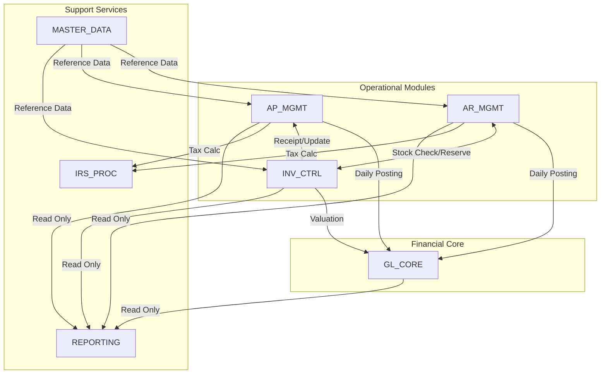
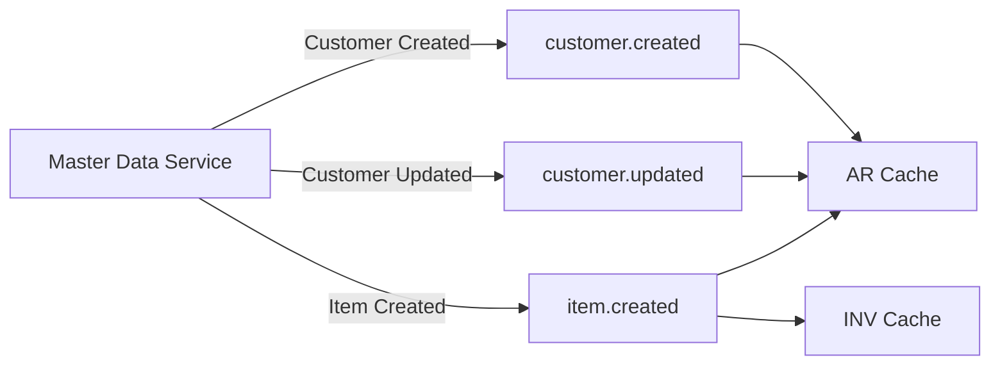
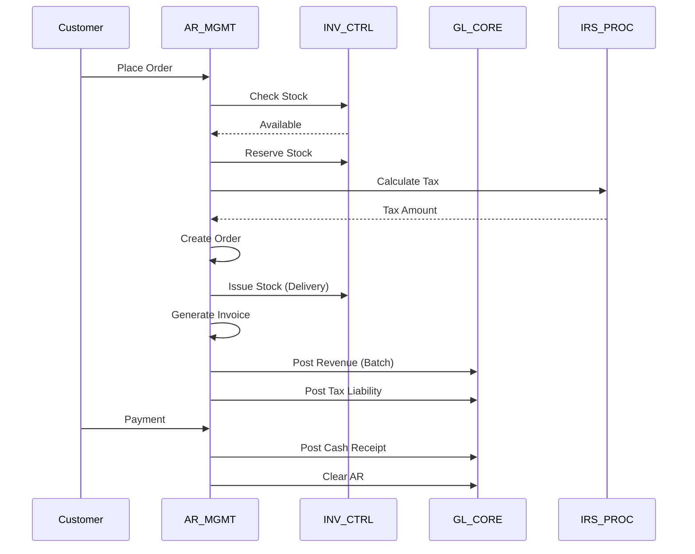
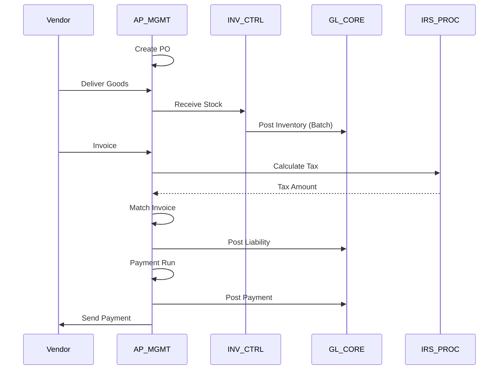

# ACAS Integration Architecture
## Subsystem Interfaces and Communication Patterns

Generated: ${new Date().toISOString()}

## Overview

This document details the integration architecture between ACAS subsystems, defining current interfaces, data flows, and proposing future integration patterns for modernization.

---

## Current Integration Landscape

### Integration Patterns Used

1. **Direct File Access** (70%)
   - Subsystems directly read/write shared files
   - No abstraction layer
   - Tight coupling through file structures

2. **Program Calls** (20%)
   - Direct COBOL CALL statements
   - Synchronous execution
   - Parameter passing through LINKAGE

3. **Batch Interfaces** (8%)
   - Sequential file exchanges
   - Scheduled processing
   - Delayed synchronization

4. **Shared Copybooks** (2%)
   - Common data definitions
   - Compile-time binding
   - Version lock-in

---

## Integration Points Matrix

### Major Integration Flows



---

## Detailed Interface Specifications

### 1. AR_MGMT → GL_CORE Interface

#### Current Implementation
- **Type**: Batch file interface
- **Frequency**: Daily (EOD)
- **Program**: SL910 (Sales GL Interface)
- **Data Volume**: 100-5,000 transactions/day

#### Data Flow
```
Sales Transactions → SL910 → GL Batch File → GL051 → GL Master
```

#### Interface Records
```cobol
01 GL-INTERFACE-RECORD.
   05 GL-TRANS-DATE      PIC 9(8).
   05 GL-TRANS-TYPE      PIC X(2).    *> SI=Sales Invoice, CR=Credit, CP=Cash
   05 GL-ACCOUNT-NUMBER  PIC X(15).
   05 GL-DEBIT-AMOUNT    PIC 9(13)V99.
   05 GL-CREDIT-AMOUNT   PIC 9(13)V99.
   05 GL-REFERENCE       PIC X(20).
   05 GL-DESCRIPTION     PIC X(50).
   05 GL-SOURCE-MODULE   PIC X(2).    *> "SL"
   05 GL-SOURCE-TRANS    PIC X(20).
```

#### Future State Design
```yaml
API: POST /gl/journal-entries
Content-Type: application/json
Authorization: Bearer {token}

{
  "batchId": "SL-20240315-001",
  "source": "AR_MGMT",
  "entries": [
    {
      "date": "2024-03-15",
      "accountNumber": "11000",
      "debit": 1000.00,
      "credit": 0,
      "reference": "INV-12345",
      "description": "Customer invoice"
    }
  ]
}
```

---

### 2. AP_MGMT → GL_CORE Interface

#### Current Implementation
- **Type**: Batch file interface
- **Frequency**: Daily (EOD)
- **Program**: PL910 (Purchase GL Interface)
- **Data Volume**: 50-2,000 transactions/day

#### Integration Logic
1. Extract AP transactions for the day
2. Summarize by GL account
3. Create balancing entries
4. Write to interface file
5. Trigger GL posting batch

#### Future State Design
- Event-driven posting via message queue
- Real-time validation
- Asynchronous acknowledgment
- Audit trail via event store

---

### 3. AR_MGMT ↔ INV_CTRL Interface

#### Current Implementation
- **Type**: Direct file access + Program calls
- **Frequency**: Real-time
- **Programs**: Multiple touchpoints

#### Integration Points

##### Stock Availability Check
```cobol
*> In Order Entry (SL020)
CALL "ST060" USING ITEM-NUMBER
                   REQUESTED-QTY
                   AVAILABLE-QTY
                   RETURN-CODE.
```

##### Stock Reservation
```cobol
*> In Order Confirmation
CALL "stockMT" USING "RESERVE"
                     ITEM-NUMBER
                     ORDER-NUMBER
                     RESERVE-QTY
                     RETURN-CODE.
```

##### Stock Issue on Delivery
```cobol
*> In Delivery Processing (SL120)
CALL "ST030" USING ITEM-NUMBER
                   LOCATION-CODE
                   ISSUE-QTY
                   UNIT-COST
                   RETURN-CODE.
```

#### Future State Design
```typescript
// Stock Service API
interface StockService {
  checkAvailability(itemId: string, quantity: number): Promise<AvailabilityResponse>
  reserveStock(orderId: string, items: OrderItem[]): Promise<ReservationResponse>
  issueStock(deliveryId: string, items: DeliveryItem[]): Promise<IssueResponse>
  releaseReservation(orderId: string): Promise<void>
}

// Event-Driven Updates
events: [
  "stock.reserved",
  "stock.issued",
  "stock.released",
  "stock.adjusted"
]
```

---

### 4. Tax Calculation Interfaces

#### Current Implementation
- **Type**: Subroutine calls
- **Frequency**: Per transaction
- **Programs**: acasirsub1 (calculation engine)

#### Integration Pattern
```cobol
*> Called from AR and AP modules
CALL "acasirsub1" USING TAX-CODE
                        BASE-AMOUNT
                        TAX-AMOUNT
                        EFFECTIVE-DATE
                        RETURN-CODE.
```

#### Tax Calculation Flow
1. Transaction identifies tax code
2. Call tax engine with base amount
3. Engine retrieves rates from IRS tables
4. Calculate tax based on rules
5. Return tax amount and breakdown

#### Future State: Tax Microservice
```yaml
API: POST /tax/calculate
{
  "taxCode": "ST-CA",
  "baseAmount": 1000.00,
  "transactionDate": "2024-03-15",
  "entityType": "CUSTOMER",
  "entityId": "CUST-123"
}

Response:
{
  "taxAmount": 87.50,
  "effectiveRate": 8.75,
  "breakdown": [
    {"component": "STATE", "rate": 7.25, "amount": 72.50},
    {"component": "COUNTY", "rate": 1.50, "amount": 15.00}
  ]
}
```

---

## Data Synchronization Patterns

### 1. Master Data Distribution

#### Current State
```
MASTER_DATA files → Direct read by all modules
                  → File locking issues
                  → Consistency challenges
```

#### Future State: Event-Driven MDM


### 2. Transaction Propagation

#### Current Batch Pattern
```
Module → Transaction File → Nightly Batch → Target Module → Acknowledgment
   |                                                              |
   └─────────── 24 hour cycle time ─────────────────────────────┘
```

#### Future Event Streaming
```
Module → Event → Message Bus → Subscribers → Real-time processing
   |                                              |
   └────────── < 1 second latency ───────────────┘
```

---

## Critical Integration Scenarios

### 1. Order-to-Cash Integration Flow



### 2. Purchase-to-Pay Integration Flow



---

## Integration Modernization Strategy

### Phase 1: API Gateway Introduction
```
Current:  Module A → Direct File Access → Module B
Interim:  Module A → API Gateway → File Adapter → Module B
Target:   Module A → API Gateway → Module B API
```

### Phase 2: Event Bus Implementation
```yaml
Event Categories:
  - Master Data Events (customer.*, vendor.*, item.*)
  - Transaction Events (order.*, invoice.*, payment.*)
  - System Events (period.closed, batch.completed)
  
Technology Stack:
  - Apache Kafka for event streaming
  - Schema Registry for event contracts
  - Debezium for CDC from legacy files
```

### Phase 3: Microservices Transition

#### Service Boundaries
| Service | Responsibilities | APIs |
|---------|-----------------|------|
| Customer Service | Customer master data | CRUD, Search, Validate |
| Order Service | Order lifecycle | Create, Update, Fulfill |
| Inventory Service | Stock management | Check, Reserve, Issue |
| Tax Service | Tax calculations | Calculate, Report |
| GL Service | Journal entries | Post, Query, Close |

#### Communication Patterns
1. **Synchronous**: REST APIs for queries and validations
2. **Asynchronous**: Events for state changes
3. **Batch**: File interfaces during transition

---

## Integration Anti-Patterns to Avoid

### Current Issues

1. **Distributed Monolith**
   - Chatty interfaces between services
   - Synchronous chains of calls
   - Shared database anti-pattern

2. **Big Ball of Mud**
   - No clear boundaries
   - Everything talks to everything
   - Cascading failures

3. **Integration Spaghetti**
   - Point-to-point integrations
   - No central governance
   - Duplicate integration logic

### Mitigation Strategies

1. **API-First Design**
   - Define contracts before implementation
   - Version management
   - Backward compatibility

2. **Event-Driven Architecture**
   - Loose coupling through events
   - Event sourcing for audit
   - CQRS where appropriate

3. **Service Mesh**
   - Centralized communication control
   - Circuit breakers
   - Service discovery

---

## Integration Governance

### API Standards
```yaml
URL Structure: /{version}/{domain}/{resource}/{id}
Versioning: URL-based (v1, v2)
Authentication: OAuth 2.0 + JWT
Rate Limiting: 1000 req/min per client
Pagination: Cursor-based
Error Format: RFC 7807 (Problem Details)
```

### Event Standards
```json
{
  "eventId": "uuid",
  "eventType": "order.created",
  "eventTime": "2024-03-15T10:30:00Z",
  "source": "order-service",
  "dataVersion": "1.0",
  "data": {
    // Event-specific payload
  }
}
```

### Integration Testing Strategy

1. **Contract Testing**
   - Consumer-driven contracts
   - Provider verification
   - Breaking change detection

2. **Integration Test Pyramid**
   - Unit: Mock external dependencies
   - Integration: Test actual integrations
   - E2E: Critical business flows only

3. **Chaos Engineering**
   - Network latency injection
   - Service failure simulation
   - Data corruption testing

---

## Performance Considerations

### Current Bottlenecks

| Integration Point | Current Latency | Volume | Bottleneck |
|-------------------|-----------------|--------|------------|
| Batch GL Posting | 2-4 hours | 10K txn | Sequential processing |
| Stock Availability | 50-200ms | 1K/hour | File locking |
| Tax Calculation | 100-300ms | 5K/day | No caching |
| Master Data Lookup | 20-50ms | 10K/hour | Direct file read |

### Target Performance

| Integration Point | Target Latency | Strategy |
|-------------------|----------------|----------|
| GL Posting | < 1 minute | Event streaming |
| Stock Availability | < 10ms | In-memory cache |
| Tax Calculation | < 20ms | Service with cache |
| Master Data Lookup | < 5ms | Distributed cache |

---

## Security Considerations

### Current State
- No encryption in transit
- Basic file permissions
- Limited audit trail
- No API security

### Target State

1. **Transport Security**
   - TLS 1.3 for all APIs
   - mTLS for service-to-service
   - Encrypted message queues

2. **Authentication/Authorization**
   - OAuth 2.0 for external APIs
   - Service accounts for internal
   - RBAC with fine-grained permissions

3. **Data Security**
   - Encryption at rest
   - Field-level encryption for PII
   - Data masking in non-prod

4. **Audit and Compliance**
   - Comprehensive audit logging
   - Immutable audit trail
   - Compliance reporting

---

## Migration Roadmap

### Stage 1: Foundation (Months 1-3)
- Deploy API Gateway
- Implement service registry
- Create file-to-API adapters
- Set up monitoring

### Stage 2: Master Data (Months 4-6)
- Build MDM service
- Implement data synchronization
- Deploy caching layer
- Migrate first consumers

### Stage 3: Event Bus (Months 7-9)
- Deploy Kafka cluster
- Implement event publishers
- Create event consumers
- Build event store

### Stage 4: Service Migration (Months 10-24)
- Migrate by subsystem priority
- Maintain dual-run capability
- Progressive cutover
- Decommission legacy interfaces

---

## Success Metrics

### Technical Metrics
- API latency (p95 < 100ms)
- Event processing lag (< 1s)
- Integration test coverage (> 80%)
- API availability (> 99.9%)

### Business Metrics
- Real-time data availability
- Reduced batch window (-75%)
- Faster month-end close (-50%)
- Improved data accuracy (+30%)

---

## Conclusion

The integration architecture transformation from tightly-coupled file-based integration to loosely-coupled API and event-driven architecture is critical for ACAS modernization. Success requires:

1. Gradual migration with parallel run
2. Strong governance and standards
3. Comprehensive testing strategy
4. Performance and security focus
5. Clear communication patterns

The proposed architecture provides flexibility, scalability, and maintainability while managing the risks of transformation.