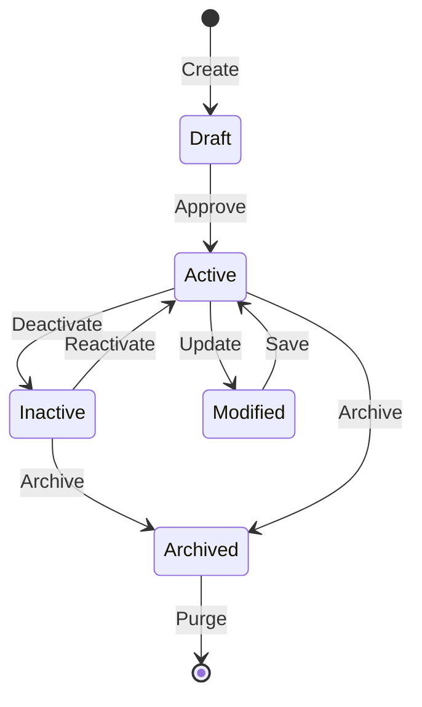
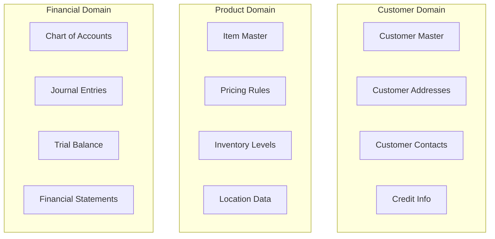

# ACAS Data Ownership Map
## Master Data and Entity Ownership by Subsystem

Generated: ${new Date().toISOString()}

## Overview

This document maps data ownership across ACAS subsystems, establishing clear boundaries for data governance and migration planning.

---

## Data Ownership Matrix

### Primary Entity Ownership

| Entity | Owner Subsystem | Access Rights | Data Governance |
|--------|----------------|---------------|-----------------|
| **Chart of Accounts** | GL_CORE | R: All, W: GL_CORE | Financial Controller |
| **GL Transactions** | GL_CORE | R: GL_CORE/RPT, W: GL_CORE | GL Team |
| **GL Balances** | GL_CORE | R: GL_CORE/RPT, W: GL_CORE | GL Team |
| **Customer Master** | AR_MGMT | R: All, W: AR_MGMT | Sales Operations |
| **Sales Orders** | AR_MGMT | R: AR/INV/RPT, W: AR_MGMT | Sales Team |
| **Sales Invoices** | AR_MGMT | R: AR/GL/RPT, W: AR_MGMT | AR Team |
| **Vendor Master** | AP_MGMT | R: All, W: AP_MGMT | Procurement |
| **Purchase Orders** | AP_MGMT | R: AP/INV/RPT, W: AP_MGMT | Purchasing |
| **AP Invoices** | AP_MGMT | R: AP/GL/RPT, W: AP_MGMT | AP Team |
| **Item Master** | INV_CTRL | R: All, W: INV_CTRL | Inventory Manager |
| **Stock Levels** | INV_CTRL | R: All, W: INV_CTRL | Warehouse |
| **Stock Movements** | INV_CTRL | R: INV/GL/RPT, W: INV_CTRL | Warehouse |
| **Tax Rates** | IRS_PROC | R: All, W: IRS_PROC | Tax Team |
| **Tax Transactions** | IRS_PROC | R: IRS/GL/RPT, W: IRS_PROC | Tax Team |
| **System Parameters** | MASTER_DATA | R: All, W: MASTER_DATA | System Admin |
| **User Security** | COMMON_SERVICES | R: System, W: COMMON | Security Admin |

### Shared Data Entities

| Entity | Primary Owner | Secondary Owners | Conflict Resolution |
|--------|--------------|------------------|---------------------|
| **Pricing** | AR_MGMT | INV_CTRL | AR_MGMT has priority |
| **Costs** | INV_CTRL | AP_MGMT | Last update wins |
| **GL Codes** | GL_CORE | All modules | GL_CORE validates |
| **Tax Codes** | IRS_PROC | AR/AP_MGMT | IRS_PROC validates |

---

## Data Lifecycle Management

### Entity State Transitions



### Data Retention Policies

| Data Category | Active Retention | Archive Period | Purge After | Legal Hold |
|---------------|------------------|----------------|-------------|------------|
| **GL Transactions** | 2 years | 5 years | 7 years | Yes |
| **Customer Master** | While active | 3 years | Never | No |
| **Sales Trans** | 3 years | 4 years | 7 years | Yes |
| **Vendor Master** | While active | 3 years | Never | No |
| **Purchase Trans** | 3 years | 4 years | 7 years | Yes |
| **Inventory Trans** | 1 year | 2 years | 3 years | No |
| **Tax Records** | 4 years | 3 years | 7 years | Yes |
| **Audit Logs** | 1 year | 6 years | 7 years | Yes |

---

## Data Access Patterns

### Read/Write Distribution

| Subsystem | Own Data R/W | Cross-Subsystem Read | Cross-Subsystem Write |
|-----------|--------------|---------------------|----------------------|
| GL_CORE | 100% | 20% (parameters) | 0% |
| AR_MGMT | 100% | 40% (inv, tax) | 15% (GL post) |
| AP_MGMT | 100% | 40% (inv, tax) | 15% (GL post) |
| INV_CTRL | 100% | 20% (orders) | 10% (GL post) |
| IRS_PROC | 100% | 30% (trans) | 5% (GL post) |
| MASTER_DATA | 100% | 0% | 0% |
| REPORTING | 0% | 100% | 0% |

### Data Volume Metrics

| Entity | Record Count | Daily Growth | Annual Growth |
|--------|-------------|--------------|---------------|
| GL Accounts | 500-1,000 | 0-1 | 10-20 |
| GL Transactions | 1M-5M | 500-5,000 | 200K-1M |
| Customers | 5,000-50,000 | 5-20 | 1,000-5,000 |
| Sales Orders | 100K-1M | 100-1,000 | 30K-300K |
| Vendors | 1,000-10,000 | 1-5 | 100-500 |
| Purchase Orders | 50K-500K | 50-500 | 15K-150K |
| Items | 10,000-100,000 | 10-50 | 1,000-10,000 |
| Stock Movements | 500K-5M | 500-5,000 | 200K-1M |

---

## Data Quality Responsibilities

### Quality Dimensions by Owner

| Subsystem | Completeness | Accuracy | Timeliness | Consistency |
|-----------|--------------|----------|------------|-------------|
| GL_CORE | GL Team | GL Team | GL Team | GL Team |
| AR_MGMT | Sales Ops | AR Team | AR Team | AR Team |
| AP_MGMT | Procurement | AP Team | AP Team | AP Team |
| INV_CTRL | Warehouse | Warehouse | Warehouse | Inventory Mgr |
| IRS_PROC | Tax Team | Tax Team | Tax Team | Tax Team |
| MASTER_DATA | Data Steward | Data Steward | System | Data Steward |

### Data Validation Rules

```yaml
Customer Master:
  - Unique customer number
  - Valid address required
  - Credit limit >= 0
  - Tax ID format validation
  
Item Master:
  - Unique item code
  - Valid UOM
  - Cost > 0
  - Price > cost (warning)
  
GL Account:
  - Valid account structure
  - Proper hierarchy
  - Balance type matches account type
  - No orphan accounts
```

---

## Migration Data Ownership

### Migration Responsibilities

| Phase | Data Set | Current Owner | Migration Owner | Validation |
|-------|----------|---------------|-----------------|------------|
| 1 | Reference Data | MASTER_DATA | Platform Team | Business SME |
| 2 | Customer Master | AR_MGMT | AR Team + IT | Sales Ops |
| 3 | Vendor Master | AP_MGMT | AP Team + IT | Procurement |
| 4 | Item Master | INV_CTRL | Inventory + IT | Operations |
| 5 | Open Transactions | Various | Module Teams | Finance |
| 6 | History | Various | Archive Team | Compliance |

### Data Migration Priorities

1. **Critical Master Data** (Months 1-2)
   - System parameters
   - User security
   - GL chart of accounts

2. **Operational Masters** (Months 3-4)
   - Customer records
   - Vendor records
   - Item catalog

3. **Transaction Data** (Months 5-6)
   - Open orders
   - Unpaid invoices
   - Current inventory

4. **Historical Data** (Months 7-8)
   - Closed transactions
   - Archive records
   - Audit trails

---

## Future State Data Architecture

### Domain-Driven Design Alignment



### Microservice Data Ownership

| Microservice | Owned Entities | Shared Entities | Integration |
|--------------|----------------|-----------------|-------------|
| Customer Service | Customer, Address, Contact | - | API |
| Order Service | Order, Order Lines | Customer, Item | API |
| Inventory Service | Stock Level, Movement | Item | API + Events |
| Tax Service | Tax Rate, Calculation | - | API |
| GL Service | Account, Journal, Balance | - | API + Events |

---

## Data Governance Framework

### RACI Matrix

| Activity | GL | AR | AP | INV | IRS | IT | DG |
|----------|----|----|----|----|-----|----|----|
| Define Standards | C | C | C | C | C | R | A |
| Maintain Quality | A | A | A | A | A | R | C |
| Access Control | I | I | I | I | I | A | R |
| Archive/Purge | C | C | C | C | C | R | A |

**R**: Responsible, **A**: Accountable, **C**: Consulted, **I**: Informed

### Data Stewardship

| Domain | Business Steward | Technical Steward | Executive Sponsor |
|--------|-----------------|-------------------|-------------------|
| Financial | GL Manager | GL Team Lead | CFO |
| Customer | Sales Ops Mgr | AR Team Lead | Sales VP |
| Vendor | Procurement Mgr | AP Team Lead | Operations VP |
| Inventory | Warehouse Mgr | Inventory Lead | COO |
| Compliance | Tax Manager | Tax Team Lead | CFO |

---

## Conclusion

Clear data ownership is essential for successful subsystem isolation and migration. This map provides:

1. **Clear Boundaries**: Each subsystem owns specific entities
2. **Access Control**: Read/write permissions defined
3. **Governance Structure**: Accountability established
4. **Migration Path**: Ownership through transition
5. **Quality Framework**: Responsibilities assigned

Success requires maintaining these boundaries during migration while ensuring data consistency and business continuity.