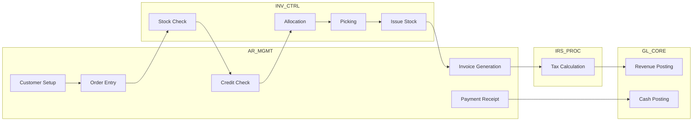
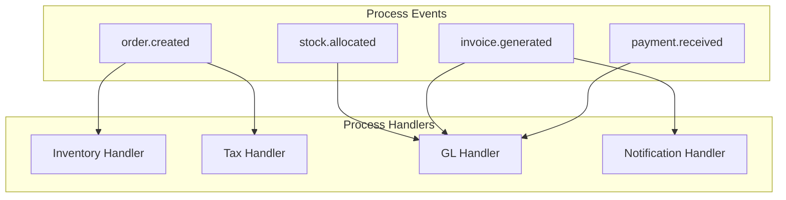

# ACAS Process Allocation
## Business Process Distribution Across Subsystems

Generated: ${new Date().toISOString()}

## Overview

This document maps business processes to subsystems, ensuring clear process ownership and identifying cross-subsystem orchestration requirements.

---

## Core Business Process Inventory

### Financial Processes

| Process | Primary Subsystem | Supporting Subsystems | Process Owner |
|---------|-------------------|----------------------|---------------|
| **Financial Close** | GL_CORE | All | CFO |
| Chart of Accounts Mgmt | GL_CORE | - | Controller |
| Journal Entry Processing | GL_CORE | - | GL Manager |
| Financial Reporting | GL_CORE | REPORTING | Controller |
| Budget Management | GL_CORE | - | FP&A |
| Period Close | GL_CORE | All | Controller |
| Year-End Processing | GL_CORE | All | CFO |
| Consolidation | GL_CORE | - | Controller |
| Audit Support | GL_CORE | REPORTING | Audit Manager |

### Revenue Processes

| Process | Primary Subsystem | Supporting Subsystems | Process Owner |
|---------|-------------------|----------------------|---------------|
| **Order to Cash** | AR_MGMT | INV_CTRL, IRS_PROC | Sales Director |
| Customer Onboarding | AR_MGMT | MASTER_DATA | Sales Ops |
| Credit Management | AR_MGMT | - | Credit Manager |
| Order Management | AR_MGMT | INV_CTRL | Sales Ops |
| Pricing & Discounting | AR_MGMT | - | Sales Manager |
| Delivery Processing | AR_MGMT | INV_CTRL | Logistics |
| Invoicing | AR_MGMT | IRS_PROC, GL_CORE | AR Manager |
| Collections | AR_MGMT | - | Collections Mgr |
| Cash Application | AR_MGMT | GL_CORE | AR Manager |
| Sales Reporting | AR_MGMT | REPORTING | Sales Analyst |

### Procurement Processes

| Process | Primary Subsystem | Supporting Subsystems | Process Owner |
|---------|-------------------|----------------------|---------------|
| **Procure to Pay** | AP_MGMT | INV_CTRL, IRS_PROC | Procurement Dir |
| Vendor Onboarding | AP_MGMT | MASTER_DATA | Vendor Manager |
| Purchase Requisition | AP_MGMT | - | Procurement |
| Purchase Order Mgmt | AP_MGMT | - | Buyers |
| Receiving | AP_MGMT | INV_CTRL | Warehouse |
| Invoice Processing | AP_MGMT | IRS_PROC | AP Manager |
| Payment Processing | AP_MGMT | GL_CORE | Treasury |
| Vendor Management | AP_MGMT | - | Vendor Manager |
| Expense Management | AP_MGMT | GL_CORE | AP Manager |

### Inventory Processes

| Process | Primary Subsystem | Supporting Subsystems | Process Owner |
|---------|-------------------|----------------------|---------------|
| **Inventory Management** | INV_CTRL | - | Ops Director |
| Item Master Mgmt | INV_CTRL | MASTER_DATA | Product Manager |
| Stock Receiving | INV_CTRL | AP_MGMT | Warehouse Mgr |
| Stock Issuing | INV_CTRL | AR_MGMT | Warehouse Mgr |
| Cycle Counting | INV_CTRL | - | Inventory Mgr |
| Physical Inventory | INV_CTRL | GL_CORE | Inventory Mgr |
| Reorder Processing | INV_CTRL | AP_MGMT | Planning Mgr |
| Stock Valuation | INV_CTRL | GL_CORE | Cost Accountant |

### Compliance Processes

| Process | Primary Subsystem | Supporting Subsystems | Process Owner |
|---------|-------------------|----------------------|---------------|
| **Tax Compliance** | IRS_PROC | - | Tax Director |
| Tax Configuration | IRS_PROC | MASTER_DATA | Tax Manager |
| Transaction Tax Calc | IRS_PROC | AR/AP_MGMT | Tax Manager |
| Tax Reporting | IRS_PROC | REPORTING | Tax Manager |
| Tax Filing | IRS_PROC | - | Tax Manager |
| Audit Support | IRS_PROC | REPORTING | Tax Manager |

---

## Process Flow Allocation

### Order-to-Cash Process Flow



### Process Step Ownership

| Step | Owning Subsystem | SLA | Volume/Day |
|------|------------------|-----|------------|
| Customer Setup | AR_MGMT | 30 min | 10-50 |
| Order Entry | AR_MGMT | 5 min | 100-1000 |
| Stock Check | INV_CTRL | <1 sec | 1000-10000 |
| Credit Check | AR_MGMT | <5 sec | 100-1000 |
| Allocation | INV_CTRL | <2 sec | 100-1000 |
| Picking | INV_CTRL | 2 hours | 100-1000 |
| Stock Issue | INV_CTRL | 5 min | 100-1000 |
| Invoice Gen | AR_MGMT | 1 min | 100-1000 |
| Tax Calc | IRS_PROC | <1 sec | 1000-5000 |
| GL Posting | GL_CORE | Batch/EOD | All |
| Payment | AR_MGMT | 2 min | 50-500 |

---

## Batch Process Allocation

### Daily Batch Processes

| Process | Time | Duration | Subsystem | Dependencies |
|---------|------|----------|-----------|--------------|
| Sales EOD | 18:00 | 30 min | AR_MGMT | Day's transactions |
| Purchase EOD | 18:30 | 20 min | AP_MGMT | Day's transactions |
| Inventory Recon | 19:00 | 45 min | INV_CTRL | AR/AP complete |
| GL Posting | 20:00 | 60 min | GL_CORE | All subsystems |
| Reports Gen | 21:00 | 90 min | REPORTING | GL posting |
| Backup | 23:00 | 120 min | BATCH_PROC | All complete |

### Monthly Processes

| Process | Day | Duration | Subsystem | Dependencies |
|---------|-----|----------|-----------|--------------|
| Statements | 1st | 4 hours | AR_MGMT | Month-end |
| Aging | 1st | 2 hours | AR/AP_MGMT | Month-end |
| Inventory Count | 1st | 8 hours | INV_CTRL | Ops freeze |
| Tax Prep | 5th | 6 hours | IRS_PROC | GL close |
| Month Close | Last | 12 hours | GL_CORE | All subsystems |
| Archive | 15th | 6 hours | BATCH_PROC | Prior month |

---

## Cross-Subsystem Process Orchestration

### Orchestration Requirements

| Process | Orchestrator | Participants | Type |
|---------|--------------|--------------|------|
| Order Fulfillment | AR_MGMT | INV, IRS, GL | Synchronous + Async |
| Purchase Receipt | AP_MGMT | INV, GL | Synchronous + Async |
| Period Close | GL_CORE | All | Batch Sequential |
| Physical Inventory | INV_CTRL | GL | Batch with freeze |
| Customer Credit | AR_MGMT | GL | Real-time query |

### Process Handoff Matrix

| From | To | Process | Method | Frequency |
|------|-----|---------|--------|-----------|
| AR_MGMT | INV_CTRL | Stock Check | API Call | Real-time |
| AR_MGMT | IRS_PROC | Tax Calc | API Call | Real-time |
| AR_MGMT | GL_CORE | Posting | Batch File | Daily |
| AP_MGMT | INV_CTRL | Receipt | API Call | Real-time |
| AP_MGMT | GL_CORE | Posting | Batch File | Daily |
| INV_CTRL | GL_CORE | Valuation | Batch File | Daily |
| ALL | REPORTING | Data Extract | Read Replica | On-demand |

---

## Process Migration Strategy

### Migration Priorities

| Priority | Process Group | Rationale | Risk |
|----------|--------------|-----------|------|
| 1 | Reporting | Read-only, low risk | Low |
| 2 | Master Data Mgmt | Foundation for others | Medium |
| 3 | Tax Processing | Isolated logic | Low |
| 4 | Inventory Mgmt | Defined boundaries | Medium |
| 5 | Order Processing | Customer-facing | High |
| 6 | AP Processing | Vendor impact | High |
| 7 | GL Processing | Core financial | Very High |

### Process Decomposition for Microservices

```yaml
Order Service:
  - Order creation
  - Order validation
  - Order status management
  - Order fulfillment orchestration

Inventory Service:
  - Stock level management
  - Reservation handling
  - Movement tracking
  - Cycle count processing

Invoice Service:
  - Invoice generation
  - Credit note handling
  - Invoice delivery
  - Archive management

Payment Service:
  - Payment receipt
  - Payment allocation
  - Payment methods
  - Reconciliation
```

---

## Process Performance Metrics

### Current State Metrics

| Process | Current Time | Target Time | Improvement |
|---------|-------------|-------------|-------------|
| Order Entry | 5-10 min | 2 min | 75% |
| Invoice Generation | 2-5 min | 30 sec | 90% |
| Stock Check | 200ms | 10ms | 95% |
| Payment Posting | 5 min | 1 min | 80% |
| Month Close | 5 days | 2 days | 60% |
| Report Generation | 2-4 hours | 15 min | 90% |

### Process Automation Opportunities

| Process | Current | Automation Potential | Technology |
|---------|---------|---------------------|------------|
| Order Entry | Manual | High - 80% | API + RPA |
| Invoice Matching | Semi-auto | High - 90% | ML Matching |
| Payment Application | Manual | Medium - 60% | Rules Engine |
| Inventory Count | Manual | Medium - 50% | RFID/Barcode |
| Report Distribution | Manual | High - 95% | Scheduling |

---

## Process Governance

### Process Ownership Model

| Level | Role | Responsibilities |
|-------|------|------------------|
| Executive | Process Sponsor | Strategy, funding |
| Management | Process Owner | Design, performance |
| Operational | Process Manager | Execution, improvement |
| Technical | Process Architect | Systems, integration |

### Change Management

| Change Type | Approval Level | Impact Assessment |
|-------------|----------------|-------------------|
| Process Flow | Process Owner | Business + Technical |
| Integration | Architecture Board | All affected systems |
| Automation | Process Owner + IT | Risk assessment |
| Elimination | Executive Sponsor | Full impact analysis |

---

## Future State Process Architecture

### Event-Driven Process Orchestration



### Process KPIs

| Process | KPI | Current | Target |
|---------|-----|---------|--------|
| Order to Cash | Cycle Time | 5 days | 2 days |
| Order to Cash | DSO | 45 days | 30 days |
| Procure to Pay | Cycle Time | 7 days | 3 days |
| Procure to Pay | Early Payment | 20% | 80% |
| Inventory | Accuracy | 95% | 99.5% |
| Financial Close | Days to Close | 5 days | 2 days |

---

## Conclusion

Process allocation across subsystems follows business domain boundaries while maintaining clear ownership and integration points. Key success factors:

1. **Clear Ownership**: Each process has a primary owner
2. **Defined Interfaces**: Integration points documented
3. **Performance Targets**: Measurable improvements
4. **Automation Focus**: High-value opportunities identified
5. **Migration Path**: Risk-based prioritization

The future state architecture enables flexible, event-driven process orchestration while maintaining business continuity during transition.