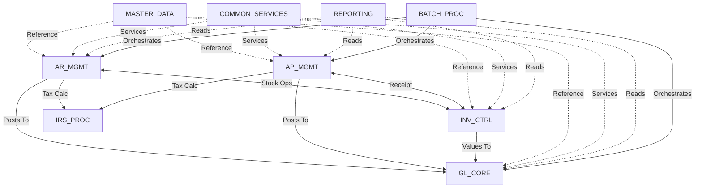
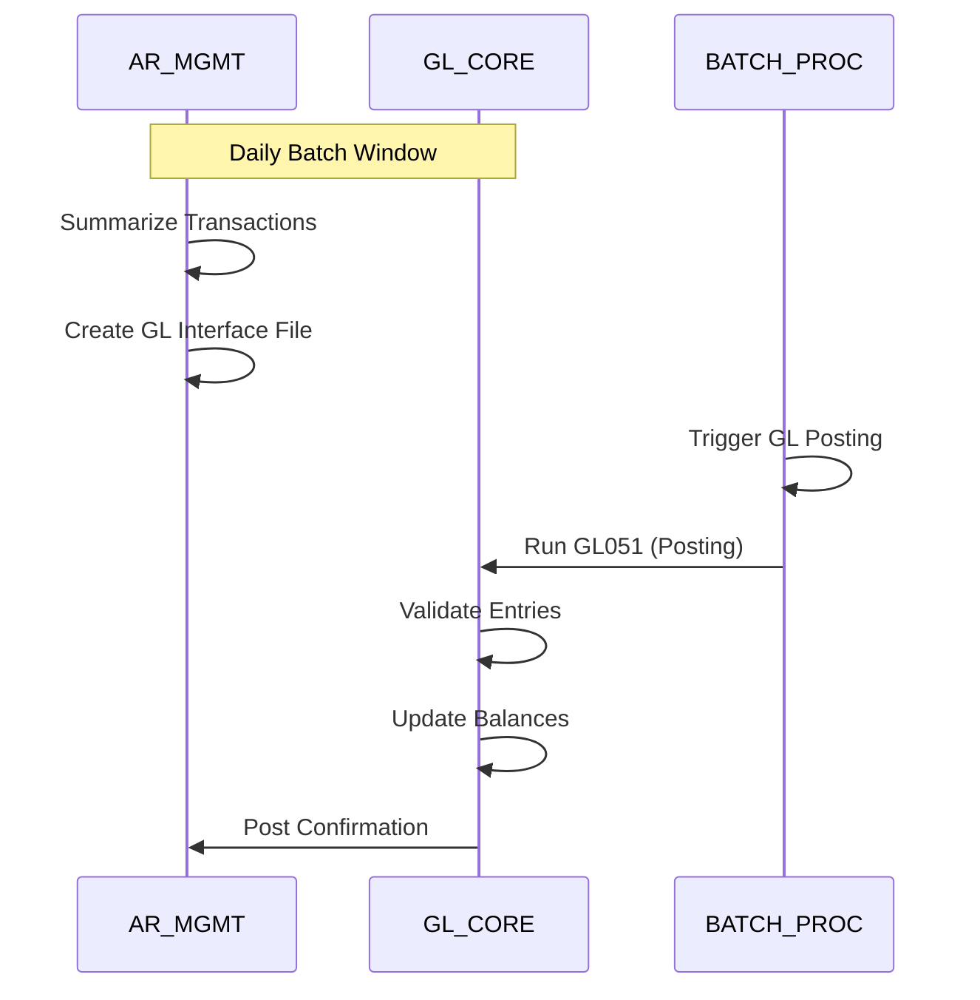
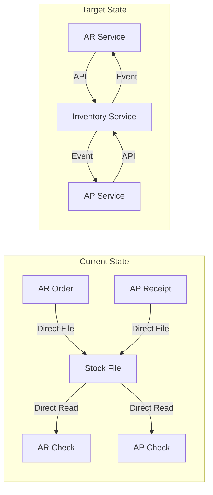
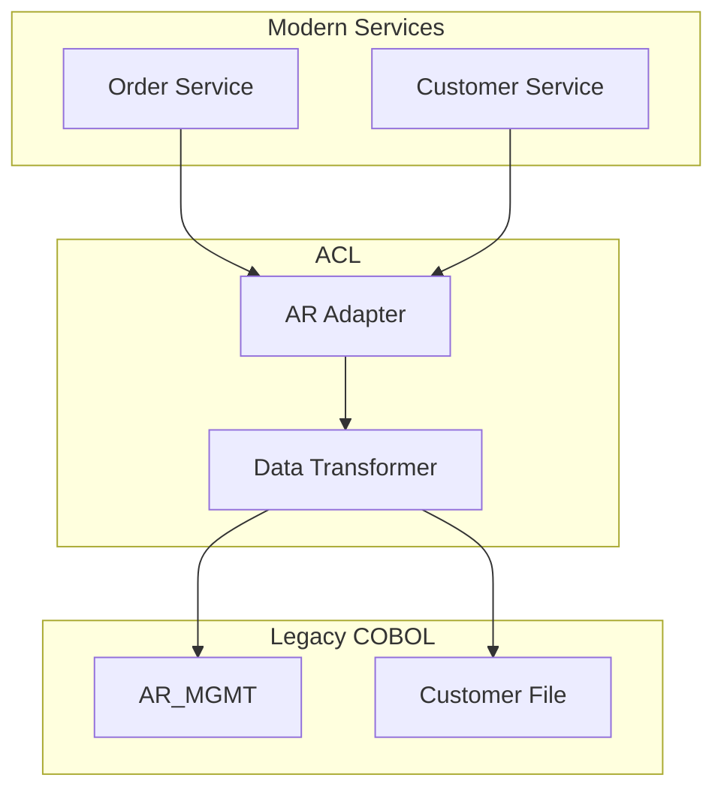
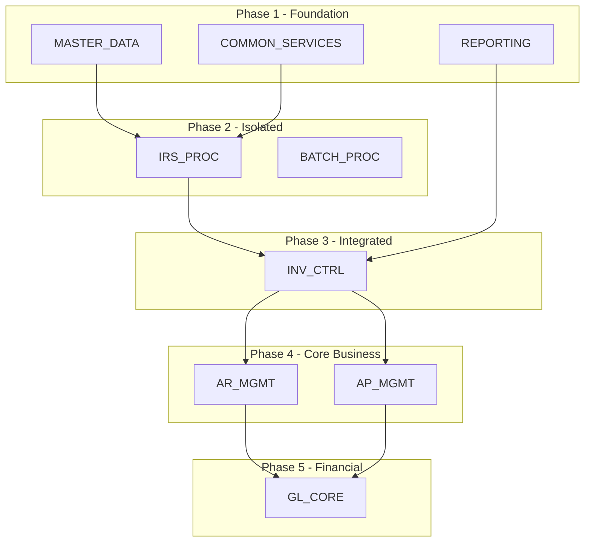

# ACAS Dependency Analysis
## Subsystem Dependencies and Decoupling Strategy

Generated: ${new Date().toISOString()}

## Overview

This document provides comprehensive dependency analysis between ACAS subsystems, identifying coupling points and providing strategies for progressive decoupling during modernization.

---

## Dependency Visualization

### High-Level Dependency Graph



---

## Dependency Types and Metrics

### Dependency Classification

| Type | Description | Count | Risk | Decoupling Strategy |
|------|-------------|-------|------|---------------------|
| **Data Dependencies** | Direct file access | 47 | High | API abstraction |
| **Code Dependencies** | CALL statements | 23 | Medium | Service interfaces |
| **Temporal Dependencies** | Batch sequencing | 18 | Medium | Event-driven |
| **Schema Dependencies** | Shared copybooks | 35 | High | Contract versioning |
| **Behavioral Dependencies** | Business rules | 12 | Low | Rule engine |

### Dependency Intensity Matrix

| From\To | GL | AR | AP | INV | IRS | MD | CS | RPT | BAT | Total Out |
|---------|----|----|----|----|-----|----|----|-----|-----|-----------|
| **GL** | - | 0 | 0 | 0 | 0 | 3 | 5 | 0 | 2 | 10 |
| **AR** | 8 | - | 0 | 6 | 4 | 5 | 8 | 0 | 3 | 34 |
| **AP** | 7 | 0 | - | 5 | 3 | 5 | 7 | 0 | 3 | 30 |
| **INV** | 4 | 2 | 2 | - | 0 | 3 | 6 | 0 | 2 | 19 |
| **IRS** | 2 | 1 | 1 | 0 | - | 2 | 4 | 0 | 1 | 11 |
| **MD** | 0 | 0 | 0 | 0 | 0 | - | 2 | 0 | 1 | 3 |
| **CS** | 0 | 0 | 0 | 0 | 0 | 0 | - | 0 | 0 | 0 |
| **RPT** | 3 | 4 | 3 | 2 | 2 | 2 | 3 | - | 1 | 20 |
| **BAT** | 2 | 3 | 2 | 1 | 1 | 1 | 2 | 1 | - | 13 |
| **Total In** | 26 | 10 | 8 | 14 | 10 | 21 | 37 | 1 | 13 | 140 |

**Coupling Score**: Higher numbers indicate stronger dependencies

---

## Critical Dependency Paths

### 1. GL Posting Dependencies



**Decoupling Strategy**:
- Phase 1: Add API wrapper around file interface
- Phase 2: Replace file with message queue
- Phase 3: Real-time posting via events

### 2. Inventory Integration Dependencies



### 3. Tax Calculation Dependencies

**Current State**:
```cobol
* In AR/AP transaction processing
CALL "acasirsub1" USING tax-parameters tax-results
```

**Target State**:
```typescript
// Tax Microservice API
const taxResult = await taxService.calculate({
  taxCode: "ST-CA",
  amount: 1000.00,
  date: "2024-03-15"
});
```

---

## Dependency Breaking Strategies

### 1. Strangler Fig Pattern

| Subsystem | Strangler Approach | Timeline | Risk |
|-----------|-------------------|----------|------|
| REPORTING | New BI layer reading from replicas | 3 months | Low |
| IRS_PROC | Tax API wrapping COBOL logic | 6 months | Low |
| MASTER_DATA | MDM service with sync to legacy | 4 months | Medium |
| INV_CTRL | Inventory API with dual writes | 9 months | High |

### 2. Anti-Corruption Layer



### 3. Event Sourcing Approach

| Event | Source | Consumers | Benefit |
|-------|--------|-----------|---------|
| customer.created | Customer Service | AR, GL, RPT | Decouple master data |
| order.placed | Order Service | INV, GL | Decouple transactions |
| stock.updated | Inventory Service | AR, AP, RPT | Real-time visibility |
| invoice.generated | Invoice Service | GL, AR | Async posting |

---

## Circular Dependencies

### Identified Circular Dependencies

1. **AR ↔ INV**: Orders need stock, stock needs order info
2. **None at subsystem level**: Good architectural boundaries

### Resolution Strategies

| Dependency | Current | Resolution | Implementation |
|------------|---------|------------|----------------|
| AR-INV Stock | Bidirectional | Event-driven | Inventory publishes availability |
| File Locking | Multiple readers | Read replicas | Separate read/write paths |

---

## Migration Dependencies

### Subsystem Migration Order



### Dependency-Driven Constraints

| Constraint | Impact | Mitigation |
|------------|--------|------------|
| GL must be last | Long dual-run | Invest in GL adapter early |
| AR/AP need INV | Complex coordination | Careful API design |
| Batch dependencies | Timing issues | Progressive batch modernization |
| Master data everywhere | Can't break deps | Build MDM first |

---

## Technical Debt from Dependencies

### High-Priority Debt

| Debt Item | Cause | Impact | Resolution Cost |
|-----------|-------|--------|-----------------|
| File locking | Shared file access | Performance | High |
| Copybook versions | No abstraction | Maintenance | Medium |
| Batch chains | Temporal coupling | Inflexibility | High |
| No interfaces | Direct integration | Brittleness | Very High |

### Debt Reduction Plan

1. **Year 1**: Introduce API layer
2. **Year 2**: Implement event bus
3. **Year 3**: Retire file interfaces
4. **Year 4**: Complete decoupling

---

## Monitoring and Metrics

### Dependency Metrics to Track

| Metric | Current | Target | Measurement |
|--------|---------|--------|-------------|
| Coupling Index | 0.73 | 0.30 | Dependencies/Subsystems |
| Integration Points | 140 | 50 | Count of interfaces |
| Sync Dependencies | 85% | 20% | Sync/Total |
| Batch Dependencies | 35% | 5% | Batch-only integrations |

### Decoupling Progress Dashboard

```yaml
Dashboard Metrics:
  - APIs Created vs File Interfaces Remaining
  - Events Published vs Batch Dependencies
  - Service Autonomy Score
  - Integration Test Coverage
  - Deployment Independence
```

---

## Risk Mitigation

### Dependency-Related Risks

| Risk | Probability | Impact | Mitigation |
|------|-------------|--------|------------|
| Breaking critical path | Medium | High | Extensive testing |
| Data inconsistency | High | High | Dual writes + reconciliation |
| Performance degradation | Medium | Medium | Caching + optimization |
| Incomplete decoupling | Low | High | Clear boundaries |

### Testing Strategy

1. **Contract Testing**: Ensure interface compatibility
2. **Integration Testing**: Verify end-to-end flows
3. **Chaos Testing**: Test failure scenarios
4. **Performance Testing**: Ensure no degradation

---

## Recommendations

### Quick Wins
1. **Read-only separation**: Implement read replicas for reporting
2. **API facades**: Wrap file interfaces with APIs
3. **Event publication**: Start publishing events alongside current integration

### Strategic Initiatives
1. **Service mesh**: Manage service-to-service communication
2. **API gateway**: Centralize external interfaces
3. **Event streaming**: Replace batch with real-time where possible
4. **Distributed tracing**: Understand dependency flows

### Governance
1. **Dependency review board**: Approve new dependencies
2. **Architecture fitness functions**: Automated dependency checks
3. **Coupling metrics**: Track and reduce over time
4. **Interface versioning**: Manage change without breaking

---

## Conclusion

The ACAS dependency analysis reveals a system with reasonable subsystem boundaries but tight implementation coupling through file sharing and batch dependencies. The path to modernization requires:

1. **Systematic decoupling**: Following the analyzed dependency paths
2. **Progressive migration**: Respecting dependency constraints
3. **Dual-run capabilities**: Maintaining operations during transition
4. **Strong governance**: Preventing new coupling

Success metrics will show reduced coupling index, increased service autonomy, and improved system flexibility. The investment in decoupling will enable faster innovation and reduced maintenance costs in the modernized architecture.