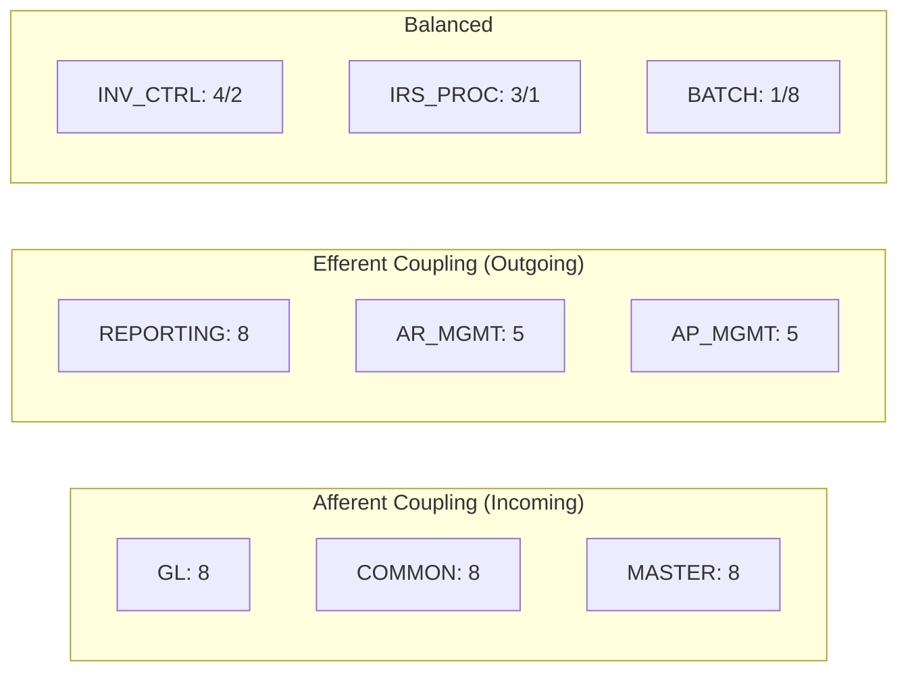
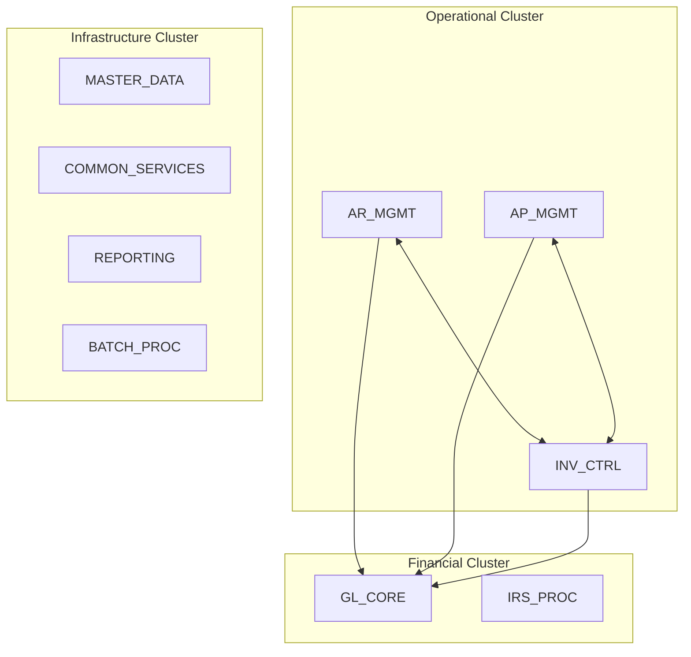
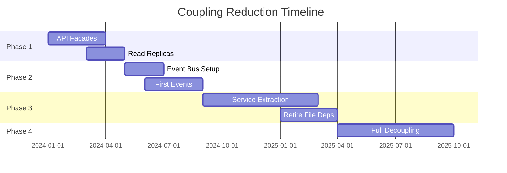
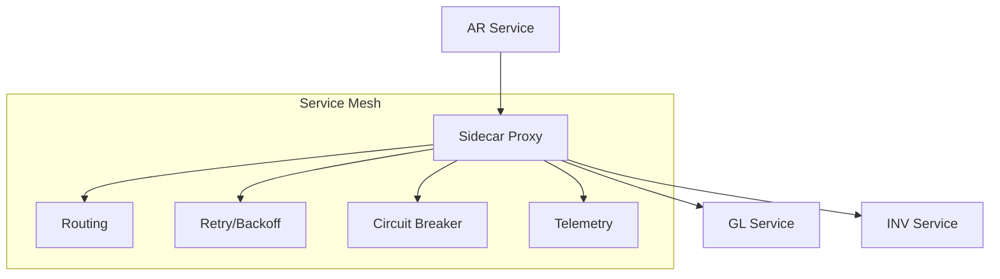

# ACAS Coupling Analysis
## Measuring and Reducing Inter-Subsystem Dependencies

Generated: ${new Date().toISOString()}

## Overview

This analysis measures the coupling between ACAS subsystems using established software engineering metrics and provides specific recommendations for reducing coupling to enable independent evolution.

---

## Coupling Metrics

### Coupling Types Identified

| Type | Description | Severity | Count |
|------|-------------|----------|-------|
| **Content Coupling** | Direct file access across subsystems | Highest | 23 |
| **Common Coupling** | Shared global data (files) | High | 47 |
| **Control Coupling** | One subsystem controls another's flow | High | 12 |
| **Stamp Coupling** | Sharing data structures (copybooks) | Medium | 89 |
| **Data Coupling** | Simple data parameter passing | Low | 34 |
| **Message Coupling** | Communication via messages | Lowest | 0 |

### Afferent vs Efferent Coupling



### Instability Index

| Subsystem | Afferent (Ca) | Efferent (Ce) | Instability (Ce/(Ce+Ca)) | Assessment |
|-----------|---------------|---------------|--------------------------|------------|
| GL_CORE | 8 | 1 | 0.11 | Very Stable |
| AR_MGMT | 2 | 5 | 0.71 | Unstable |
| AP_MGMT | 2 | 5 | 0.71 | Unstable |
| INV_CTRL | 4 | 2 | 0.33 | Balanced |
| IRS_PROC | 3 | 1 | 0.25 | Stable |
| MASTER_DATA | 8 | 0 | 0.00 | Maximally Stable |
| COMMON_SERVICES | 8 | 0 | 0.00 | Maximally Stable |
| REPORTING | 0 | 8 | 1.00 | Maximally Unstable |
| BATCH_PROC | 1 | 8 | 0.89 | Very Unstable |

---

## Detailed Coupling Analysis

### GL_CORE Coupling Profile

**Characteristics**: Hub of financial data, everyone posts to GL

```yaml
Incoming Dependencies (8):
  - AR_MGMT: Sales postings (Common Coupling - file interface)
  - AP_MGMT: Purchase postings (Common Coupling - file interface)
  - INV_CTRL: Inventory postings (Common Coupling - file interface)
  - IRS_PROC: Tax postings (Common Coupling - file interface)
  - BATCH_PROC: Scheduling control (Control Coupling)
  - MASTER_DATA: Parameters (Data Coupling)
  - COMMON_SERVICES: Security (Stamp Coupling)
  - REPORTING: Data reads (Content Coupling)

Outgoing Dependencies (1):
  - MASTER_DATA: Period parameters (Data Coupling)

Coupling Reduction Strategy:
  - Implement event-driven posting API
  - Replace file interfaces with message queue
  - Provide read-only API for reporting
```

### AR_MGMT Coupling Profile

**Characteristics**: Complex business logic with many integrations

```yaml
Incoming Dependencies (2):
  - BATCH_PROC: Scheduling (Control Coupling)
  - COMMON_SERVICES: Utilities (Stamp Coupling)

Outgoing Dependencies (5):
  - GL_CORE: Financial postings (Common Coupling)
  - INV_CTRL: Stock operations (Content Coupling)
  - IRS_PROC: Tax calculations (Control Coupling)
  - MASTER_DATA: Customer data (Data Coupling)
  - COMMON_SERVICES: Security (Stamp Coupling)

High Coupling Issues:
  - Direct file access to inventory
  - Synchronous tax calculations
  - Tight batch dependencies

Decoupling Plan:
  - Inventory API with async events
  - Tax calculation service
  - Event-driven GL posting
```

### INV_CTRL Coupling Profile

**Characteristics**: Central to operations, balanced coupling

```yaml
Bidirectional Dependencies:
  - AR_MGMT <-> INV_CTRL: Stock operations
  - AP_MGMT <-> INV_CTRL: Receipts/returns
  
Critical Coupling Points:
  - Real-time stock checks (Content Coupling)
  - Stock reservations (Control Coupling)
  - Valuation updates (Common Coupling)

Modernization Impact:
  - Must maintain real-time performance
  - Need distributed transaction support
  - Require event notifications
```

---

## Coupling Heat Map

### Inter-Subsystem Coupling Intensity

```
        GL   AR   AP  INV  IRS   MD   CS  RPT  BAT
   GL   -    L    L   L    L     L    M   L    M
   AR   H    -    -   H    M     M    M   -    L
   AP   H    -    -   H    M     M    M   -    L
  INV   M    M    M   -    -     L    L   -    L
  IRS   L    L    L   -    -     L    L   -    L
   MD   -    -    -   -    -     -    L   -    L
   CS   -    -    -   -    -     -    -   -    -
  RPT   M    M    M   M    M     M    M   -    L
  BAT   M    M    M   L    L     L    M   L    -

Legend: H=High, M=Medium, L=Low, -=None
```

### Coupling Clusters



---

## Coupling Reduction Strategies

### 1. Interface Segregation

**Current State**: Monolithic file structures shared across subsystems

**Target State**: Specific APIs for each use case

```typescript
// Instead of shared customer file
interface CustomerService {
  // AR needs full customer data
  getCustomerForOrder(id: string): Customer
  
  // GL only needs account info
  getCustomerAccount(id: string): AccountInfo
  
  // Reporting needs summary
  getCustomerSummary(id: string): Summary
}
```

### 2. Event-Driven Decoupling

**Replace synchronous calls with events**:

```yaml
Current:
  AR -> CALL GL Posting Program
  AR -> WAIT for completion
  AR -> Continue processing

Target:
  AR -> Publish "InvoiceCreated" event
  AR -> Continue immediately
  GL -> Subscribe to event
  GL -> Process asynchronously
```

### 3. Temporal Decoupling

**Current**: Tight batch window dependencies

**Target**: Continuous processing

| Process | Current | Target |
|---------|---------|--------|
| GL Posting | Nightly batch | Real-time events |
| Reports | After GL post | Continuous update |
| Tax Calc | In-transaction | Async service |
| Inventory | Lock during update | Optimistic locking |

### 4. Data Decoupling

**Strategies by data type**:

| Data Type | Current Coupling | Decoupling Strategy |
|-----------|------------------|---------------------|
| Master Data | Direct file read | API with caching |
| Transactions | Shared files | Event streaming |
| Parameters | File lookup | Configuration service |
| Reports | Direct DB access | Read replicas |

---

## Measuring Coupling Reduction

### Coupling Metrics Dashboard

```yaml
Key Metrics:
  - Coupling Index: Sum of all coupling weights / Total possible
  - Dependency Count: Number of inter-subsystem dependencies  
  - Sync Ratio: Synchronous / Total dependencies
  - Change Impact: Average subsystems affected by change
  - Deploy Independence: % subsystems deployable alone

Current State:
  - Coupling Index: 0.68
  - Dependency Count: 205
  - Sync Ratio: 0.85
  - Change Impact: 3.2 subsystems
  - Deploy Independence: 22%

Target State (2 years):
  - Coupling Index: 0.25
  - Dependency Count: 80
  - Sync Ratio: 0.20
  - Change Impact: 1.5 subsystems
  - Deploy Independence: 78%
```

### Progress Tracking



---

## Architectural Patterns for Low Coupling

### 1. Hexagonal Architecture per Subsystem

```
         ┌─────────────────┐
         │   Use Cases     │
         └────────┬────────┘
    ┌─────────────┴─────────────┐
    │                           │
┌───▼───┐                   ┌───▼───┐
│ Port  │    Domain         │ Port  │
│ (API) │    Models         │ (DB)  │
└───┬───┘                   └───┬───┘
    │      ┌───────────┐        │
    │      │  Business │        │
    └─────►│   Logic   │◄───────┘
           └───────────┘
```

### 2. Async Messaging Patterns

```yaml
Patterns to Implement:
  - Publish/Subscribe: For broadcasts
  - Request/Reply: For async queries  
  - Event Sourcing: For audit trails
  - CQRS: For read/write separation
  - Saga: For distributed transactions
```

### 3. Service Mesh for Communication



---

## Recommendations

### Immediate Actions (0-3 months)
1. Document all coupling points
2. Implement API facades over files
3. Start collecting coupling metrics
4. Create decoupling roadmap

### Short Term (3-6 months)
1. Deploy event infrastructure
2. Implement first async flows
3. Create service boundaries
4. Reduce batch dependencies

### Medium Term (6-12 months)
1. Extract first microservices
2. Implement service mesh
3. Migrate critical integrations
4. Achieve 50% deploy independence

### Long Term (12-24 months)
1. Complete service extraction
2. Retire file-based integration
3. Achieve target coupling metrics
4. Enable continuous deployment

---

## Conclusion

The coupling analysis reveals that ACAS has reasonable architectural boundaries but high implementation coupling. The path forward requires:

1. **Systematic measurement** of coupling metrics
2. **Progressive decoupling** using proven patterns
3. **Event-driven architecture** to reduce synchronous dependencies
4. **Service-oriented design** for subsystem autonomy

Success will enable faster development, independent deployment, and improved system resilience.