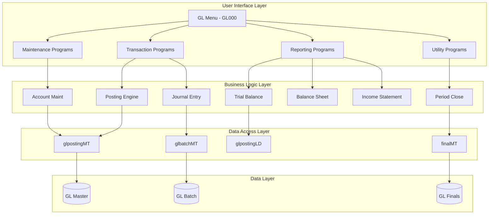
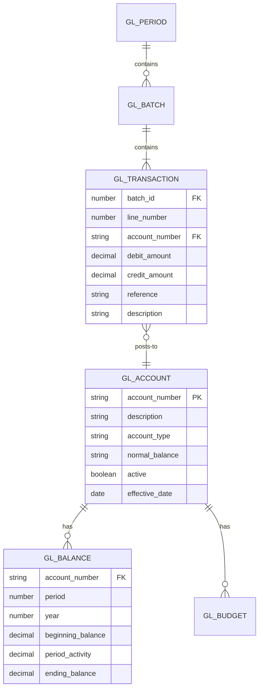
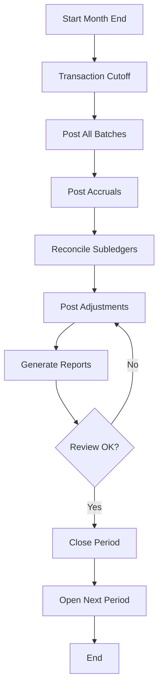
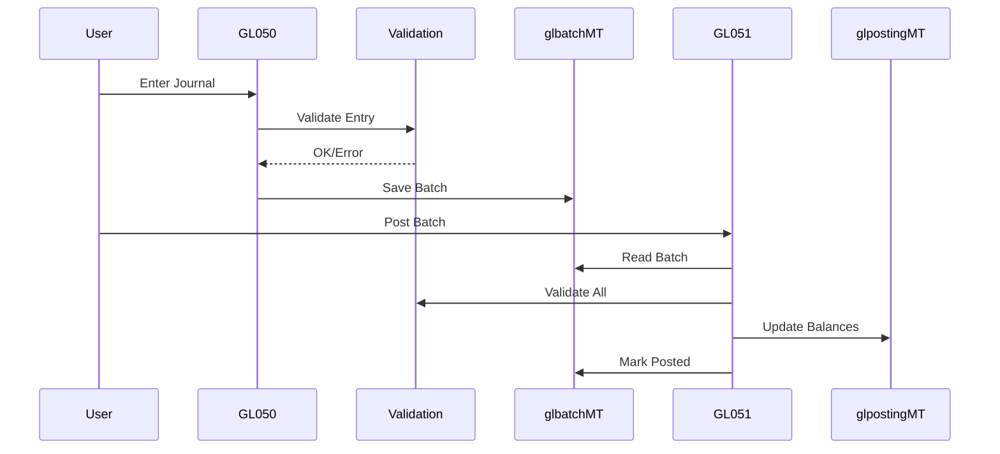

# GL_CORE Subsystem Specification
## General Ledger Core Services

Generated: ${new Date().toISOString()}

## Overview

GL_CORE is the financial backbone of ACAS, providing comprehensive general ledger functionality including chart of accounts management, journal processing, financial reporting, and period management.

---

## Subsystem Boundaries

### Included Capabilities
- Chart of Accounts maintenance
- Journal entry processing and validation
- Automatic and manual posting
- Period and year-end closing
- Financial statement generation
- Multi-currency support
- Budget management and control
- Audit trail and compliance

### Excluded Capabilities
- Subledger detail (handled by AR/AP)
- Tax calculations (handled by IRS_PROC)
- Operational reporting (handled by REPORTING)
- Transaction origination (handled by source modules)

---

## Component Architecture

### Program Components



### Key Programs

| Program | Type | Purpose | Criticality |
|---------|------|---------|-------------|
| general.cbl | Menu | Main GL menu | High |
| GL020 | Maintenance | COA maintenance | High |
| GL050 | Transaction | Journal entry | Critical |
| GL051 | Batch | Posting engine | Critical |
| GL070 | Report | Trial balance | High |
| GL071 | Report | Balance sheet | High |
| GL072 | Report | P&L statement | High |
| GL090 | Utility | Period close | Critical |

---

## Data Model

### Core Entities



### File Specifications

| File | Type | Key | Records | Growth |
|------|------|-----|---------|--------|
| glpost.dat | ISAM | Account + Period | 10K-50K | 10%/year |
| glbatch.dat | Sequential | Batch + Line | 50K-500K | 20%/year |
| nominal.dat | ISAM | Account | 500-2K | 5%/year |

---

## Interface Specifications

### Inbound Interfaces

#### 1. Subledger Postings
**Source**: AR_MGMT, AP_MGMT, INV_CTRL  
**Frequency**: Daily batch  
**Volume**: 500-5000 transactions/day  

```cobol
01 GL-POSTING-INTERFACE.
   05 POST-DATE         PIC 9(8).
   05 POST-MODULE       PIC X(2).
   05 POST-BATCH        PIC 9(6).
   05 POST-ENTRIES      OCCURS 999.
      10 ACCOUNT-NUMBER PIC X(15).
      10 DEBIT-AMOUNT   PIC 9(13)V99.
      10 CREDIT-AMOUNT  PIC 9(13)V99.
      10 REFERENCE      PIC X(20).
```

### Outbound Interfaces

#### 1. Financial Data Extract
**Destination**: REPORTING  
**Frequency**: On-demand  
**Format**: Sequential file or API  

#### 2. Period Status
**Destination**: All modules  
**Frequency**: Real-time  
**Method**: Parameter lookup  

---

## Business Rules

### Critical Business Rules

1. **Balanced Entries**: Every journal entry must balance (debits = credits)
2. **Period Control**: Transactions only allowed in open periods
3. **Account Validation**: All accounts must exist and be active
4. **Authorization**: Journal entries over threshold require approval
5. **Audit Trail**: All changes must be logged with user/timestamp

### Validation Rules

```yaml
Journal Entry Validation:
  - Total debits must equal total credits
  - All accounts must be valid and active
  - Transaction date must be in open period
  - Reference must be unique within batch
  - Amounts must be positive
  
Account Validation:
  - Account number must follow COA structure
  - Parent account must exist for detail accounts
  - Account type must be valid (AS,LI,EQ,RE,EX)
  - Normal balance must match account type
```

---

## Process Flows

### Month-End Close Process



### Journal Entry Processing



---

## Security and Compliance

### Access Control

| Function | Role Required | Approval Needed |
|----------|--------------|-----------------|
| View accounts | GL User | No |
| Maintain COA | GL Admin | Yes, Controller |
| Enter journals | GL User | No |
| Post journals | GL Supervisor | Auto if < $10K |
| Close period | Controller | Yes, CFO |
| Run reports | GL User | No |

### Audit Requirements

- All journal entries tracked with user ID and timestamp
- Changes to COA require approval workflow
- Posted entries cannot be modified (reversal only)
- Complete audit trail for compliance
- Period close documentation required

---

## Performance Requirements

### Response Time SLAs

| Operation | Current | Target | Critical |
|-----------|---------|---------|----------|
| Account inquiry | 2s | <500ms | No |
| Journal entry | 5s | <2s | No |
| Posting batch (1000 lines) | 5min | <1min | Yes |
| Trial balance | 30s | <5s | Yes |
| Financial statements | 2min | <10s | Yes |
| Month-end close | 4hr | <1hr | Yes |

### Scalability Requirements

- Support 100K+ GL accounts
- Process 10K+ transactions/day
- Handle 5 years of history online
- Support 100+ concurrent users

---

## Migration Strategy

### Modernization Approach

1. **Phase 1**: Expose APIs for account lookup
2. **Phase 2**: Build new reporting engine
3. **Phase 3**: Modernize journal entry UI
4. **Phase 4**: Migrate posting engine
5. **Phase 5**: Cutover period close process

### Technology Stack

**Current**: COBOL + ISAM files  
**Target**: Java microservices + PostgreSQL  

### Data Migration

- Migrate COA first (reference data)
- Historical balances by period
- Open transactions only
- Archive old detail

---

## Risk Assessment

### Technical Risks

| Risk | Impact | Probability | Mitigation |
|------|--------|-------------|------------|
| Data integrity | Critical | Low | Reconciliation, parallel run |
| Performance | High | Medium | Optimization, caching |
| Integration | High | Medium | Careful API design |
| Training | Medium | High | Phased rollout |

### Business Risks

| Risk | Impact | Probability | Mitigation |
|------|--------|-------------|------------|
| Financial reporting errors | Critical | Low | Extensive testing |
| Compliance issues | High | Low | Audit involvement |
| Period close delays | High | Medium | Parallel run period |

---

## Success Criteria

### Technical Metrics
- Zero data discrepancies during parallel run
- Performance meets or exceeds SLAs
- 99.9% availability
- All integrations functioning

### Business Metrics
- Month-end close time reduced 50%
- User satisfaction > 80%
- Audit findings: None
- Report accuracy: 100%

---

## Dependencies

### Upstream Dependencies
- All subledgers for posting data
- MASTER_DATA for parameters
- BATCH_PROC for scheduling

### Downstream Dependencies
- REPORTING for financial data
- All modules for period status
- External auditors for compliance