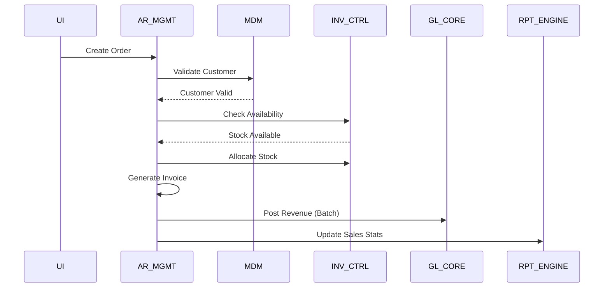
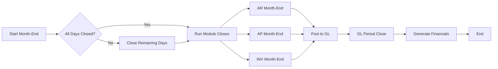

# ACAS Integration Architecture

## Overview

This document defines how the 14 identified subsystems communicate and integrate with each other, establishing clear contracts and protocols for inter-subsystem communication.

## Integration Principles

1. **Asynchronous When Possible**: Reduce tight coupling through batch/queue-based integration
2. **Clear Contracts**: Well-defined interfaces with versioning
3. **Error Recovery**: Built-in retry and compensation mechanisms
4. **Audit Trail**: All integrations logged for compliance
5. **Performance**: Minimize synchronous calls, batch where appropriate

## Integration Patterns

### 1. Synchronous Integration (Direct Call)

Used for real-time operations requiring immediate response.

```
Caller → API/Service → Target Subsystem
         ↓
      Response
```

**When to use**:
- User-initiated transactions
- Real-time validations
- Immediate data requirements

### 2. Asynchronous Integration (Batch)

Used for bulk operations and non-time-critical processing.

```
Source → File/Queue → Batch Processor → Target
                           ↓
                      Error Queue
```

**When to use**:
- End-of-day processing
- Bulk data transfers
- Report generation

### 3. Event-Driven Integration

Used for loosely coupled notifications.

```
Event Source → Event Bus → Subscribers
                    ↓
              Event Store
```

**When to use**:
- State change notifications
- Multi-subscriber scenarios
- Audit requirements

## Subsystem Communication Matrix

| From | To | Type | Frequency | Data Volume | Protocol |
|------|----|----|-----------|-------------|----------|
| AR_MGMT | GL_CORE | Batch | Daily | High | File transfer |
| AR_MGMT | INV_CTRL | Sync | Real-time | Medium | Direct call |
| AR_MGMT | MDM | Sync | Real-time | Low | Direct call |
| AP_MGMT | GL_CORE | Batch | Daily | High | File transfer |
| AP_MGMT | INV_CTRL | Sync | Real-time | Medium | Direct call |
| AP_MGMT | MDM | Sync | Real-time | Low | Direct call |
| INV_CTRL | GL_CORE | Batch | Daily | Medium | File transfer |
| IRS_PROC | GL_CORE | Batch | Weekly | Low | File transfer |
| BATCH_FW | All | Async | Scheduled | Varies | Job control |
| RPT_ENGINE | All | Batch | On-demand | High | Data extract |
| SEC_AUDIT | All | Async | Continuous | Low | Event log |

## Interface Specifications

### 1. AR to GL Interface (Daily Revenue Posting)

**Interface ID**: AR-GL-001  
**Type**: Batch File Transfer  
**Frequency**: Daily at 18:00  
**Direction**: AR_MGMT → GL_CORE

**File Format**:
```
HEADER|YYYYMMDD|RECORD-COUNT|CONTROL-TOTAL
DETAIL|JOURNAL-TYPE|ACCOUNT|DEBIT|CREDIT|REFERENCE|DESCRIPTION
TRAILER|TOTAL-DEBITS|TOTAL-CREDITS|HASH-TOTAL
```

**Processing**:
1. AR_MGMT generates posting file after invoice batch
2. File placed in /interfaces/ar-to-gl/
3. GL_CORE batch picks up and processes
4. Confirmation file returned
5. Error records to error queue

### 2. Order to Inventory Interface

**Interface ID**: AR-INV-001  
**Type**: Synchronous Call  
**Protocol**: Direct program CALL

**Request**:
```cobol
01 INVENTORY-CHECK-REQUEST.
   05 ITEM-CODE         PIC X(20).
   05 QUANTITY-REQUIRED PIC 9(7)V99.
   05 WAREHOUSE-CODE    PIC X(3).
   05 ALLOCATION-TYPE   PIC X.

01 INVENTORY-CHECK-RESPONSE.
   05 AVAILABLE-QTY     PIC 9(7)V99.
   05 ALLOCATED-QTY     PIC 9(7)V99.
   05 RETURN-CODE       PIC 99.
   05 ERROR-MESSAGE     PIC X(50).
```

### 3. Master Data Query Interface

**Interface ID**: MDM-001  
**Type**: Synchronous Call  
**Protocol**: Direct program CALL via *MT programs

**Operations**:
- READ: Get master record
- VALIDATE: Check existence
- SEARCH: Find by criteria
- LIST: Get collection

### 4. Batch Job Dependencies

**Interface ID**: BATCH-001  
**Type**: Job Control Language (JCL)  
**Orchestrator**: BATCH_FW

```
Job: DAILY-PROCESSING
  Step 1: Close Sales Day (AR_MGMT)
    → Step 2: Update Inventory (INV_CTRL)
      → Step 3: Post to GL (GL_CORE)
        → Step 4: Generate Reports (RPT_ENGINE)
```

## Event Catalog

### Business Events

| Event | Source | Subscribers | Payload |
|-------|--------|-------------|---------|
| CUSTOMER_CREATED | MDM | AR_MGMT, RPT_ENGINE | Customer master data |
| INVOICE_POSTED | AR_MGMT | GL_CORE, INV_CTRL | Invoice header/lines |
| PAYMENT_RECEIVED | AR_MGMT | GL_CORE, MDM | Payment details |
| STOCK_RECEIVED | INV_CTRL | AP_MGMT, GL_CORE | Receipt details |
| PERIOD_CLOSED | GL_CORE | All modules | Period/status |
| USER_LOGIN | SEC_AUDIT | - | User/time/terminal |

### System Events

| Event | Source | Subscribers | Payload |
|-------|--------|-------------|---------|
| FILE_LOCKED | FILE_SVC | ERROR_FW | File/user/program |
| BATCH_FAILED | BATCH_FW | ERROR_FW, SEC_AUDIT | Job/error/time |
| THRESHOLD_EXCEEDED | Various | SEC_AUDIT | Metric/value/limit |

## Data Flow Diagrams

### Order to Cash Flow



### Month-End Processing Flow



## Interface Error Handling

### Error Categories

1. **Technical Errors**
   - File not found
   - Format errors
   - System unavailable

2. **Business Errors**
   - Validation failures
   - Business rule violations
   - Insufficient data

3. **Data Errors**
   - Referential integrity
   - Duplicate keys
   - Invalid codes

### Error Resolution Matrix

| Error Type | Detection | Notification | Resolution |
|-----------|-----------|--------------|------------|
| Missing file | Batch monitor | Email + Log | Manual resubmit |
| Format error | Parse routine | Error file | Fix and reprocess |
| Validation fail | Business logic | Report | Business review |
| System error | Exception | Alert | Technical support |

## Performance Considerations

### Synchronous Interfaces
- Response time SLA: < 2 seconds
- Timeout: 30 seconds
- Retry: 3 attempts with exponential backoff

### Batch Interfaces
- Processing window: 22:00 - 06:00
- File size limit: 1GB
- Parallel processing: Up to 4 streams

### Optimization Strategies
1. Cache frequently accessed master data
2. Batch similar transactions
3. Use compression for large files
4. Implement circuit breakers
5. Monitor interface performance

## Security Requirements

### Authentication
- Service accounts for batch
- User context for real-time
- API keys for external

### Authorization
- Role-based access control
- Interface-specific permissions
- Audit all access

### Data Protection
- Encrypt sensitive data in transit
- Mask PII in logs
- Secure file transfer protocols

## Migration Considerations

### Current State
- Tight coupling via direct CALLs
- Shared file access
- Limited error recovery

### Target State
- Loose coupling via APIs
- Message-based integration
- Comprehensive error handling

### Migration Strategy
1. Wrap existing interfaces
2. Add monitoring/logging
3. Implement new protocols
4. Gradual subsystem migration
5. Retire legacy interfaces