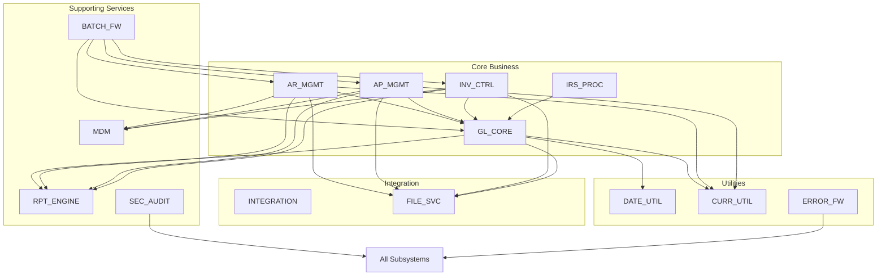

# ACAS Master Subsystem Architecture

## Executive Overview

The ACAS system has been analyzed and decomposed into 14 distinct subsystems based on functional cohesion, data ownership, and business domain boundaries. This architecture provides a clear separation of concerns that will guide future modularization and migration efforts.

### Architecture Principles Applied

1. **Single Responsibility**: Each subsystem owns a specific business domain
2. **Loose Coupling**: Minimal dependencies between subsystems
3. **High Cohesion**: Related functions grouped together
4. **Clear Interfaces**: Well-defined integration points
5. **Data Ownership**: Each entity owned by exactly one subsystem

## Subsystem Overview

### Core Business Subsystems (5)

1. **GL_CORE** - General Ledger Core
   - Central accounting engine
   - Financial reporting foundation
   - Period/year-end processing

2. **AR_MGMT** - Accounts Receivable Management
   - Customer relationships
   - Revenue processing
   - Credit control

3. **AP_MGMT** - Accounts Payable Management
   - Supplier relationships
   - Expense processing
   - Payment control

4. **INV_CTRL** - Inventory Control System
   - Stock management
   - Valuation methods
   - Movement tracking

5. **IRS_PROC** - Incomplete Records System
   - Simplified accounting
   - Small business focus
   - Automated double-entry

### Supporting Subsystems (4)

6. **MDM** - Master Data Management
   - Customer master
   - Supplier master
   - Product catalog
   - Chart of accounts

7. **RPT_ENGINE** - Reporting Engine
   - Report generation
   - Data extraction
   - Format handling

8. **BATCH_FW** - Batch Processing Framework
   - Job scheduling
   - Process orchestration
   - Error recovery

9. **SEC_AUDIT** - Security & Audit
   - Access control
   - Audit logging
   - Compliance tracking

### Integration Subsystems (2)

10. **INTEGRATION** - External Integration Services
    - Bank interfaces
    - EDI processing
    - API management

11. **FILE_SVC** - File Management Services
    - File I/O operations
    - Lock management
    - Backup/recovery

### Utility Subsystems (3)

12. **DATE_UTIL** - Date & Calendar Management
    - Date calculations
    - Period management
    - Holiday processing

13. **CURR_UTIL** - Currency & Number Processing
    - Multi-currency support
    - Exchange rates
    - Rounding rules

14. **ERROR_FW** - Error Handling Framework
    - Error capture
    - Recovery procedures
    - Notification services

## Subsystem Relationships

## Migration Impact Analysis

### Subsystem Independence Scores

| Subsystem | Independence | Dependencies | Migration Complexity |
|-----------|-------------|--------------|---------------------|
| IRS_PROC | 95% | 1 (GL only) | Low |
| DATE_UTIL | 90% | None | Low |
| CURR_UTIL | 90% | None | Low |
| ERROR_FW | 85% | All (reverse) | Low |
| MDM | 80% | None | Medium |
| INV_CTRL | 70% | GL, MDM | Medium |
| RPT_ENGINE | 65% | All modules | Medium |
| FILE_SVC | 60% | All modules | Medium |
| AP_MGMT | 55% | GL, MDM, INV | High |
| AR_MGMT | 55% | GL, MDM, INV | High |
| BATCH_FW | 50% | All modules | High |
| SEC_AUDIT | 45% | All modules | High |
| INTEGRATION | 40% | Multiple | High |
| GL_CORE | 20% | All feeders | Very High |

### Recommended Migration Sequence

1. **Phase 1 - Utilities** (3 months)
   - DATE_UTIL
   - CURR_UTIL
   - ERROR_FW

2. **Phase 2 - Isolated Business** (3 months)
   - IRS_PROC

3. **Phase 3 - Master Data** (4 months)
   - MDM

4. **Phase 4 - Inventory** (6 months)
   - INV_CTRL

5. **Phase 5 - Receivables** (6 months)
   - AR_MGMT

6. **Phase 6 - Payables** (6 months)
   - AP_MGMT

7. **Phase 7 - Infrastructure** (4 months)
   - FILE_SVC
   - BATCH_FW
   - SEC_AUDIT

8. **Phase 8 - Integration** (3 months)
   - INTEGRATION
   - RPT_ENGINE

9. **Phase 9 - Core** (6 months)
   - GL_CORE

## Subsystem Metrics

### Size Distribution

| Subsystem | Programs | Lines of Code | Complexity |
|-----------|----------|---------------|-----------|
| GL_CORE | 31 | 15,234 | High |
| AR_MGMT | 42 | 22,156 | Very High |
| AP_MGMT | 38 | 19,234 | High |
| INV_CTRL | 35 | 18,456 | High |
| IRS_PROC | 12 | 5,234 | Low |
| MDM | 28 | 12,345 | Medium |
| RPT_ENGINE | 25 | 14,567 | High |
| BATCH_FW | 18 | 8,234 | Medium |
| SEC_AUDIT | 8 | 3,456 | Low |
| INTEGRATION | 15 | 6,789 | Medium |
| FILE_SVC | 10 | 4,567 | Low |
| DATE_UTIL | 3 | 1,234 | Low |
| CURR_UTIL | 4 | 1,567 | Low |
| ERROR_FW | 5 | 2,345 | Low |

### Data Ownership Summary

| Data Entity | Owner Subsystem | Accessors |
|------------|----------------|-----------|
| Customers | MDM | AR_MGMT, RPT_ENGINE |
| Suppliers | MDM | AP_MGMT, RPT_ENGINE |
| Products/Items | MDM | INV_CTRL, AR_MGMT, AP_MGMT |
| Chart of Accounts | MDM | GL_CORE, All posting modules |
| Invoices (Sales) | AR_MGMT | GL_CORE, RPT_ENGINE |
| Invoices (Purchase) | AP_MGMT | GL_CORE, RPT_ENGINE |
| Stock Movements | INV_CTRL | GL_CORE |
| GL Transactions | GL_CORE | RPT_ENGINE |
| System Parameters | SEC_AUDIT | All subsystems |
| Audit Logs | SEC_AUDIT | None (write-only) |

## Critical Success Factors

1. **Data Integrity**
   - Maintain referential integrity across subsystems
   - Implement distributed transaction support
   - Create data reconciliation tools

2. **Performance**
   - Minimize inter-subsystem calls
   - Implement caching where appropriate
   - Optimize batch processing windows

3. **Backward Compatibility**
   - Maintain existing interfaces during migration
   - Support parallel run capabilities
   - Provide rollback mechanisms

4. **Testing Strategy**
   - Unit tests per subsystem
   - Integration tests for interfaces
   - End-to-end business process tests
   - Performance benchmarking

5. **Change Management**
   - Clear communication of boundaries
   - Training on new architecture
   - Gradual transition approach