# ACAS Complete Data Flow Diagrams

## Overview

This document provides comprehensive data flow diagrams showing how information moves through the ACAS system, from initial entry through processing to final output.

## Master Data Flow

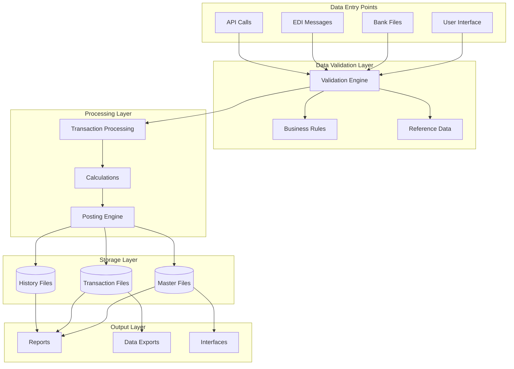

## Order-to-Cash Data Flow

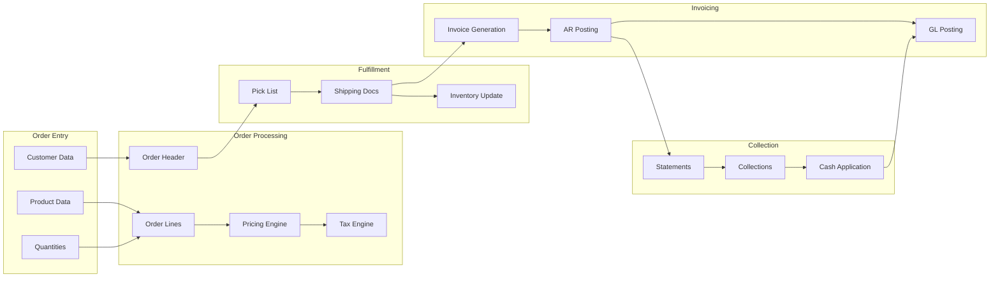

### Order Entry Data Elements

| Data Element | Source | Validations | Transformations |
|-------------|--------|-------------|-----------------|
| Customer Number | UI/EDI | Exists, active, credit | Add check digit |
| Product Code | UI/EDI | Exists, saleable | Expand to full |
| Order Quantity | UI/EDI | Numeric, > 0 | Round to pack |
| Price | System | Override authority | Apply discount |
| Tax | System | Valid rate | Calculate amount |

## Procure-to-Pay Data Flow

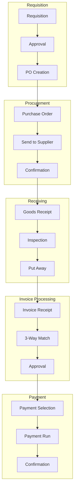

## General Ledger Data Flow

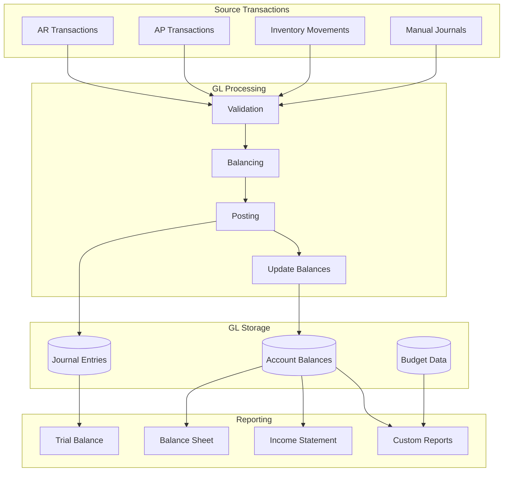

## Master Data Flow

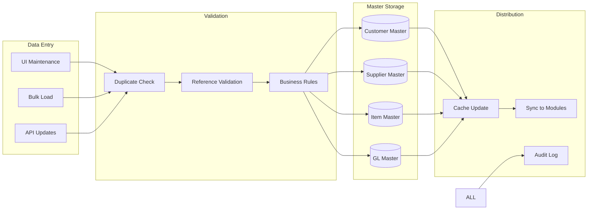

## Batch Processing Data Flow

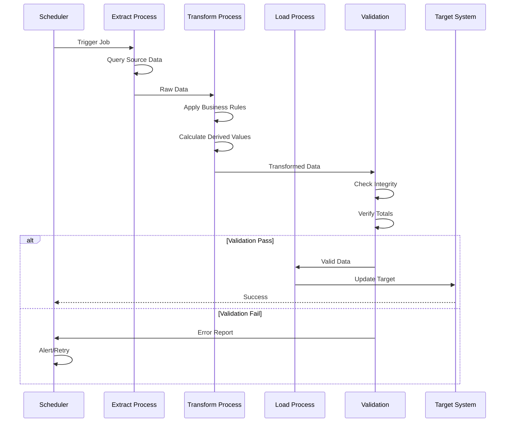

## Real-Time Integration Data Flow

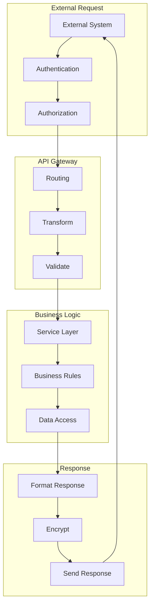

## Error Data Flow

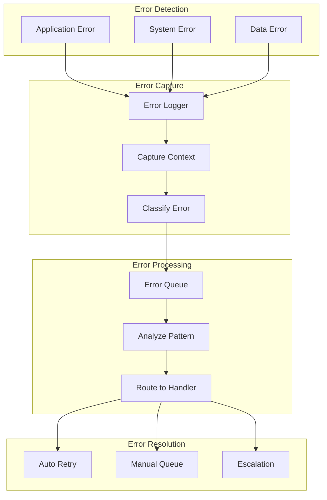

## Report Generation Data Flow

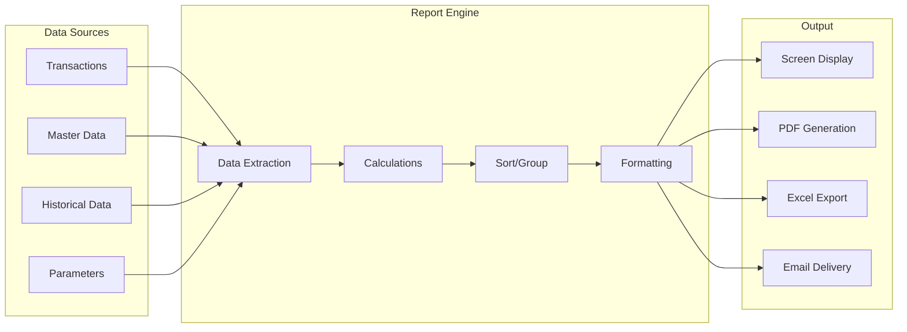

## Data Lifecycle Flow

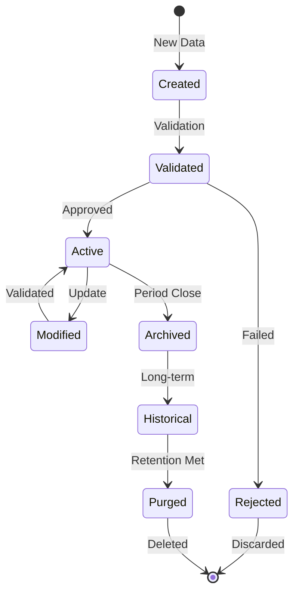

## Performance-Critical Data Flows

### High-Volume Transaction Flow

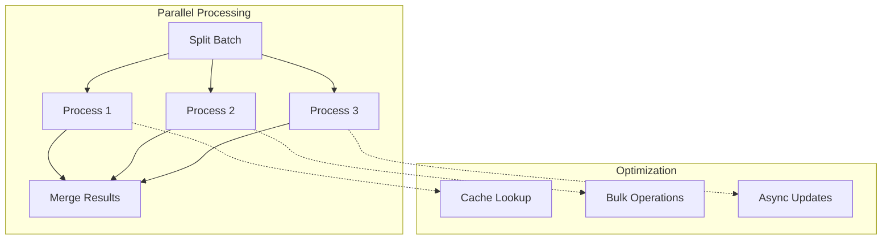

## Data Security Flow

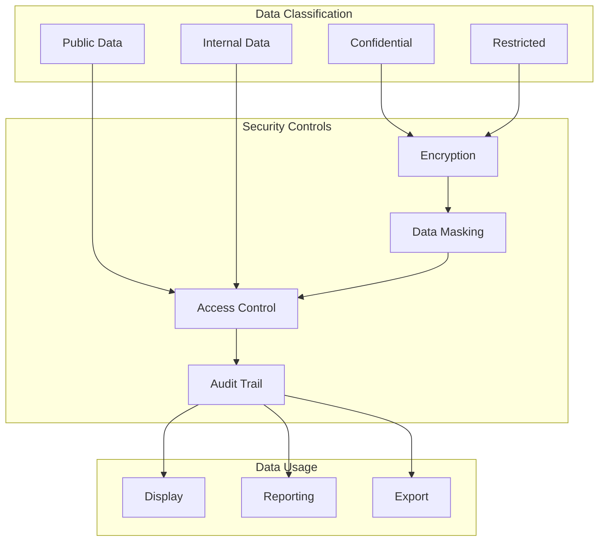