# ACAS State Transition Diagrams

## Overview

This document captures the state transitions for key business entities and processes within the ACAS system. Understanding these state machines is crucial for maintaining data integrity and business rule compliance during migration.

## Customer Order State Transitions

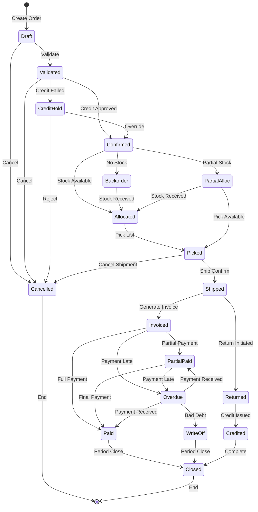

### Order State Business Rules

| State | Allowed Actions | Restrictions |
|-------|----------------|--------------|
| Draft | Edit all fields, delete | No GL impact |
| Validated | Edit quantity, cancel | Credit check required |
| Confirmed | Cancel with approval | Inventory allocated |
| Shipped | Return only | Cannot cancel |
| Invoiced | Apply payments | Cannot edit |
| Paid | View only | Locked |

## Purchase Order State Transitions

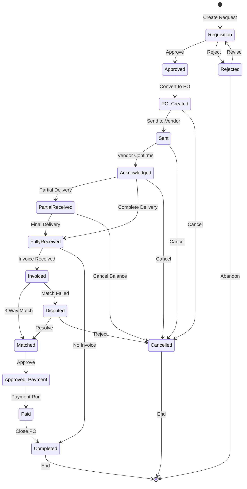

## Invoice Lifecycle States

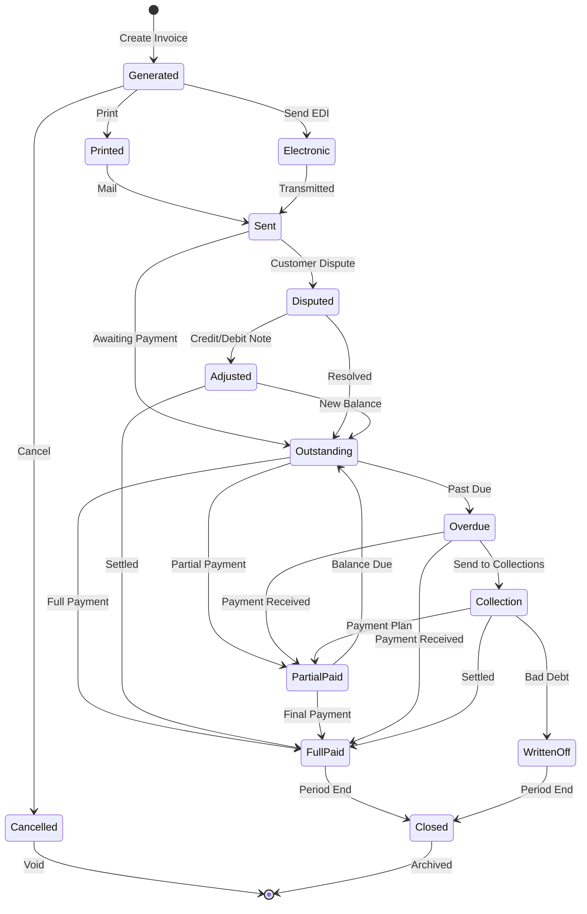

## Inventory Item States

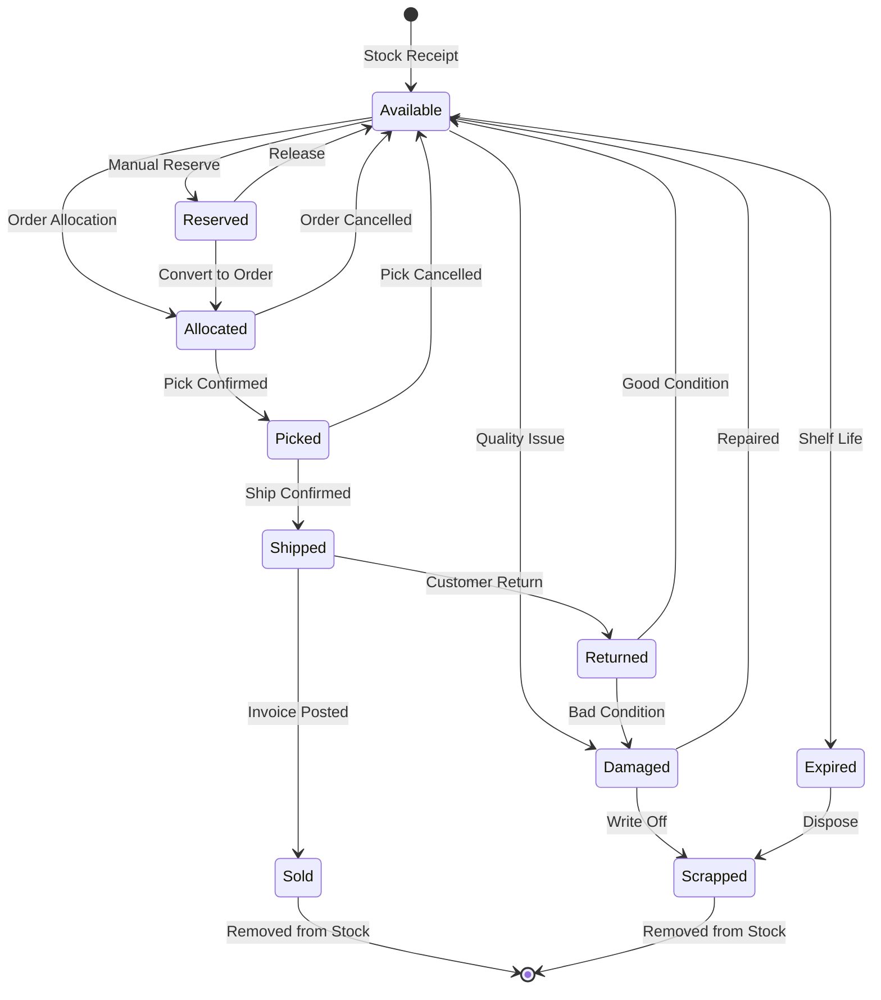

## GL Period States

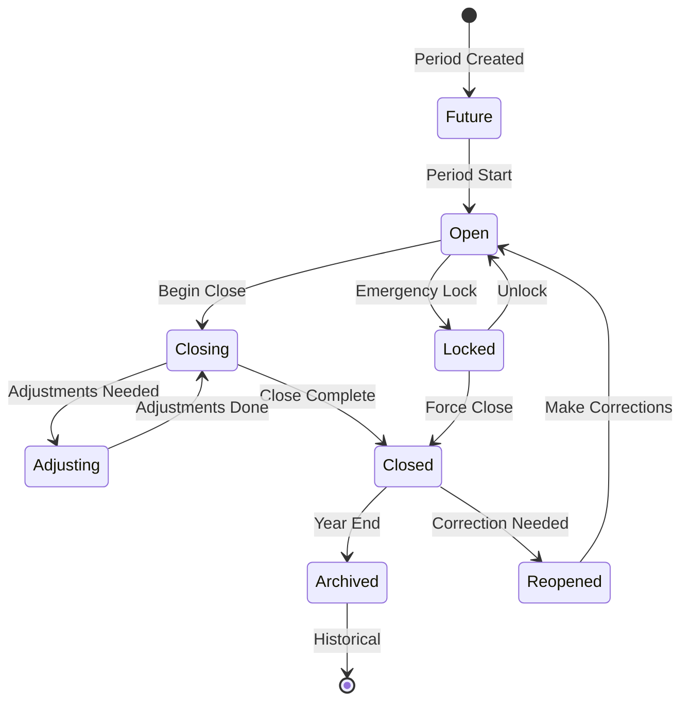

### Period State Rules

| State | Posting Allowed | Actions Available |
|-------|----------------|-------------------|
| Future | No | Open when current |
| Open | Yes | Post, close, lock |
| Closing | Limited | Adjustments only |
| Closed | No | Reopen with approval |
| Archived | No | Read only |

## User Session States

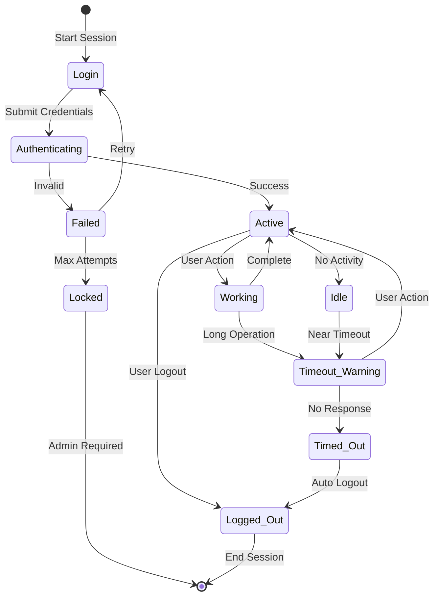

## Batch Job States

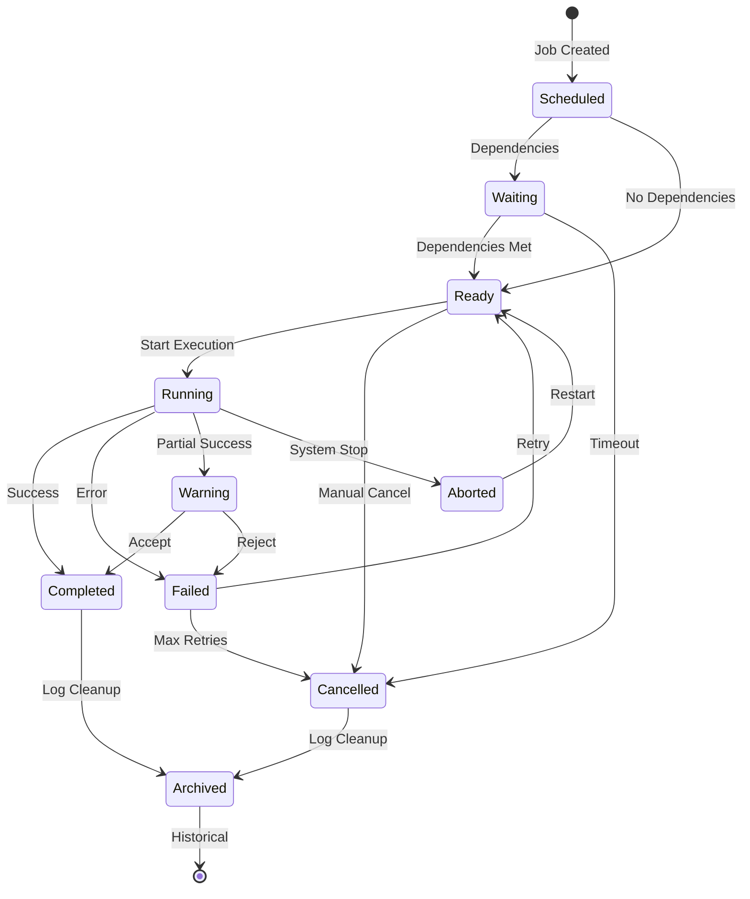

## Payment States

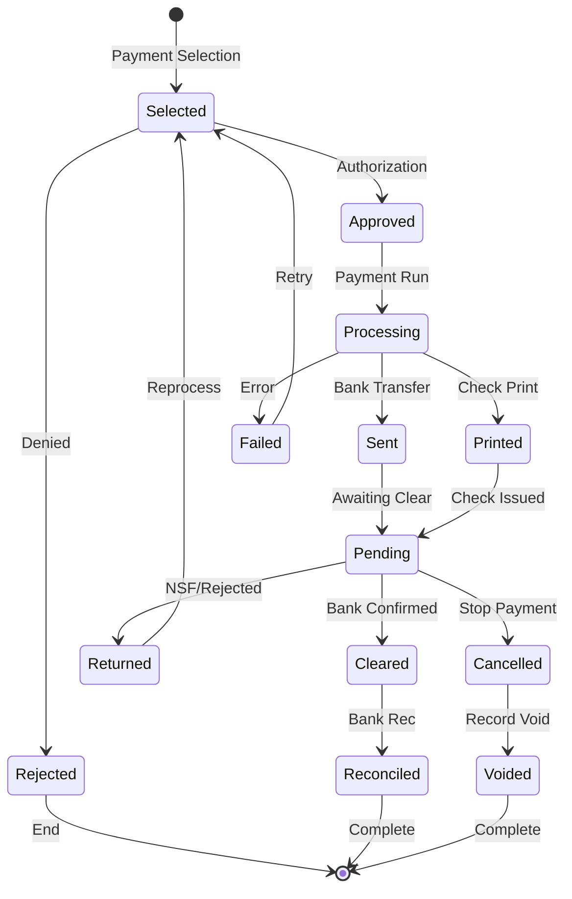

## Document Approval Workflow States

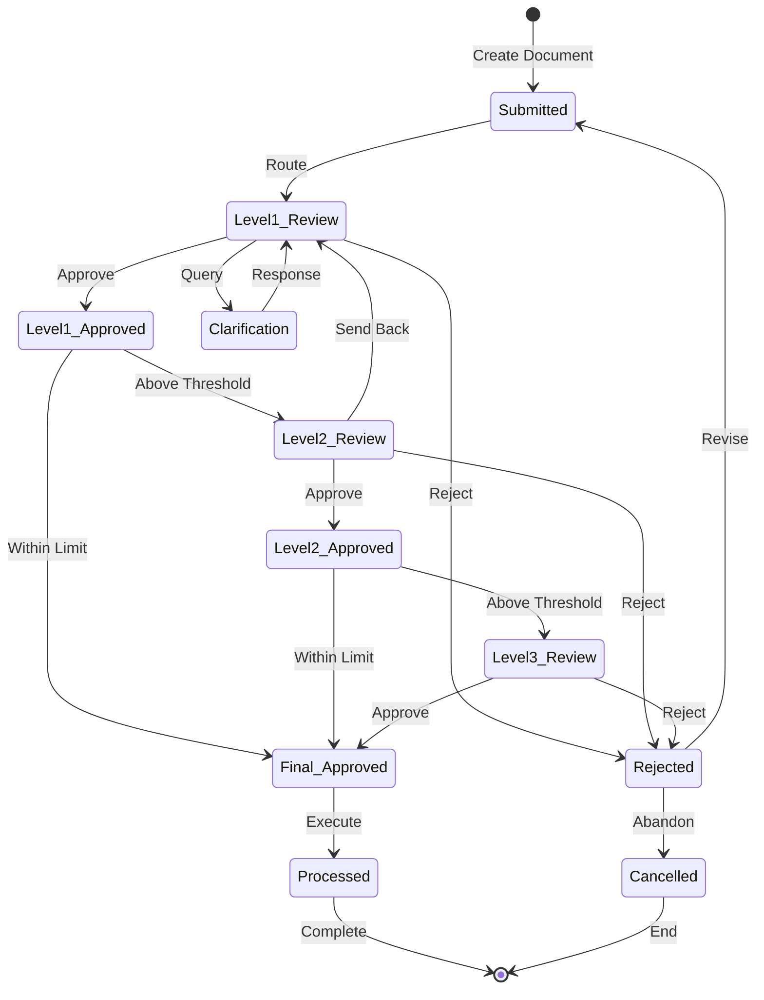

## Master Data Record States

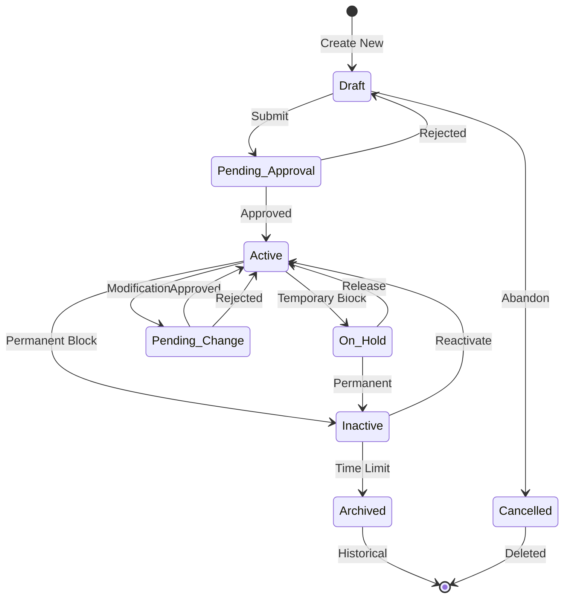

## Transaction Processing States

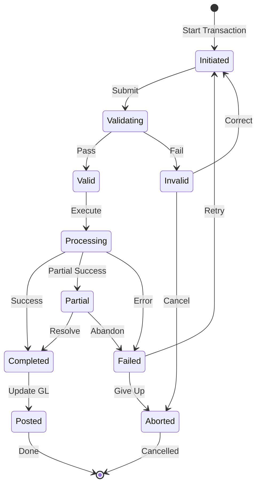

## State Transition Audit Requirements

### Audit Information Captured

For each state transition:
- Previous state
- New state  
- Timestamp
- User/System ID
- Reason code
- Authorization (if required)
- Related transaction ID

### State History Retention

| Entity Type | Retention Period | Archive Method |
|-------------|-----------------|----------------|
| Financial Transactions | 7 years | Compressed archive |
| Master Data | Lifetime + 3 years | Full history |
| User Sessions | 90 days | Rolling deletion |
| Batch Jobs | 1 year | Summary only |
| System States | 30 days | Log rotation |