# ACAS Subsystem Interaction Diagrams

## Overview

This document provides detailed interaction diagrams showing how the 14 ACAS subsystems communicate and collaborate to deliver business functionality.

## Master Subsystem Interaction Map

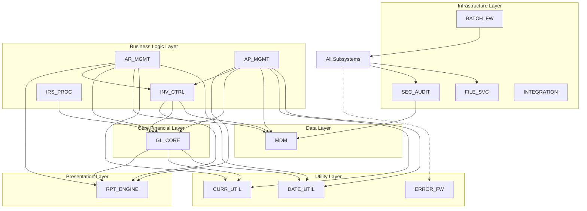

## Interaction Patterns

### 1. Synchronous Request-Response Pattern

Used for real-time data access and validation

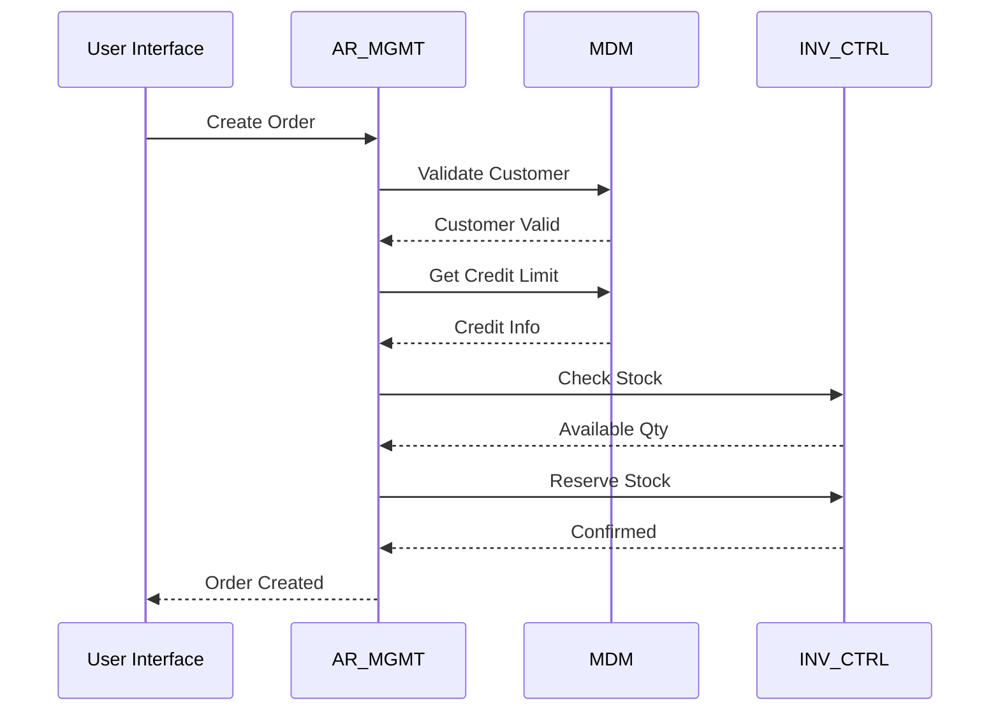

### 2. Asynchronous Batch Pattern

Used for bulk processing and GL posting

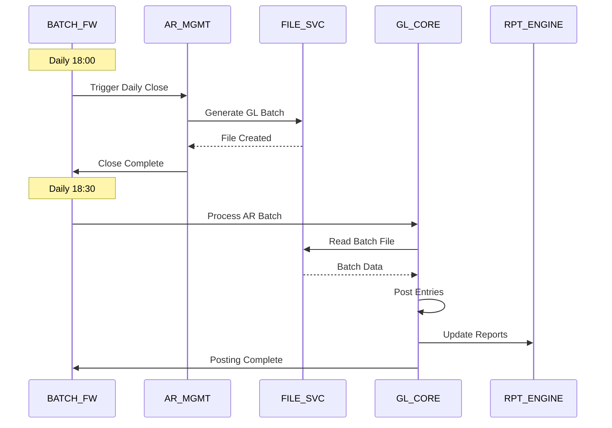

### 3. Event-Driven Pattern

Used for audit and monitoring

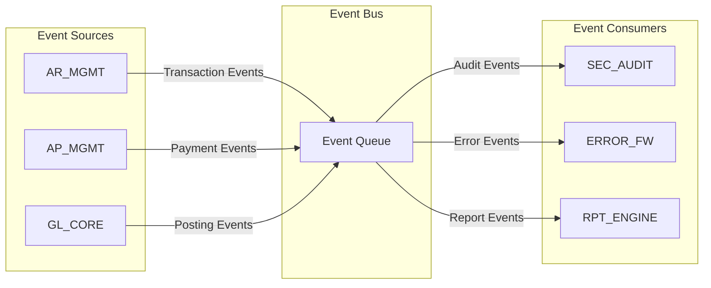

## Critical Interaction Flows

### Order-to-Cash Interaction Flow

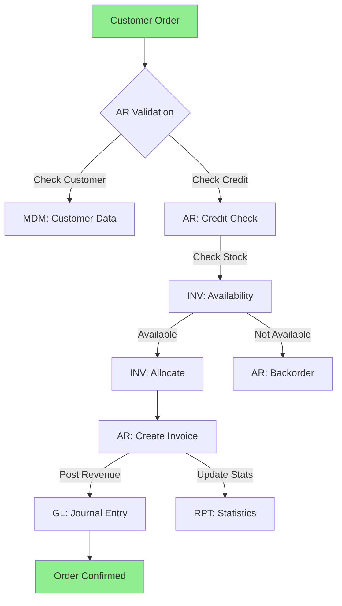

### Month-End Close Interaction Flow

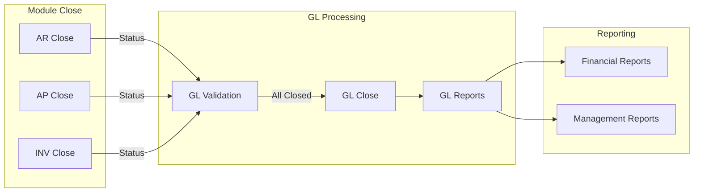

## Subsystem Communication Matrix

Detailed interaction frequency and data volumes:

| From | To | Type | Frequency | Volume | Critical? |
|------|----|----|-----------|---------|-----------|
| AR_MGMT | MDM | Sync | Per transaction | High | Yes |
| AR_MGMT | INV_CTRL | Sync | Per order line | High | Yes |
| AR_MGMT | GL_CORE | Batch | Daily | Medium | Yes |
| AP_MGMT | MDM | Sync | Per transaction | Medium | Yes |
| AP_MGMT | INV_CTRL | Sync | Per receipt | Medium | Yes |
| AP_MGMT | GL_CORE | Batch | Daily | Medium | Yes |
| INV_CTRL | GL_CORE | Batch | Daily | Low | Yes |
| IRS_PROC | GL_CORE | Batch | Weekly | Low | No |
| ALL | FILE_SVC | Sync | Continuous | Very High | Yes |
| ALL | ERROR_FW | Async | As needed | Low | No |
| ALL | SEC_AUDIT | Async | Continuous | Medium | Yes |
| BATCH_FW | ALL | Control | Scheduled | Low | Yes |

## Performance-Critical Interactions

### High-Performance Requirements

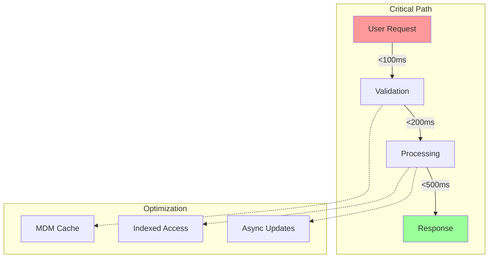

Target response times:
- Customer lookup: <100ms (cached)
- Stock check: <200ms
- Order creation: <2s total
- Report generation: <30s

## Error Propagation Paths

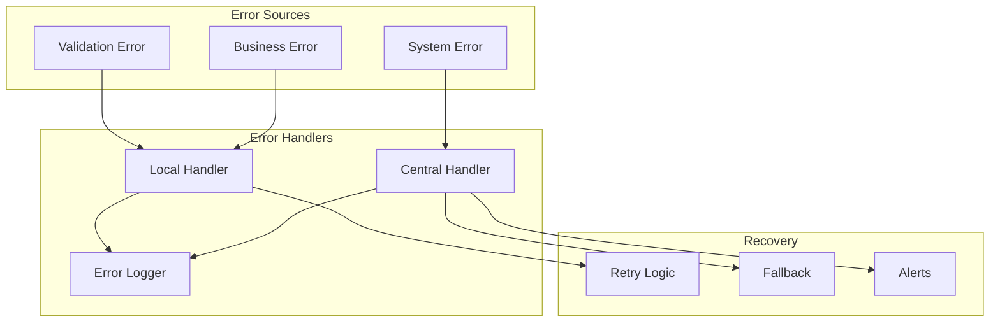

## Security Interaction Patterns

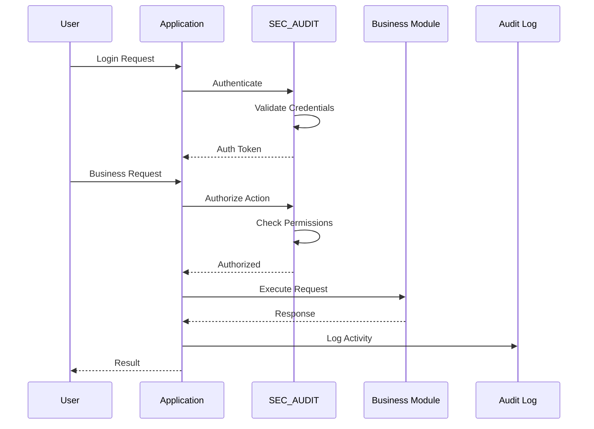

## Batch Processing Interactions

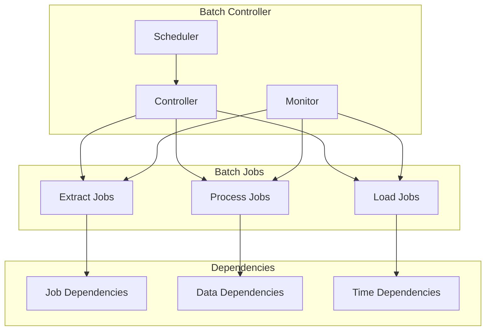

## Integration Service Interactions

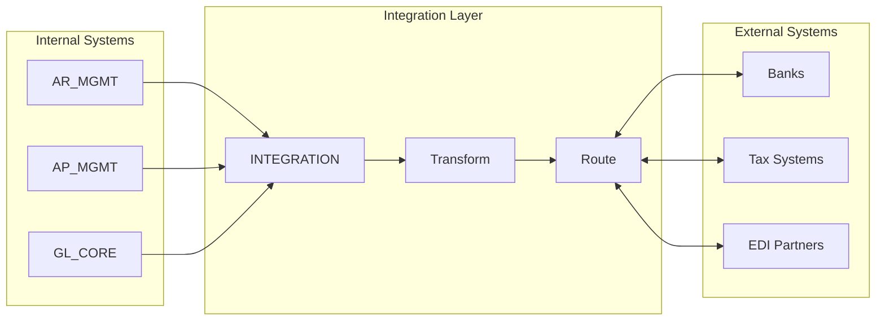

## Real-Time vs Batch Decision Matrix

| Interaction | Current | Target | Rationale |
|------------|---------|--------|-----------|
| Customer validation | Sync | Sync | Immediate feedback |
| Stock check | Sync | Sync | Real-time accuracy |
| GL posting | Batch | Near real-time | Better visibility |
| Report generation | Batch | Mixed | On-demand + scheduled |
| Audit logging | Async | Async | Performance |
| Error handling | Mixed | Async | Decoupling |