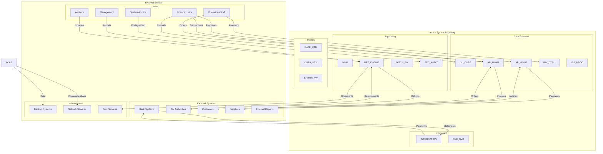
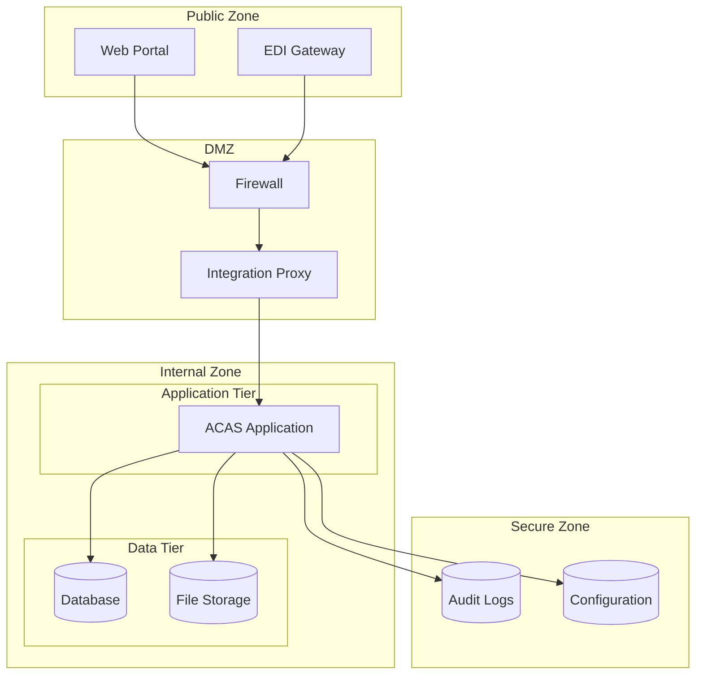
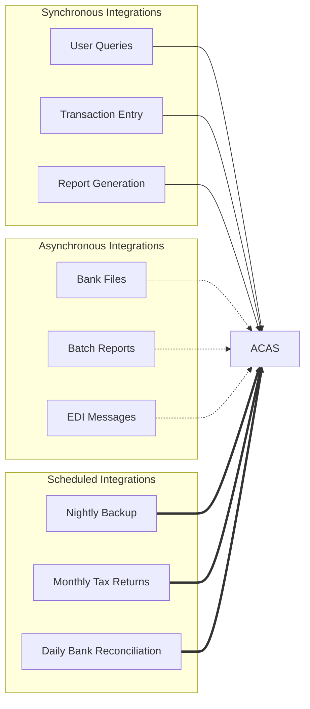

# ACAS System Context Diagram

## Overview

This diagram shows the ACAS system in its operational context, including all external entities that interact with the system and the nature of those interactions.

## System Context Diagram

## Context Relationships

### User Interactions

| User Group | Primary Subsystems | Key Activities |
|-----------|-------------------|----------------|
| Finance Users | GL, AR, AP | Transaction processing, reconciliation |
| Management | RPT, GL | Financial analysis, decision support |
| Operations | AR, AP, INV | Daily processing, customer service |
| System Admins | SEC, FILE | System maintenance, user management |
| Auditors | RPT, SEC | Compliance verification, reports |

### External System Interfaces

| External System | Interface Type | Data Flow | Frequency |
|----------------|---------------|-----------|-----------|
| Bank Systems | File transfer | Bidirectional | Daily |
| Tax Authorities | Report submission | Outbound | Monthly/Quarterly |
| Customers | Orders/Payments | Inbound | Continuous |
| Suppliers | Invoices/Payments | Bidirectional | Daily |

### Infrastructure Dependencies

| Service | Usage | Criticality |
|---------|-------|-------------|
| Backup Systems | Data protection | Critical |
| Network Services | User access, integration | Critical |
| Print Services | Document output | Important |

## Security Zones

## Data Flow Volumes

### Inbound Data Flows

| Source | Data Type | Volume/Day | Peak Time |
|--------|-----------|------------|-----------|
| Customers | Orders | 500-1000 | 10am-2pm |
| Banks | Transactions | 1000-2000 | 6am |
| Suppliers | Invoices | 200-400 | Throughout |
| Users | Queries | 5000+ | 9am-5pm |

### Outbound Data Flows

| Destination | Data Type | Volume/Day | Peak Time |
|------------|-----------|------------|-----------|
| Customers | Invoices | 500-1000 | 5pm |
| Banks | Payments | 200-300 | 4pm |
| Management | Reports | 50-100 | Morning |
| Tax Authority | Returns | Monthly | Month-end |

## System Boundaries

### Included in ACAS
- All financial transaction processing
- Master data management
- Financial reporting
- User security and audit

### External to ACAS
- Email services
- Document management
- HR/Payroll processing
- Manufacturing systems
- CRM functionality

## Integration Points Summary

## Environmental Requirements

### Technical Environment
- Operating System: Linux/Unix
- Database: ISAM files + MySQL/MariaDB
- Runtime: GnuCOBOL
- Network: TCP/IP
- Storage: NAS/SAN

### Operational Environment
- Availability: 24x7 with maintenance windows
- Backup: Daily incremental, weekly full
- Recovery: RTO < 4 hours, RPO < 1 hour
- Support: Business hours + on-call

### Compliance Environment
- Financial regulations
- Tax compliance
- Data privacy laws
- Audit requirements
- Industry standards