# AP_MGMT Subsystem - Business Flow Documentation

## Overview

This document details the key business processes and flows within the AP_MGMT subsystem, showing how transactions move through the system from initiation to completion.

## Process Flow Diagrams

### 1. Purchase Order Creation Flow

### 2. Three-Way Match Process

```mermaid
flowchart LR
    subgraph Inputs
        PO[Purchase Order]
        GR[Goods Receipt]
        INV[Supplier Invoice]
    end
    
    subgraph Matching
        PO --> M{Three-Way<br/>Match}
        GR --> M
        INV --> M
    end
    
    subgraph Outcomes
        M -->|Match| A[Auto Approve]
        M -->|Variance| B[Exception Queue]
        M -->|No Match| C[Reject]
    end
    
    A --> P[Post to GL]
    B --> R[Manual Review]
    C --> E[Return to Supplier]
```

### 3. Payment Processing Flow

### 4. Month-End Accrual Process

## Detailed Process Descriptions

### Purchase Order Workflow

#### Process Steps:

1. **Initiation**
   - Manual entry through pl020 program
   - Automatic generation from inventory reorder points
   - Requisition conversion from other departments

2. **Validation**
   - Supplier active status check
   - Item/service validation
   - Budget availability verification
   - Approval hierarchy determination

3. **Approval Routing**
   - Amount-based approval levels
   - Department head sign-off
   - Special approval for capital items
   - Emergency purchase procedures

4. **PO Generation**
   - Sequential PO number assignment
   - Terms and conditions attachment
   - Delivery instruction specification
   - Copy distribution (supplier, receiving, AP)

5. **Communication**
   - Email/fax to supplier
   - EDI transmission where available
   - Confirmation tracking
   - Amendment procedures

### Invoice Processing Workflow

#### Process Steps:

1. **Invoice Receipt**
   - Mail receipt and scanning
   - EDI automatic loading
   - Email attachment processing
   - Manual data entry

2. **Initial Validation**
   - Supplier existence check
   - Duplicate invoice prevention
   - Tax calculation verification
   - GL account determination

3. **Matching Process**
   - Locate related PO
   - Find goods receipts
   - Compare quantities/prices
   - Calculate variances

4. **Exception Handling**
   - Price variance investigation
   - Quantity discrepancy resolution
   - Missing receipt follow-up
   - Approval for overrides

5. **Posting**
   - GL distribution creation
   - Tax liability recording
   - Expense accrual reversal
   - Payment terms calculation

### Payment Execution Workflow

#### Process Steps:

1. **Payment Selection**
   - Due date identification
   - Discount opportunity analysis
   - Cash forecast consideration
   - Supplier priority weighting

2. **Batch Creation**
   - Payment method selection
   - Bank account assignment
   - Check number allocation
   - Remittance detail preparation

3. **Approval Process**
   - Batch total verification
   - Authorized signatory review
   - Special payment approval
   - Hold/release decisions

4. **Payment Generation**
   - Check printing process
   - EFT file creation
   - Positive pay file generation
   - Remittance advice production

5. **Reconciliation**
   - Bank statement matching
   - Cleared check recording
   - Outstanding item tracking
   - Void/stop payment processing

## State Transition Diagrams

### Purchase Order States

### Invoice Lifecycle

## Business Rules in Flows

### Purchase Order Rules

1. **Approval Hierarchy**
   - < $1,000: Supervisor approval
   - < $10,000: Manager approval
   - >= $10,000: Director approval
   - >= $50,000: CFO approval

2. **Supplier Selection**
   - Preferred supplier check
   - Competitive bid requirement > $5,000
   - Sole source justification
   - Supplier performance rating

3. **Budget Controls**
   - Department budget check
   - Capital vs expense determination
   - Year-end cutoff rules
   - Emergency purchase procedures

### Invoice Processing Rules

1. **Matching Tolerances**
   - Price: 5% or $100 (lesser)
   - Quantity: 2% or 10 units (lesser)
   - Tax: Must match exactly
   - Freight: $50 variance allowed

2. **Payment Terms**
   - Standard: Net 30
   - Discount: 2/10 Net 30
   - Immediate: COD/Prepay
   - Extended: Net 60/90 with approval

3. **Duplicate Prevention**
   - Supplier + Invoice Number unique
   - Amount + Date check
   - Warning on similar amounts
   - Override with reason code

### Payment Processing Rules

1. **Payment Prioritization**
   - Critical suppliers first
   - Discount capture priority
   - Aged invoice consideration
   - Cash position constraints

2. **Check Controls**
   - Sequential numbering
   - Void tracking
   - Signature rules by amount
   - Positive pay inclusion

3. **EFT Processing**
   - Prenote requirement
   - Account verification
   - Daily cutoff times
   - International wire approval

## Integration Points in Flows

### With GL_CORE
- Invoice posting creates journal entries
- Payment execution updates cash accounts
- Accruals post at month-end
- Reversals process automatically

### With INV_CTRL
- PO creation reserves inventory
- Goods receipt updates quantities
- Cost variances flag for review
- Returns process credits

### With MDM
- Supplier data validation
- Payment terms lookup
- Tax code determination
- Bank account verification

### With RPT_ENGINE
- Aged payables data extract
- Cash requirements forecast
- Spend analysis metrics
- Supplier performance KPIs

## Exception Handling

### Common Exceptions

1. **Supplier Issues**
   - Inactive supplier
   - Missing tax information
   - Invalid bank details
   - Credit hold status

2. **Matching Failures**
   - Price variance
   - Quantity mismatch
   - Missing PO
   - No goods receipt

3. **Payment Problems**
   - Insufficient funds
   - Invalid account
   - Check void required
   - Duplicate payment

### Resolution Procedures

1. **Escalation Path**
   - AP clerk investigation
   - Supervisor review
   - Manager approval
   - CFO override

2. **Documentation Requirements**
   - Exception reason codes
   - Supporting documentation
   - Approval evidence
   - Audit trail maintenance

## Performance Metrics

### Key Performance Indicators

1. **Processing Efficiency**
   - Invoices processed per day
   - Average processing time
   - First-pass match rate
   - Exception resolution time

2. **Payment Performance**
   - On-time payment rate
   - Discount capture rate
   - Payment accuracy
   - Duplicate payment rate

3. **Control Effectiveness**
   - PO compliance rate
   - Three-way match rate
   - Approval policy adherence
   - Segregation of duties

### Service Level Agreements

1. **Processing Times**
   - Invoice entry: Same day
   - PO approval: 24 hours
   - Payment processing: 48 hours
   - Query resolution: 24 hours

2. **Accuracy Targets**
   - Data entry: 99.5%
   - Payment accuracy: 99.9%
   - GL posting: 100%
   - Supplier data: 99%

## Compliance Checkpoints

### SOX Controls
- Segregation of duties enforced
- Approval limits system-enforced
- Audit trail complete
- Period controls active

### Tax Compliance
- 1099 tracking automated
- Sales tax calculation verified
- Use tax accrual processed
- Filing deadlines monitored

### Internal Audit Points
- Vendor master changes logged
- Payment approval documented
- Bank reconciliation timely
- Outstanding items investigated