# AR_MGMT Process Flows

## Overview

This document details the key business process flows within the AR_MGMT subsystem. These flows represent the complete order-to-cash cycle and all supporting processes for managing customer relationships and revenue collection.

## Major Process Flows

### 1. Order-to-Cash Complete Flow

**Purpose**: End-to-end process from customer order through cash collection

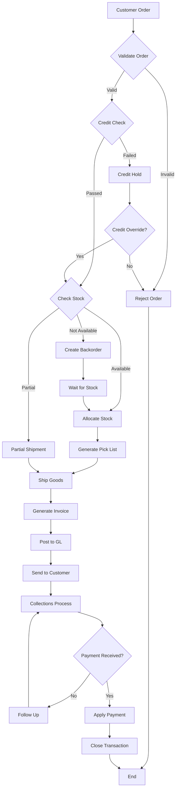

---

### 2. Credit Management Flow

**Purpose**: Manage customer credit limits and authorization

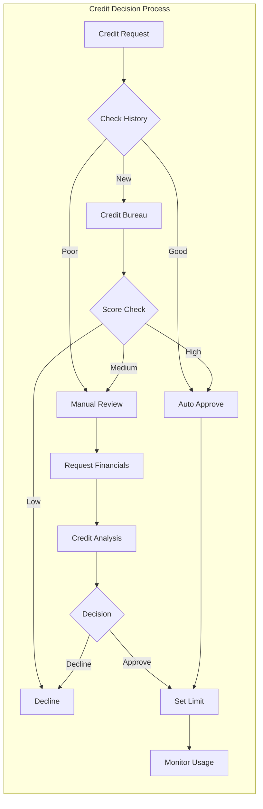

**Credit Monitoring Process**:

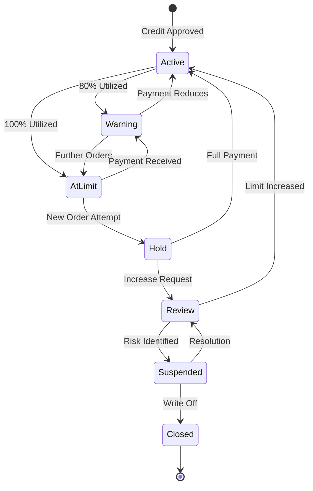

---

### 3. Invoice Generation Flow

**Purpose**: Create and distribute customer invoices

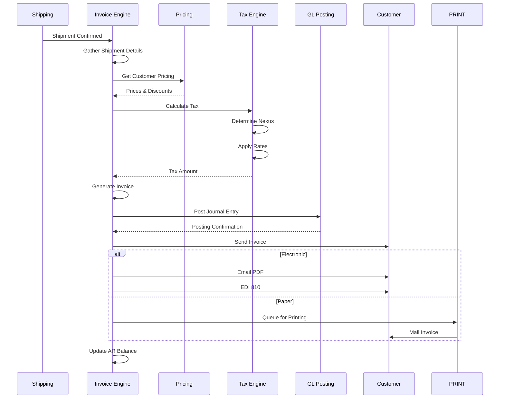

---

### 4. Cash Application Flow

**Purpose**: Apply customer payments to open invoices

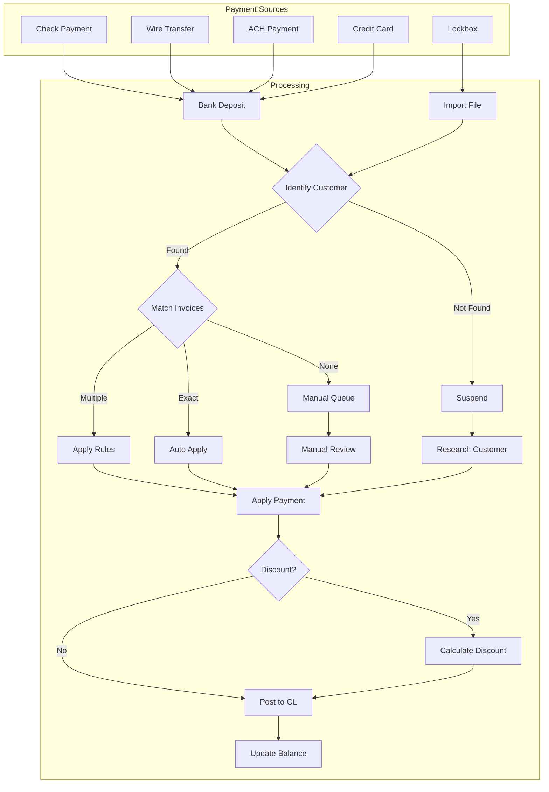

**Payment Application Rules**:

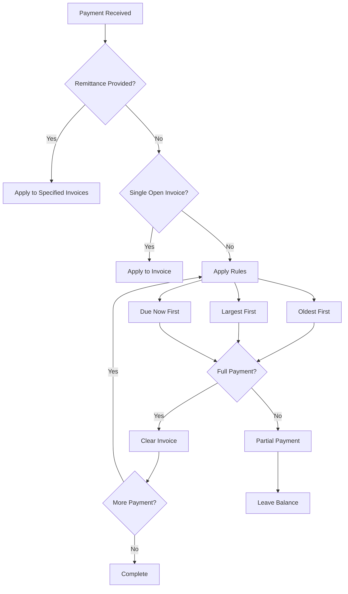

---

### 5. Collections Process Flow

**Purpose**: Systematic follow-up on overdue accounts

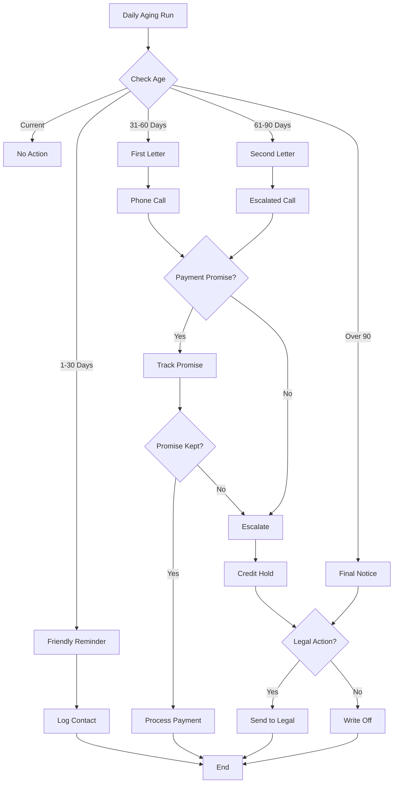

---

### 6. Customer Statement Generation

**Purpose**: Produce monthly customer account statements

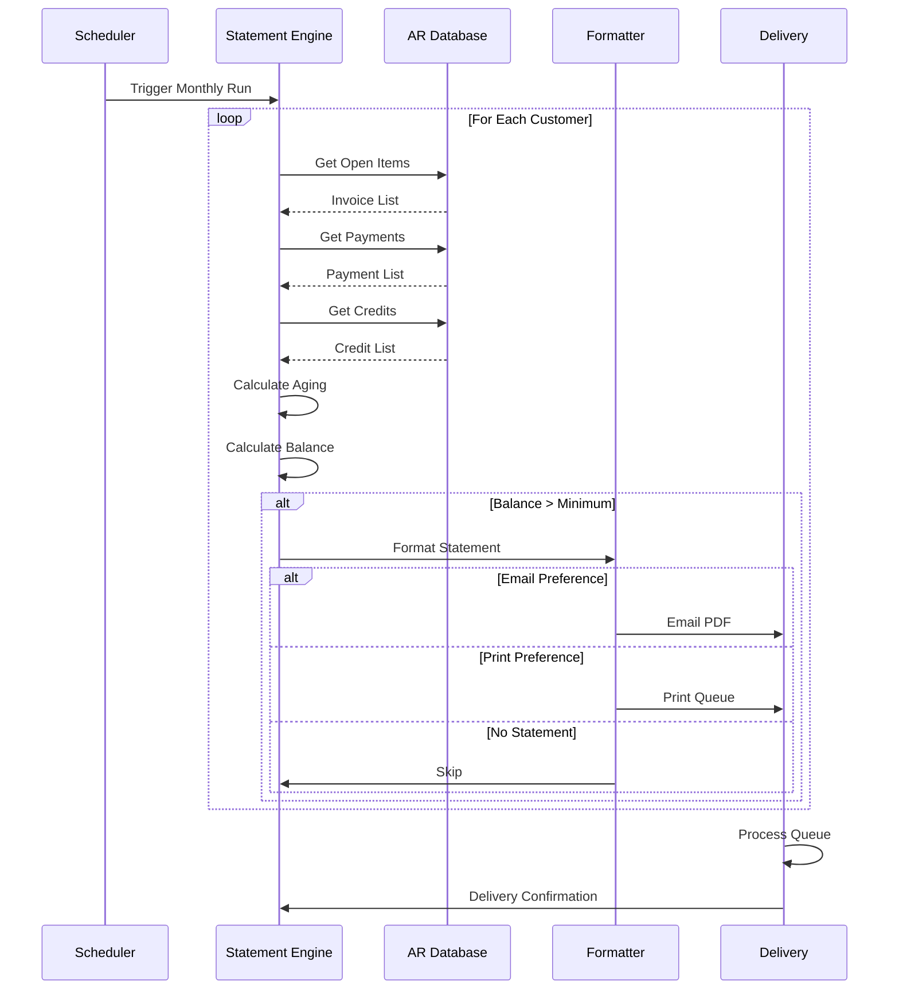

---

### 7. Order Entry Process Flow

**Purpose**: Capture and validate customer orders

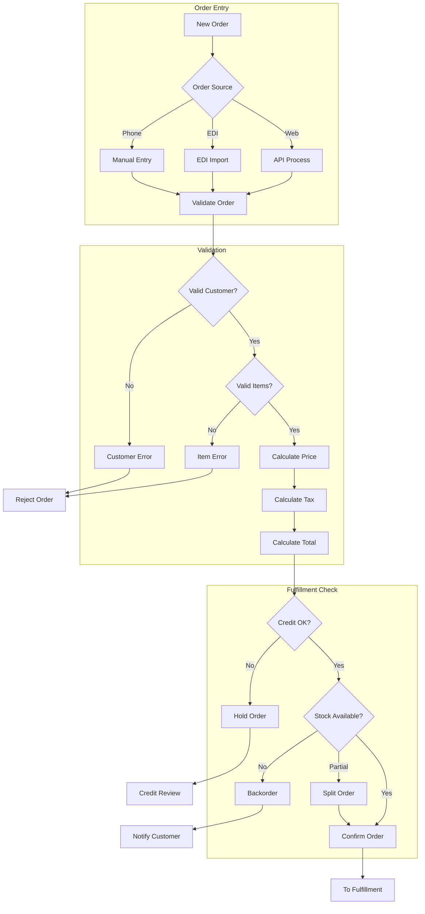

---

### 8. Month-End AR Close Process

**Purpose**: Close AR period and reconcile to GL

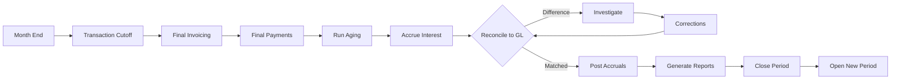

---

## Integration Flow Points

### With Inventory (INV_CTRL)

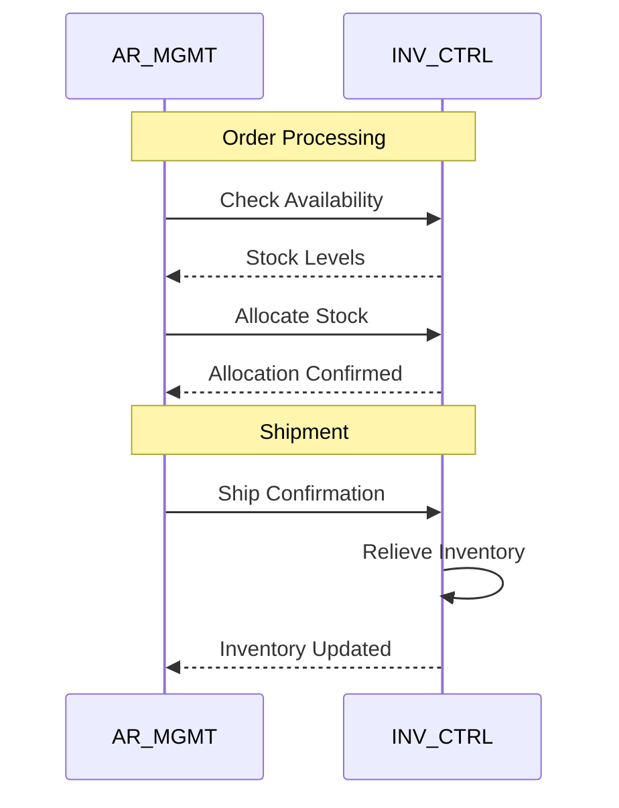

### With General Ledger (GL_CORE)

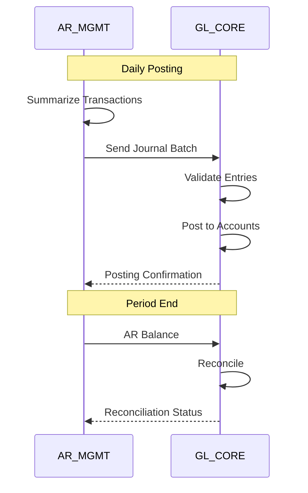

---

## Error Handling Flows

### Payment Application Errors

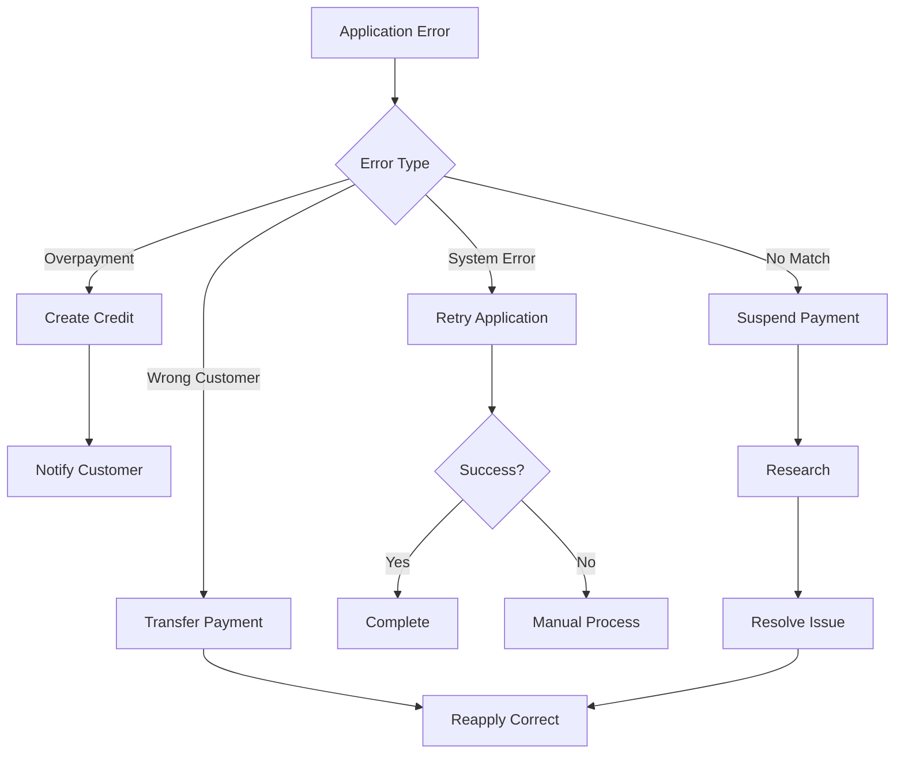

---

## Key Decision Points

### Order Processing Decisions

| Decision Point | Criteria | Action |
|---------------|----------|--------|
| Accept Order? | Credit OK, Stock available | Confirm or reject |
| Ship Partial? | Some items available | Ship available or wait |
| Apply Discount? | Within terms, good standing | Apply or skip |
| Charge Interest? | Past due date | Calculate or waive |

### Collection Decisions

| Decision Point | Criteria | Action |
|---------------|----------|--------|
| Collection Action? | Days overdue, amount | Letter, call, or legal |
| Write Off? | Age, amount, cost/benefit | Write off or pursue |
| Credit Hold? | Payment history | Hold or continue |
| Settlement Offer? | Collection likelihood | Offer or full amount |