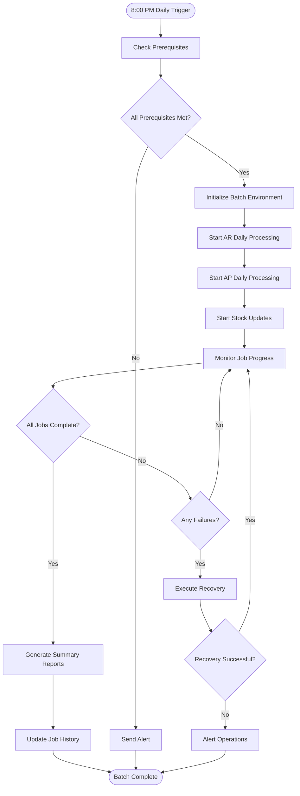
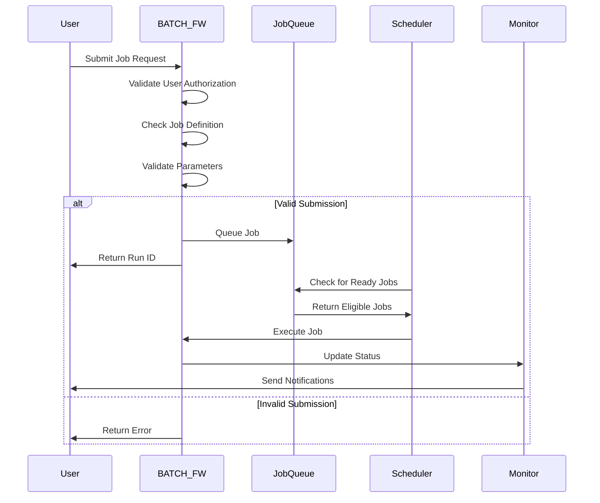
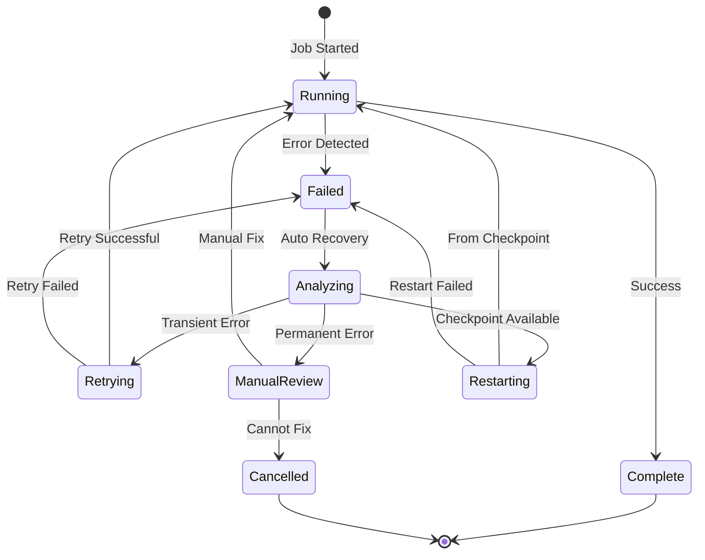
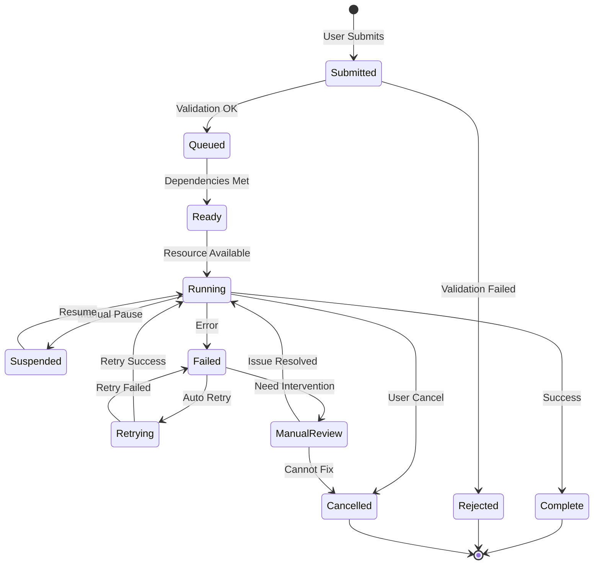
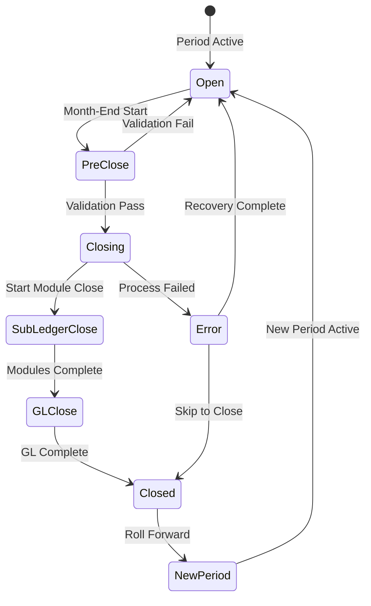
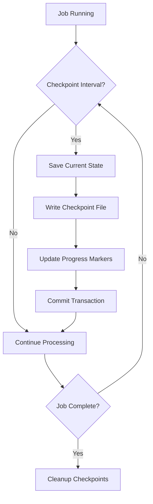
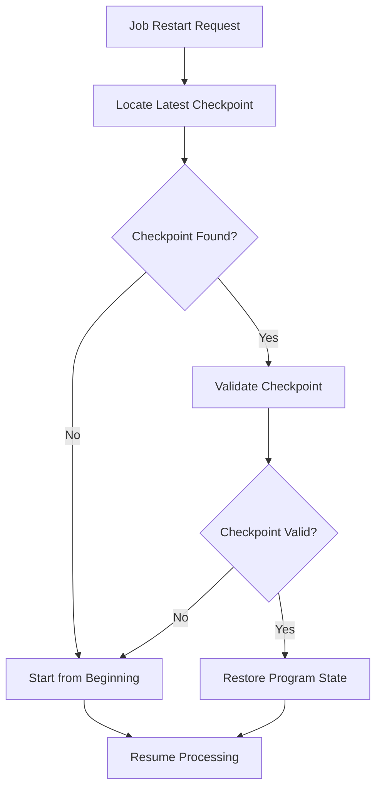

# BATCH_FW Subsystem - Business Flow Documentation

## Overview

This document details the key batch processing flows within the BATCH_FW subsystem, showing how jobs are scheduled, executed, monitored, and recovered across the entire ACAS system.

## Process Flow Diagrams

### 1. Daily Batch Processing Flow



### 2. Job Submission and Scheduling Flow



### 3. Period-End Processing Flow

```mermaid
flowchart LR
    subgraph "Phase 1: Preparation"
        A[Verify Daily Batches] --> B[Check Open Transactions]
        B --> C[User Authorization]
    end
    
    subgraph "Phase 2: Module Close"
        D[SL Month-End] --> E[PL Month-End]
        E --> F[ST Month-End]
        F --> G[Wait All Complete]
    end
    
    subgraph "Phase 3: GL Close"
        H[Post Accruals] --> I[GL Month-End]
        I --> J[Trial Balance]
        J --> K[Financial Statements]
    end
    
    subgraph "Phase 4: New Period"
        L[Open New Period] --> M[Reset Counters]
        M --> N[Archive Data]
    end
    
    C --> D
    G --> H
    K --> L
```



### 4. Error Recovery and Restart Flow



## Detailed Process Descriptions

### Job Lifecycle Management

#### Process Steps:

1. **Job Definition**
   - Register job in job master
   - Define dependencies and parameters
   - Set scheduling rules
   - Configure error handling

2. **Schedule Evaluation**
   - Time-based trigger evaluation
   - Dependency checking
   - Resource availability assessment
   - Queue position determination

3. **Job Execution**
   - Environment setup
   - Parameter validation
   - Program invocation
   - Progress monitoring

4. **Status Tracking**
   - Real-time status updates
   - Progress percentage calculation
   - Estimated completion time
   - Resource utilization monitoring

5. **Completion Processing**
   - Result validation
   - Status finalization
   - Notification sending
   - History recording

### Daily Batch Processing Workflow

#### Process Steps:

1. **Pre-Batch Validation**
   ```
   Check business day status
   Verify system resources available
   Confirm no critical jobs running
   Validate data integrity
   ```

2. **Module Processing Sequence**
   ```
   19:00 - Start AP automatic matching (pl810)
   20:00 - Start AR daily processing (sl800)
   21:00 - Start AR auto invoicing (sl810)
   22:00 - Start stock movements processing
   23:00 - Generate daily reports
   ```

3. **Monitoring and Control**
   - Real-time job status tracking
   - Progress milestone checking
   - Resource utilization monitoring
   - Error detection and alerting

4. **Post-Processing**
   - Generate batch summary
   - Update system statistics
   - Prepare for next day
   - Archive log files

### Month-End Processing Workflow

#### Process Steps:

1. **Month-End Initiation**
   ```
   Validate all daily batches complete
   Check for open transactions
   Verify cut-off procedures
   Obtain user authorization
   ```

2. **Sequential Module Processing**
   ```
   Phase 1: Sub-ledger month-ends
   - SL900 (Sales Ledger)
   - PL900 (Purchase Ledger) 
   - ST900 (Stock Control)
   
   Phase 2: GL processing
   - Post period accruals
   - GL900 (General Ledger)
   - Generate trial balance
   ```

3. **Validation and Reporting**
   - Control total reconciliation
   - Period balance verification
   - Financial statement generation
   - Variance analysis reports

4. **Period Rollover**
   - Close current period
   - Open new period
   - Reset period counters
   - Archive period data

### Error Handling and Recovery Workflow

#### Process Steps:

1. **Error Detection**
   ```
   System errors (file access, memory)
   Data errors (validation, integrity)
   Business errors (out of balance)
   Resource errors (timeout, space)
   ```

2. **Error Classification**
   ```
   Transient: Network, resource temporary unavailable
   Permanent: Data corruption, program error
   Business: Validation failure, business rule violation
   System: Hardware, OS, infrastructure
   ```

3. **Recovery Strategy Selection**
   ```
   IF transient-error
     RETRY with exponential backoff
   ELSE IF checkpoint-available
     RESTART from last checkpoint
   ELSE IF data-error
     ROUTE to manual correction queue
   ELSE
     ESCALATE to operations team
   ```

4. **Recovery Execution**
   - Apply selected recovery strategy
   - Monitor recovery progress
   - Validate recovery success
   - Resume normal processing

## State Transition Diagrams

### Job State Lifecycle



### Period Processing States



## Integration Workflows

### Cross-Module Dependencies

#### Sales-to-GL Flow
```
SL800 (Daily Processing) → SL810 (Auto Invoice) → GL Interface
│
├── Update customer balances
├── Generate GL entries
└── Post to nominal ledger
```

#### Purchase-to-GL Flow
```
PL810 (Invoice Matching) → PL900 (Month-End) → GL Interface
│
├── Create accruals
├── Post expense entries
└── Update supplier balances
```

#### Stock-to-GL Flow
```
ST800 (Movement Update) → ST900 (Valuation) → GL Interface
│
├── Update inventory values
├── Post cost of sales
└── Generate variance entries
```

### Checkpoint Management

#### Checkpoint Creation Flow


#### Restart from Checkpoint Flow


## Business Rules in Flows

### Scheduling Rules

1. **Priority Hierarchy**
   - Critical jobs: Priority 1-10
   - Normal jobs: Priority 11-50
   - Low priority: Priority 51-99

2. **Resource Allocation**
   - Maximum 10 concurrent jobs
   - Critical jobs get 50% of resources
   - Resource-intensive jobs queued separately

3. **Window Management**
   - Business hours: Limited batch processing
   - Overnight window: Full batch capability
   - Weekend: Extended processing window

### Period-End Rules

1. **Prerequisites**
   - All daily batches must complete
   - No open transactions in any module
   - Authorized user must initiate

2. **Sequence Dependencies**
   - Sub-ledgers close before GL
   - GL posts adjustments after sub-ledgers
   - New period opens only after successful close

3. **Validation Checkpoints**
   - Control totals must balance
   - Trial balance must balance
   - All interfaces must complete

### Error Handling Rules

1. **Retry Logic**
   - Transient errors: 3 retries with backoff
   - Data errors: No automatic retry
   - System errors: 1 retry then escalate

2. **Escalation Paths**
   - Job failure: Alert batch operator
   - Critical job failure: Alert manager
   - Period-end failure: Alert CFO

3. **Recovery Procedures**
   - Checkpoint every 1000 records
   - Rollback on data integrity failure
   - Manual intervention for business errors

## Performance Optimization

### Parallel Processing Strategies

1. **Independent Job Parallelism**
   - Run non-dependent jobs concurrently
   - Allocate resources by priority
   - Monitor for resource contention

2. **Data Parallelism**
   - Split large files by key ranges
   - Process chunks independently
   - Merge results at completion

3. **Pipeline Processing**
   - Overlap I/O with computation
   - Stage intermediate results
   - Minimize wait times

### Resource Management

1. **Memory Management**
   - Monitor memory usage per job
   - Implement memory limits
   - Clean up after completion

2. **I/O Optimization**
   - Batch file operations
   - Use sequential access where possible
   - Minimize seek operations

3. **CPU Scheduling**
   - Time-slice CPU-intensive jobs
   - Prioritize interactive operations
   - Balance load across resources

## Monitoring and Alerting

### Key Performance Indicators

1. **Throughput Metrics**
   - Jobs completed per hour
   - Records processed per minute
   - Average job duration

2. **Quality Metrics**
   - Job success rate
   - First-time success rate
   - Error resolution time

3. **Resource Metrics**
   - CPU utilization
   - Memory usage
   - Disk I/O rates

### Alert Conditions

1. **Performance Alerts**
   - Job duration >150% of average
   - Resource utilization >90%
   - Queue backlog >threshold

2. **Error Alerts**
   - Job failure (immediate)
   - Retry exhausted (urgent)
   - Data integrity issue (critical)

3. **Business Alerts**
   - Period-end delay
   - Critical report missing
   - Regulatory deadline risk

## Compliance and Audit

### Audit Trail Requirements

1. **Job Execution Logging**
   - All job submissions logged
   - Complete execution history
   - User and timestamp tracking

2. **Data Change Tracking**
   - Before/after values
   - Source of change
   - Authorization evidence

3. **System Access Logging**
   - User login/logout
   - Privilege escalations
   - Configuration changes

### Compliance Checkpoints

1. **SOX Controls**
   - Segregation of duties enforced
   - Approval workflows documented
   - Change control procedures

2. **Data Retention**
   - Logs retained per policy
   - Archive procedures automated
   - Retrieval capabilities maintained

3. **Recovery Testing**
   - Regular DR testing
   - Backup validation
   - Recovery time measurement