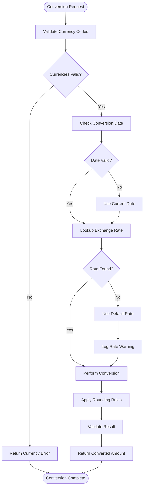
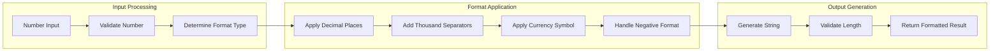

# CURR_UTIL Subsystem - Business Flow Documentation

## Overview

This document details the currency and number processing flows within the CURR_UTIL subsystem, showing how financial calculations, currency conversions, and number formatting are performed consistently across the ACAS system.

## Process Flow Diagrams

### 1. Currency Conversion Flow



### 2. Financial Calculation Flow

```mermaid
sequenceDiagram
    participant Client as Calling Module
    participant Calculator as CURR_UTIL
    parameter Validator as Input Validator
    participant Engine as Calculation Engine
    
    Client->>Calculator: Financial Calculation Request
    Calculator->>Validator: Validate Parameters
    Validator->>Calculator: Validation Result
    
    alt Parameters Valid
        Calculator->>Engine: Execute Calculation
        Engine->>Engine: Apply Formula
        Engine->>Engine: Handle Precision
        Engine->>Calculator: Return Result
        Calculator->>Client: Calculation Complete
    else Invalid Parameters
        Calculator->>Client: Parameter Error
    end
```

### 3. Number Formatting Flow



## Business Rules in Flows

### Currency Conversion Rules
- **RULE_CURR_001**: Exchange rates updated daily from authorized sources
- **RULE_CURR_002**: Historical rates maintained for 5 years
- **RULE_CURR_003**: Default rate applied when specific rate unavailable
- **RULE_CURR_004**: Conversion amounts rounded to currency precision

### Financial Calculation Rules
- **RULE_CALC_001**: Interest calculations use 365-day year unless specified
- **RULE_CALC_002**: Compound interest calculated to 4 decimal places
- **RULE_CALC_003**: Payment calculations rounded to nearest cent
- **RULE_CALC_004**: Depreciation calculated using straight-line method default

### Number Formatting Rules
- **RULE_FMT_001**: Financial amounts display 2 decimal places default
- **RULE_FMT_002**: Thousand separators applied for amounts >999
- **RULE_FMT_003**: Negative amounts displayed in parentheses
- **RULE_FMT_004**: Currency symbols positioned according to locale

### Rounding Rules
- **RULE_RND_001**: Banker's rounding (round to even) used for financial calculations
- **RULE_RND_002**: Tax calculations round up to nearest cent
- **RULE_RND_003**: Currency conversions round to target currency precision
- **RULE_RND_004**: Interest calculations maintain maximum precision until final result