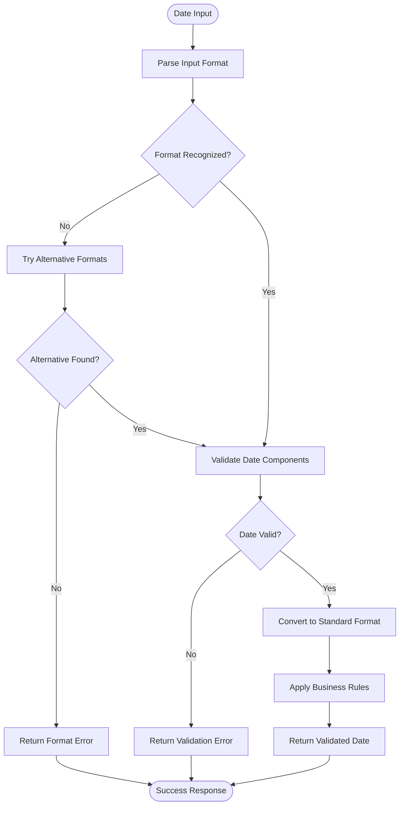
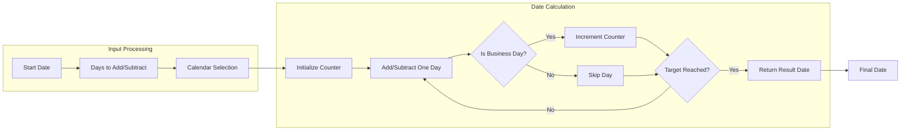

# DATE_UTIL Subsystem - Business Flow Documentation

## Overview

This document details the key date processing flows within the DATE_UTIL subsystem, showing how date operations are performed consistently across the ACAS system.

## Process Flow Diagrams

### 1. Date Validation Flow

### 2. Business Day Calculation Flow

## Business Rules in Flows

### Date Validation Rules
- **RULE_DT_001**: Accept dates in YYYY-MM-DD, DD/MM/YYYY, MM/DD/YYYY formats
- **RULE_DT_002**: Validate leap year calculations for February 29
- **RULE_DT_003**: Reject dates before 1900 or after 2099
- **RULE_DT_004**: Handle century switching for 2-digit years

### Business Day Rules
- **RULE_BD_001**: Standard calendar excludes Saturdays and Sundays
- **RULE_BD_002**: Holiday calendars override standard weekend rules
- **RULE_BD_003**: Banking calendar includes additional financial holidays
- **RULE_BD_004**: Custom calendars support regional variations

### Holiday Management Rules
- **RULE_HD_001**: Fixed holidays repeat annually on same date
- **RULE_HD_002**: Floating holidays calculate based on rules (e.g., first Monday)
- **RULE_HD_003**: Observed holidays move when falling on weekends
- **RULE_HD_004**: Regional calendars support multiple holiday sets