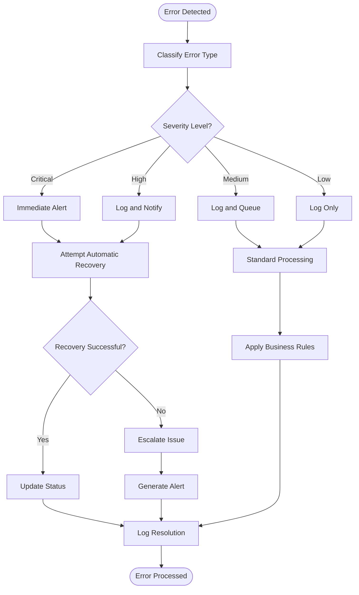
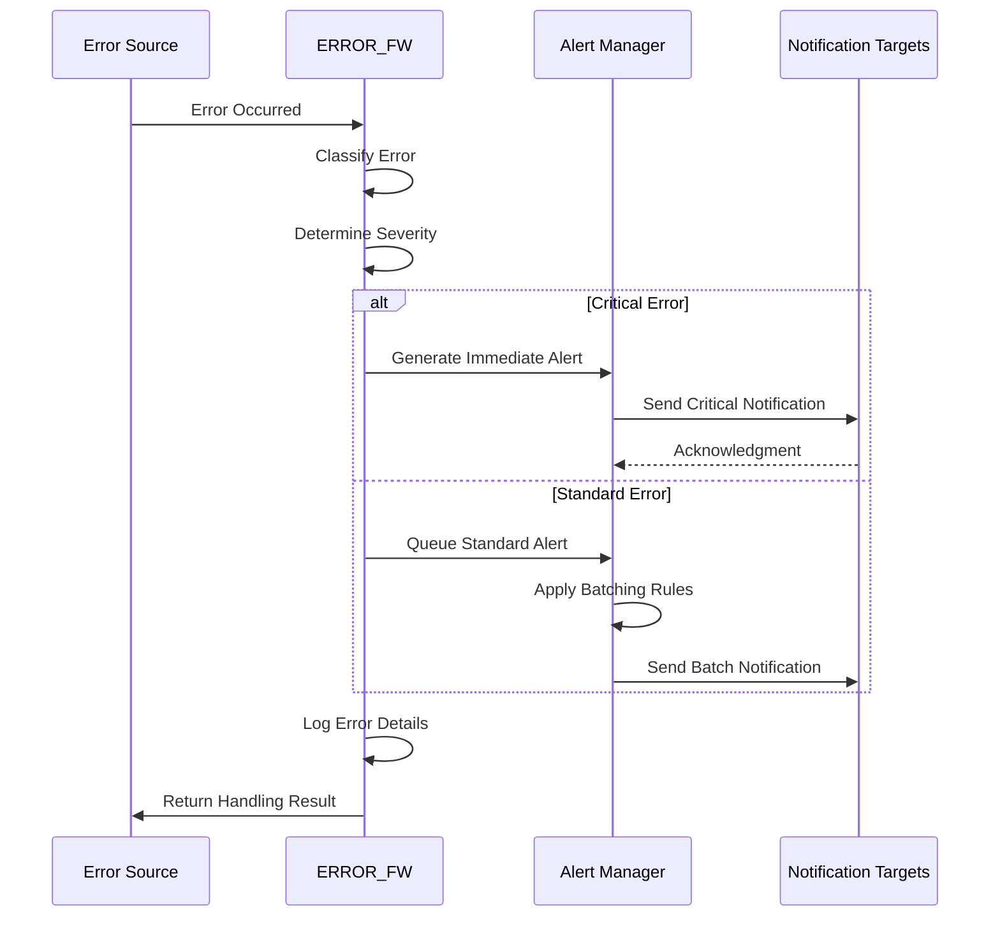

# ERROR_FW Subsystem - Business Flow Documentation

## Overview

This document details the error handling flows within the ERROR_FW subsystem, showing how errors are detected, classified, logged, and resolved throughout the ACAS system.

## Process Flow Diagrams

### 1. Error Detection and Handling Flow

### 2. Alert and Notification Flow

## Business Rules in Flows

### Error Classification Rules
- **RULE_ERR_001**: System errors classified by component and impact
- **RULE_ERR_002**: Business errors classified by module and process
- **RULE_ERR_003**: Security errors require immediate escalation
- **RULE_ERR_004**: Integration errors classified by external system

### Recovery Strategy Rules
- **RULE_REC_001**: Transient errors: Retry up to 3 times with exponential backoff
- **RULE_REC_002**: Resource errors: Queue for retry when resources available
- **RULE_REC_003**: Data errors: Require manual intervention
- **RULE_REC_004**: System errors: Attempt service restart if safe

### Alert Escalation Rules
- **RULE_ALT_001**: Critical errors alert immediately via multiple channels
- **RULE_ALT_002**: High severity errors alert within 15 minutes
- **RULE_ALT_003**: Medium severity errors batch every hour
- **RULE_ALT_004**: Unacknowledged critical alerts escalate after 30 minutes