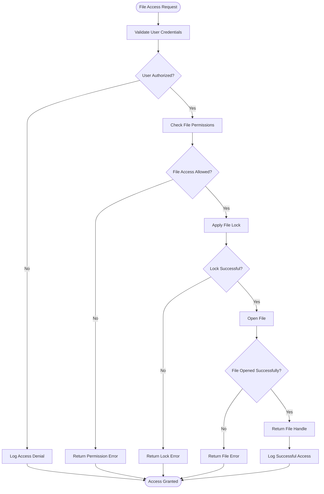
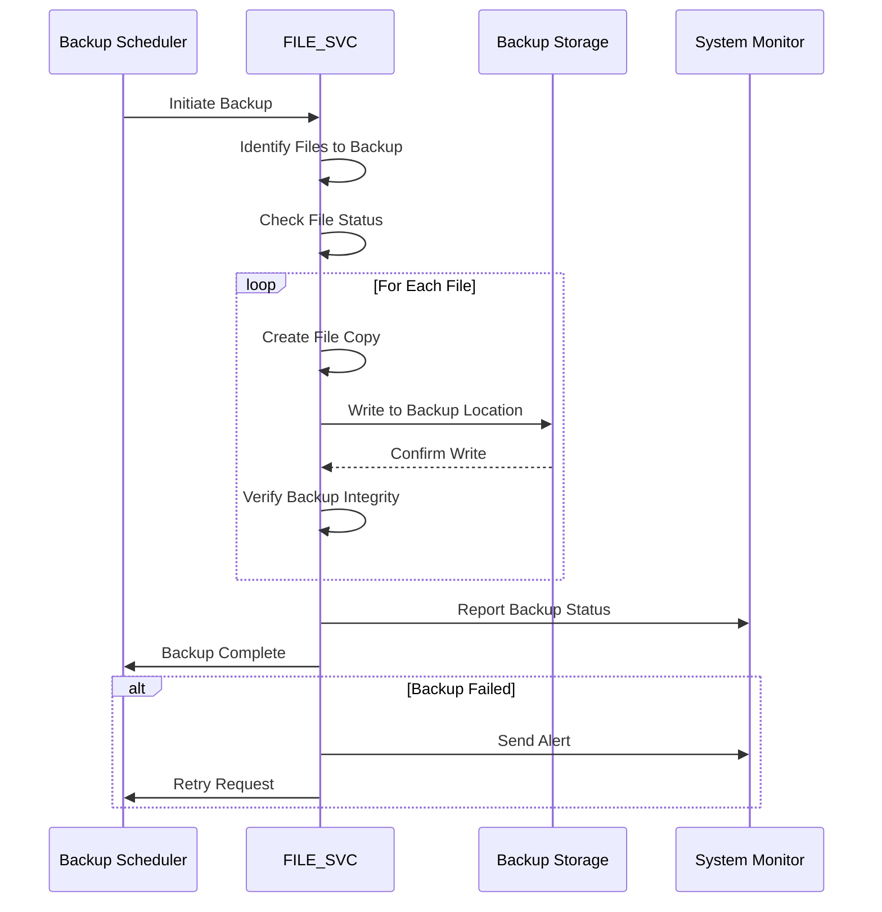

# FILE_SVC Subsystem - Business Flow Documentation

## Overview

This document details the file management flows within the FILE_SVC subsystem, showing how files are accessed, managed, secured, and maintained throughout the ACAS system.

## Process Flow Diagrams

### 1. File Access and Security Flow

### 2. Backup and Recovery Flow

## Business Rules in Flows

### File Access Rules
- **RULE_FILE_001**: Users can only access files they have explicit permissions for
- **RULE_FILE_002**: Concurrent read access allowed, exclusive write access required
- **RULE_FILE_003**: System files require administrative access
- **RULE_FILE_004**: All file access must be logged for audit purposes

### Backup and Recovery Rules
- **RULE_BACKUP_001**: Critical files backed up daily, others weekly
- **RULE_BACKUP_002**: Backups retained according to retention policy
- **RULE_BACKUP_003**: Backup integrity verified before completion
- **RULE_BACKUP_004**: Failed backups retry automatically up to 3 times

### File Maintenance Rules
- **RULE_MAINT_001**: Temporary files deleted after 7 days
- **RULE_MAINT_002**: Archive files moved to cold storage after 1 year
- **RULE_MAINT_003**: File system integrity checked weekly
- **RULE_MAINT_004**: Disk space monitoring with automatic alerts at 80% capacity