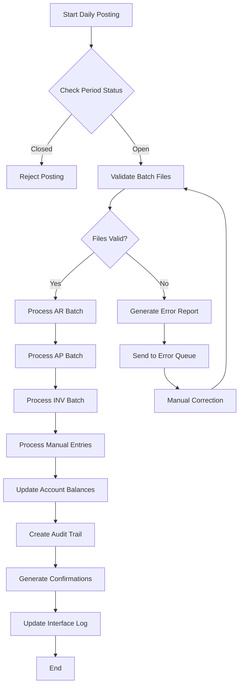
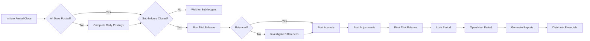
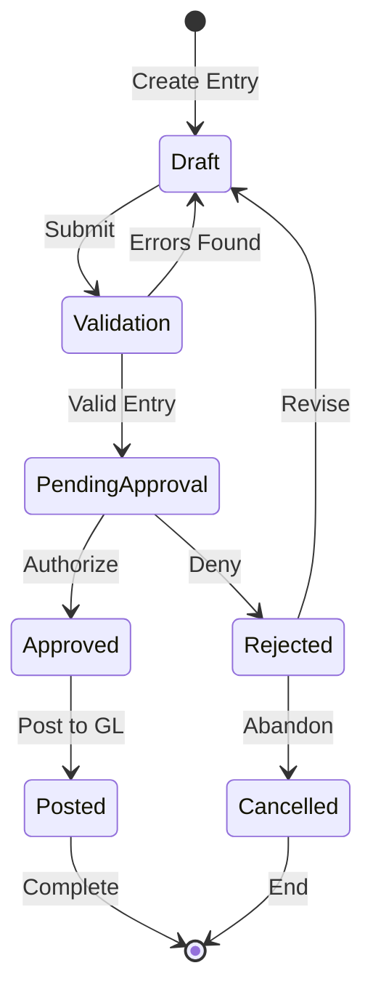
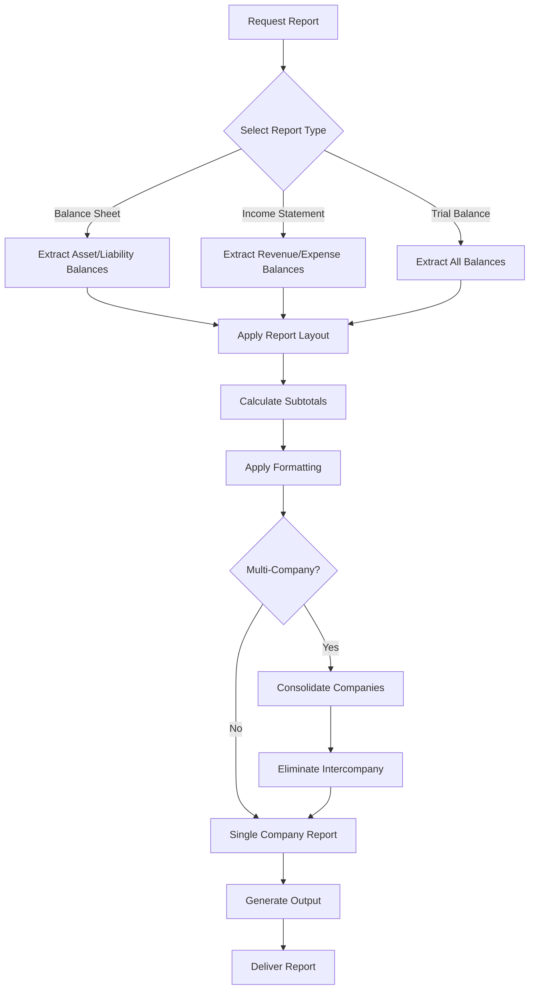
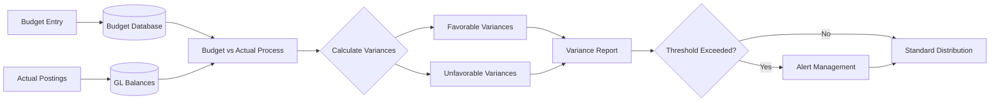
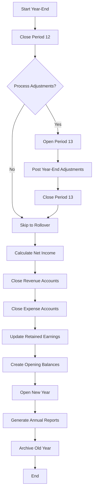
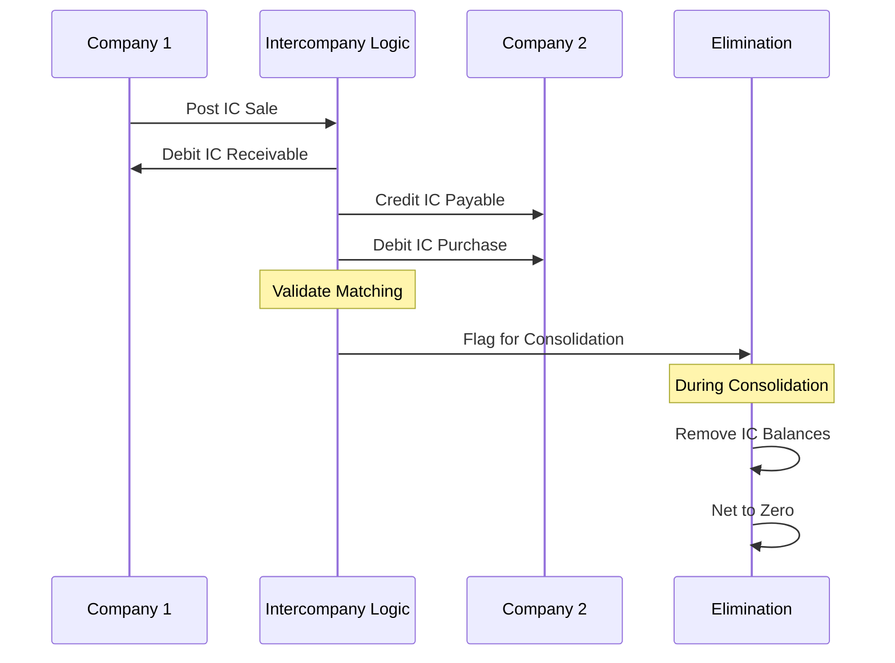
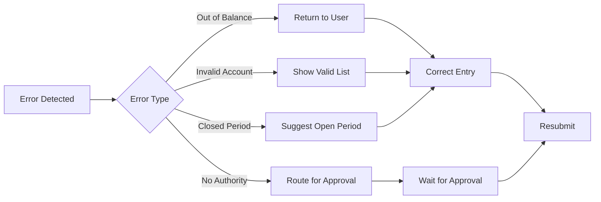
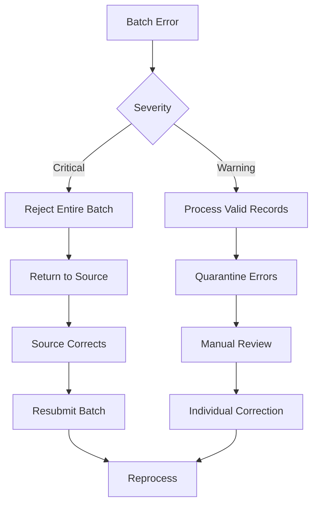
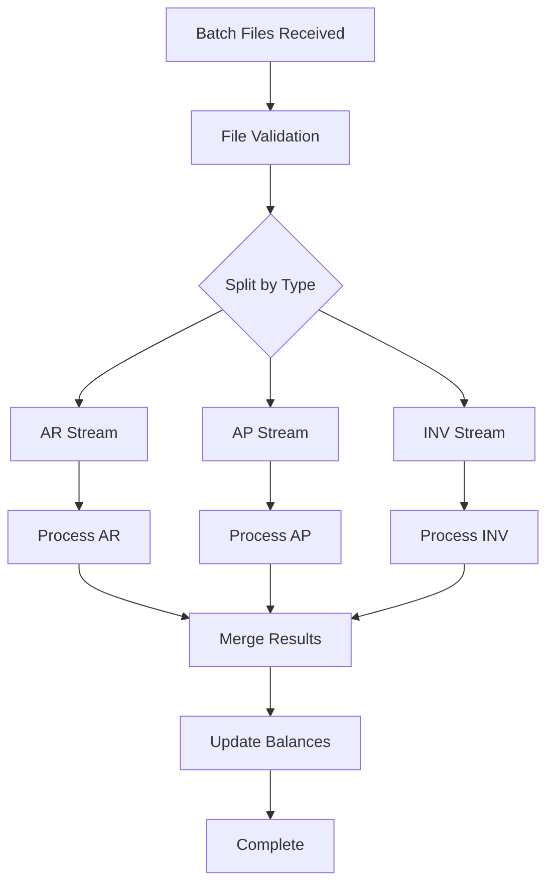

# GL_CORE Process Flows

## Overview

This document details the key business process flows within the GL_CORE subsystem, showing how data moves through the system and how different components interact to deliver general ledger functionality.

## Major Process Flows

### 1. Daily Journal Posting Flow

**Purpose**: Process journal entries from all sources into the general ledger



**Key Steps**:
1. Verify current period is open for posting
2. Collect all interface files from subsystems
3. Validate file formats and control totals
4. Process each batch sequentially
5. Update running account balances
6. Create comprehensive audit trail
7. Send confirmations back to source systems

---

### 2. Period-End Closing Flow

**Purpose**: Close accounting period and prepare for next period



**Validation Points**:
- All daily batches processed
- All sub-ledgers reported closed
- Trial balance in balance
- No pending manual entries
- Adjusting entries posted

---

### 3. Manual Journal Entry Flow

**Purpose**: Allow authorized users to create manual journal entries



**Business Rules**:
- Entries must balance (debits = credits)
- Require business justification
- Approval based on amount thresholds
- No posting to control accounts
- Supporting documentation required

---

### 4. Financial Statement Generation Flow

**Purpose**: Generate standard financial reports



**Report Types**:
- Balance Sheet (Financial Position)
- Income Statement (P&L)
- Cash Flow Statement
- Trial Balance
- General Journal
- Account Analysis

---

### 5. Budget vs Actual Processing Flow

**Purpose**: Compare actual results against budget



**Variance Calculations**:
- Revenue: Actual > Budget = Favorable
- Expense: Actual < Budget = Favorable
- Calculate both $ and % variances
- Year-to-date comparisons

---

### 6. Year-End Processing Flow

**Purpose**: Close fiscal year and prepare for new year



**Special Considerations**:
- Period 13 for adjustments
- Automatic retained earnings update
- Balance sheet accounts carry forward
- P&L accounts start at zero

---

### 7. Inter-Company Processing Flow

**Purpose**: Handle transactions between companies



**Controls**:
- Matching IC account pairs
- Automatic balancing entries
- Consolidation elimination
- Mismatch reporting

---

## Error Handling Flows

### Journal Entry Errors



### Batch Processing Errors



---

## Performance Optimization Flows

### Parallel Processing Strategy



**Benefits**:
- Reduced processing time
- Better resource utilization
- Isolated error handling
- Improved throughput

---

## Integration Points

### With Other Subsystems

1. **AR_MGMT Integration**
   - Daily revenue postings
   - Cash receipt postings
   - Credit memo adjustments

2. **AP_MGMT Integration**
   - Purchase postings
   - Payment postings
   - Expense accruals

3. **INV_CTRL Integration**
   - Cost of goods sold
   - Inventory adjustments
   - Overhead allocations

4. **RPT_ENGINE Integration**
   - Balance extracts
   - Transaction details
   - Report parameters

### Timing Dependencies

```
Daily Schedule:
18:00 - AR batch arrives
18:30 - AP batch arrives  
19:00 - INV batch arrives
19:30 - Begin GL processing
20:30 - Complete posting
21:00 - Reports available
```

---

## Key Decision Points

### Posting Decisions

| Decision | Criteria | Action |
|----------|----------|--------|
| Accept Entry? | Balanced, valid accounts | Post or reject |
| Which Period? | Transaction date vs period | Assign to period |
| Approval Needed? | Amount threshold | Route or auto-post |
| Reversal Required? | Error found after posting | Create reversing entry |

### Reporting Decisions

| Decision | Criteria | Action |
|----------|----------|--------|
| Include Company? | Active status | Include in consolidation |
| Eliminate IC? | Consolidation report | Remove IC transactions |
| Show Details? | Report parameter | Summary or detail |
| Apply Security? | User role | Filter data |