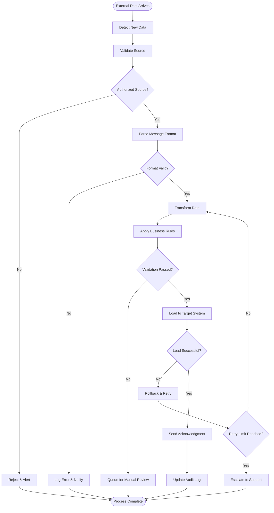
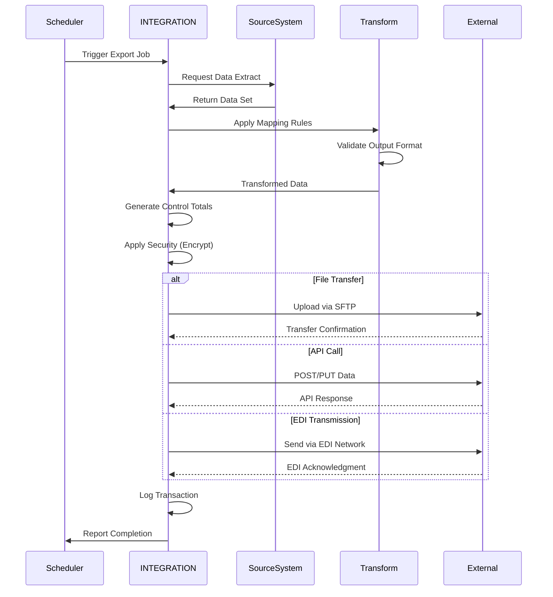
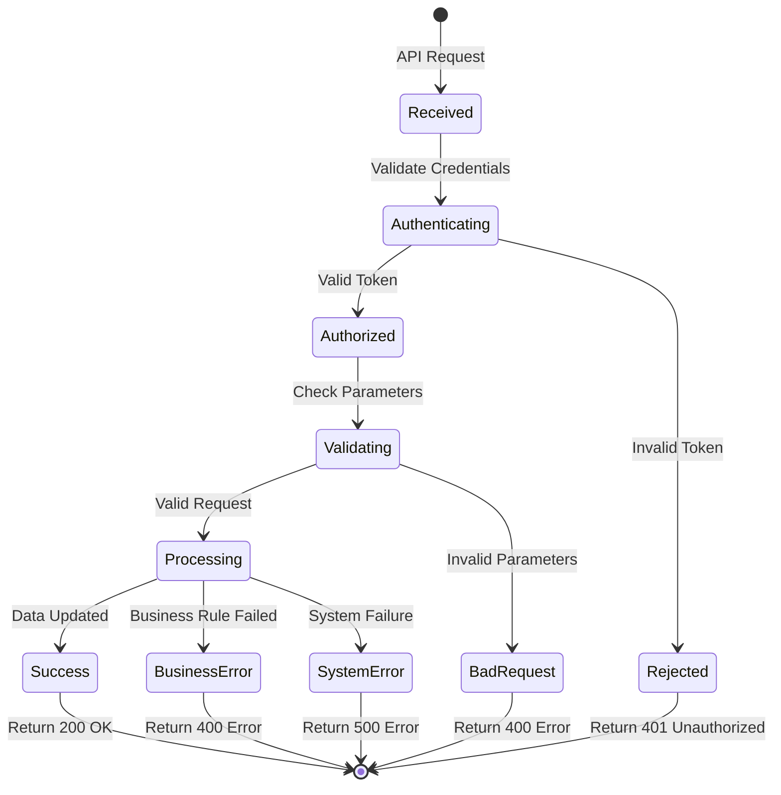
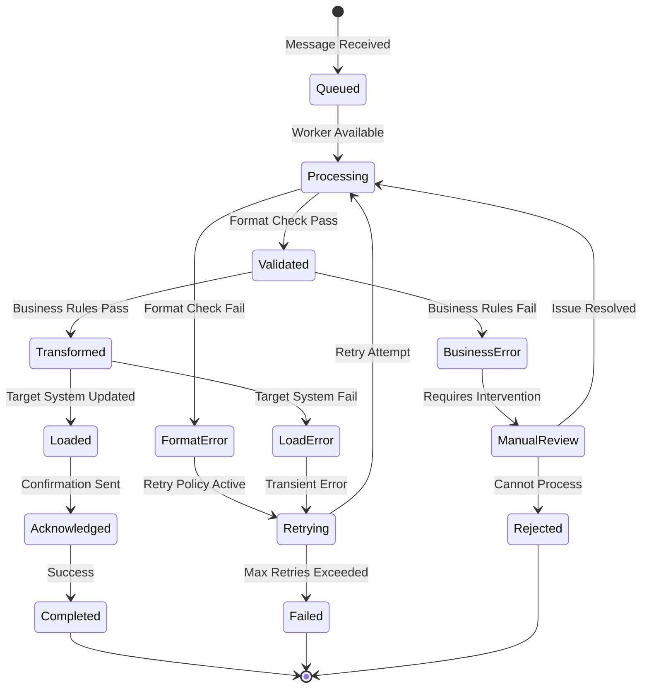
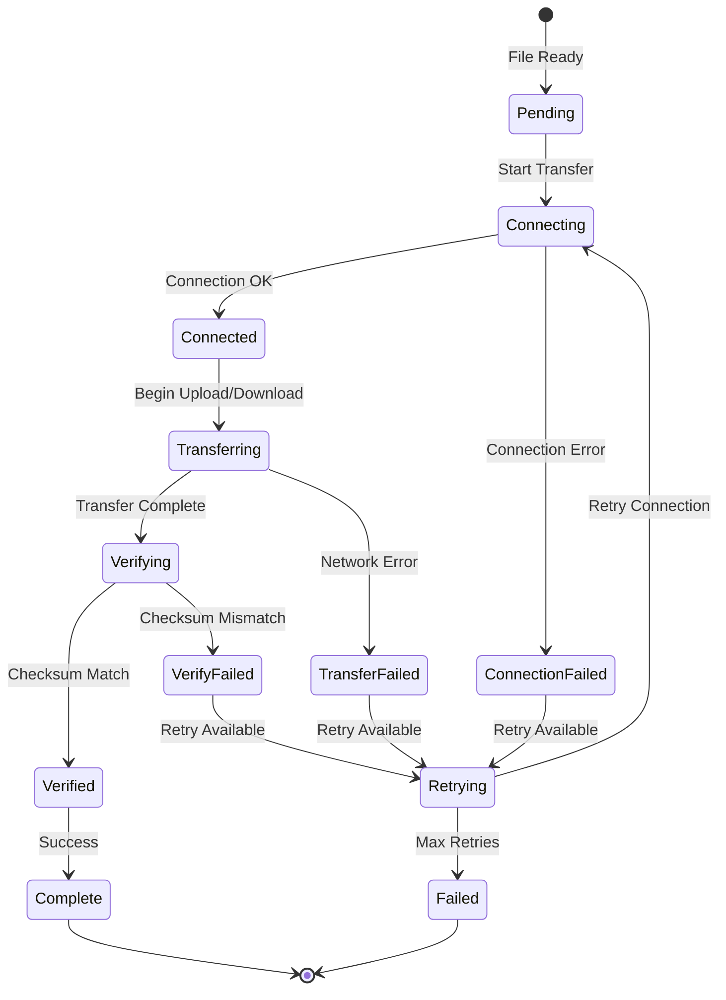
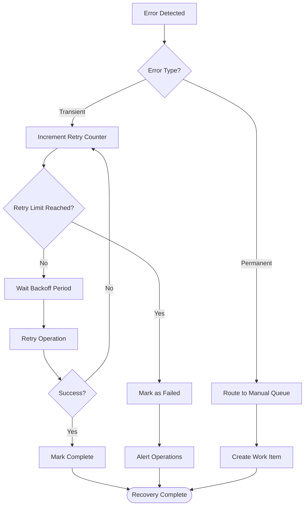

# INTEGRATION Subsystem - Business Flow Documentation

## Overview

This document details the key integration flows within the INTEGRATION subsystem, showing how data moves between ACAS and external systems, including EDI processing, file transfers, API interactions, and error handling procedures.

## Process Flow Diagrams

### 1. Inbound Data Processing Flow



### 2. Outbound Data Export Flow



### 3. EDI Transaction Processing Flow

```mermaid
flowchart LR
    subgraph "Inbound EDI"
        A[EDI Message Received] --> B[Parse EDI Envelope]
        B --> C[Validate Structure]
        C --> D[Extract Business Data]
        D --> E[Map to Internal Format]
    end
    
    subgraph "Business Processing"
        E --> F[Apply Business Rules]
        F --> G[Update ACAS Data]
        G --> H[Generate Response Data]
    end
    
    subgraph "Outbound EDI"
        H --> I[Create EDI Structure]
        I --> J[Add Control Segments]
        J --> K[Send EDI Response]
        K --> L[Log Transaction]
    end
```



### 4. Real-time API Processing Flow



## Detailed Process Descriptions

### Bank File Processing Workflow

#### Outbound Payment File Generation

1. **Data Collection**
   ```
   Extract payment requests from AP_MGMT
   Validate payment authorization
   Check available bank balance
   Apply payment prioritization rules
   ```

2. **File Creation**
   ```
   Group payments by bank account
   Apply bank-specific formatting
   Generate control totals
   Create file header and trailer
   ```

3. **Security Processing**
   ```
   Encrypt sensitive data fields
   Apply digital signature
   Generate positive pay file
   Create audit trail record
   ```

4. **Transmission**
   ```
   Upload to bank SFTP server
   Verify transmission success
   Send confirmation to AP_MGMT
   Schedule reconciliation process
   ```

#### Inbound Bank Statement Processing

1. **File Receipt**
   ```
   Monitor bank SFTP directories
   Download new statement files
   Validate file integrity
   Parse statement format (MT940, BAI2, etc.)
   ```

2. **Transaction Matching**
   ```
   Match deposits to AR receipts
   Match payments to AP disbursements
   Identify unmatched items
   Flag potential duplicates
   ```

3. **Reconciliation**
   ```
   Update cash account balances
   Create adjustment entries
   Generate exception reports
   Post reconciliation entries to GL
   ```

### EDI Document Processing Workflow

#### Purchase Order Receipt (EDI 850)

1. **Message Receipt**
   ```
   Receive EDI 850 from trading partner
   Validate EDI envelope structure
   Check partnership agreement
   Parse transaction segments
   ```

2. **Data Extraction**
   ```
   Extract header information (dates, references)
   Parse line item details
   Map product codes to internal items
   Validate pricing and terms
   ```

3. **Business Processing**
   ```
   Create purchase order in AP_MGMT
   Check supplier authorization
   Validate budget availability
   Route for approval if required
   ```

4. **Response Generation**
   ```
   Generate EDI 855 (PO Acknowledgment)
   Include accepted/rejected line items
   Set delivery commitments
   Send response to trading partner
   ```

#### Invoice Transmission (EDI 810)

1. **Invoice Selection**
   ```
   Identify invoices for EDI transmission
   Check customer EDI capability
   Validate invoice completeness
   Apply trading partner requirements
   ```

2. **EDI Creation**
   ```
   Map invoice data to EDI 810 format
   Add required reference numbers
   Calculate summary totals
   Create proper EDI envelope
   ```

3. **Transmission**
   ```
   Send via EDI network (VAN)
   Monitor transmission status
   Handle acknowledgments (997/999)
   Retry failed transmissions
   ```

### API Integration Workflow

#### Customer Order API

1. **Request Processing**
   ```
   Validate API authentication token
   Parse JSON request payload
   Validate required fields
   Check customer authorization
   ```

2. **Business Validation**
   ```
   Verify customer exists and is active
   Check credit limits and holds
   Validate item codes and availability
   Apply pricing rules
   ```

3. **Order Creation**
   ```
   Create order in AR_MGMT
   Allocate inventory items
   Calculate taxes and totals
   Generate order confirmation
   ```

4. **Response Generation**
   ```
   Create JSON response with order details
   Include order number and status
   Set HTTP response headers
   Log API transaction
   ```

## State Transition Diagrams

### Message Processing States



### File Transfer States



## Error Handling and Recovery

### Error Classification and Response

#### Network Errors
```
Connection timeout → Retry with exponential backoff
DNS resolution failure → Check configuration, alert admin
SSL certificate error → Validate certificates, renew if needed
Authentication failure → Check credentials, alert security
```

#### Data Errors
```
Format validation failure → Log error, send to manual review queue
Business rule violation → Return error to sender with details
Duplicate message → Ignore, log duplicate detection
Missing required fields → Reject with specific field errors
```

#### System Errors
```
Database connection lost → Retry operation, failover if needed
Disk space full → Alert operations, archive old files
Memory exhaustion → Restart service, investigate memory leak
Application crash → Restart service, escalate to development
```

### Recovery Procedures

#### Automatic Recovery


#### Manual Recovery Process
```
1. Identify failed message/transaction
2. Analyze error logs and system state
3. Determine root cause
4. Apply corrective action:
   - Fix data format issues
   - Resolve business rule conflicts
   - Repair system configuration
   - Contact external partner
5. Resubmit transaction
6. Monitor for successful completion
7. Update procedures to prevent recurrence
```

## Integration Monitoring and Alerting

### Performance Metrics

#### Throughput Metrics
```
Messages per minute by interface
Data volume transferred per hour
API requests per second
Success rate percentage
Average response time
```

#### Quality Metrics
```
Error rate by error type
First-time success rate
Manual intervention rate
SLA compliance percentage
Partner satisfaction scores
```

#### System Health Metrics
```
Queue depths and processing rates
Connection pool utilization
Memory and CPU usage
Disk space availability
Network bandwidth utilization
```

### Alert Conditions

#### Critical Alerts (Immediate Response)
```
Interface completely down
Security breach detected
Data corruption identified
Regulatory deadline missed
Major trading partner connection lost
```

#### Warning Alerts (Within 1 Hour)
```
Error rate above 5%
Response time degradation
Queue backlog building
Certificate expiring soon
Disk space below threshold
```

#### Information Alerts (Daily Summary)
```
Processing volume summary
Error summary by type
Performance trend analysis
Successful integration summary
```

## Business Rules in Integration

### Data Validation Rules

1. **Format Validation**
   - Required fields must be present
   - Data types must match specifications
   - Field lengths within defined limits
   - Date formats properly structured

2. **Business Validation**
   - Customer/supplier must exist and be active
   - Order amounts within credit limits
   - Item codes must be valid
   - Pricing must match agreements

3. **Security Validation**
   - Source system must be authorized
   - User credentials must be valid
   - Data encryption requirements met
   - Audit trail requirements satisfied

### Transformation Rules

1. **Data Mapping**
   - External codes mapped to internal identifiers
   - Currency conversion applied
   - Unit of measure standardization
   - Date/time zone normalization

2. **Enrichment Rules**
   - Default values applied where missing
   - Calculated fields generated
   - Reference data added
   - Business context provided

3. **Cleansing Rules**
   - Trim whitespace and normalize case
   - Standardize addresses and names
   - Remove invalid characters
   - Apply data quality checks

## Compliance and Audit

### Regulatory Compliance

#### SOX Compliance
```
- Segregation of duties in interface setup
- Approval workflows for critical interfaces
- Change control for interface modifications
- Audit trail for all data exchanges
```

#### GDPR Compliance
```
- Data anonymization for test systems
- Right to erasure implementation
- Data processing consent tracking
- Cross-border transfer controls
```

#### Industry Standards
```
- EDI compliance with X12/EDIFACT standards
- Banking standards (ISO 20022, SWIFT)
- Security standards (PCI DSS, SOC 2)
- API standards (REST, OpenAPI)
```

### Audit Requirements

#### Transaction Logging
```
Complete audit trail for all messages
Source and destination system tracking
User identification and authorization
Data transformation history
Error and exception logging
```

#### Data Lineage
```
Track data from source to destination
Document transformation rules applied
Maintain version history of mappings
Record data quality metrics
Link business context to technical data
```

#### Compliance Reporting
```
Generate regulatory reports automatically
Track SLA compliance metrics
Monitor data retention compliance
Report security incidents
Document change control procedures
```