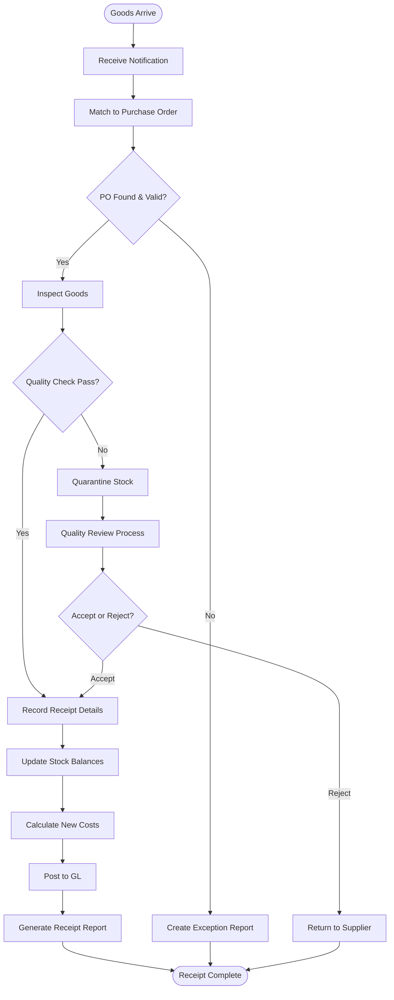
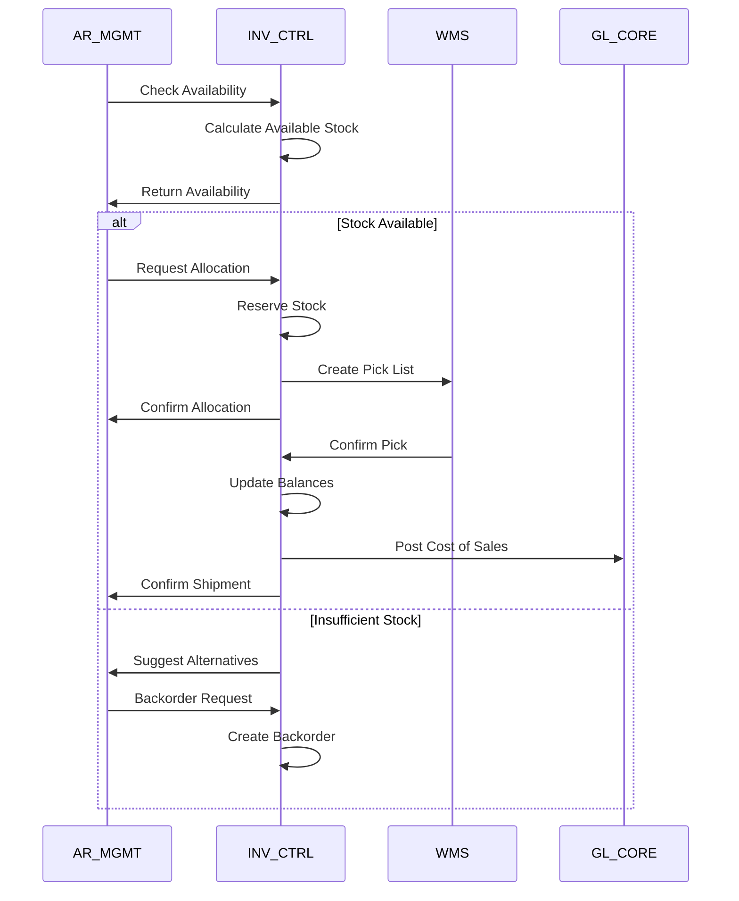
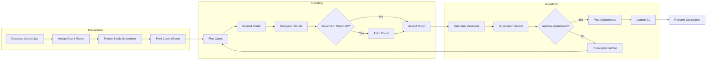
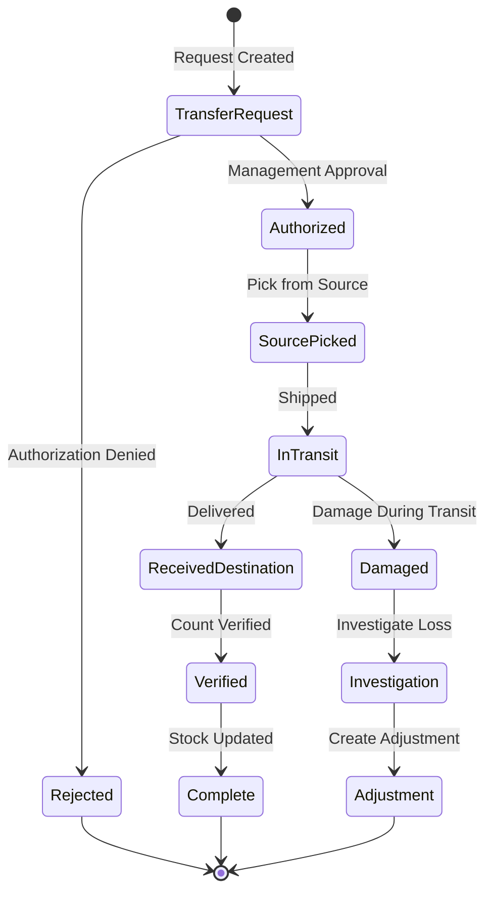
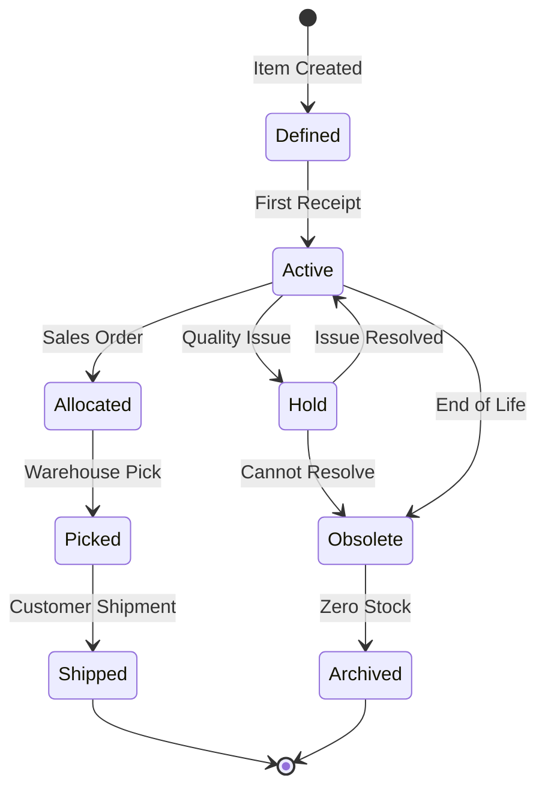
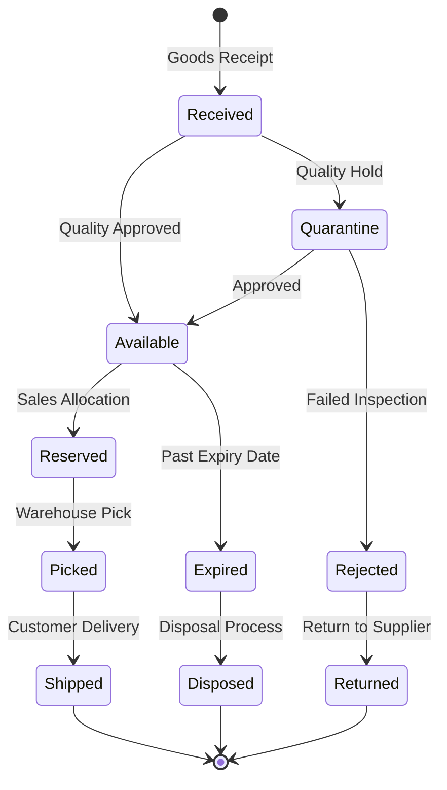
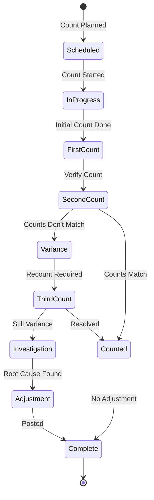

# INV_CTRL Subsystem - Business Flow Documentation

## Overview

This document details the key business processes and flows within the INV_CTRL subsystem, showing how inventory moves through the system from receipt to shipment, including stock tracking, valuation, and physical inventory management.

## Process Flow Diagrams

### 1. Purchase Receipt to Stock Flow



### 2. Sales Order Allocation Flow



### 3. Physical Inventory Count Flow



### 4. Stock Transfer Between Locations Flow



## Detailed Process Descriptions

### Stock Receipt Workflow

#### Process Steps:

1. **Pre-Receipt Validation**
   ```
   Verify purchase order exists
   Check supplier authorization
   Validate expected delivery date
   Confirm receiving location capacity
   ```

2. **Physical Receipt**
   ```
   Unload and inspect shipment
   Count quantities received
   Check condition and quality
   Verify lot numbers and expiry dates
   ```

3. **System Processing**
   ```
   Update stock on-hand quantities
   Calculate new average costs
   Create movement transaction records
   Generate GL postings for inventory value
   ```

4. **Exception Handling**
   ```
   Over/under receipts → Variance reporting
   Damaged goods → Quality hold processing
   Wrong items → Return authorization
   Missing documentation → Supplier follow-up
   ```

### Stock Issue Workflow

#### Process Steps:

1. **Issue Authorization**
   ```
   Validate sales order or work order
   Check allocation exists
   Verify picking authorization
   Confirm location access rights
   ```

2. **Stock Selection**
   ```
   Apply FIFO/LIFO rules for lot selection
   Consider expiry dates for perishables
   Validate serial numbers if required
   Check quality status
   ```

3. **Movement Processing**
   ```
   Reduce stock on-hand quantities
   Remove or reduce allocations
   Create movement transaction
   Calculate cost of goods issued
   ```

4. **GL Integration**
   ```
   Post cost of sales entries
   Update inventory asset accounts
   Create variance entries if needed
   Maintain cost layer integrity
   ```

### Cycle Count Workflow

#### Process Steps:

1. **Count Planning**
   ```
   Select items based on ABC classification
   Generate count schedules
   Assign counting teams
   Prepare count documentation
   ```

2. **Count Execution**
   ```
   Perform physical count
   Record quantities on count sheets
   Handle lot/serial number tracking
   Note any discrepancies immediately
   ```

3. **Variance Analysis**
   ```
   Compare counted vs system quantities
   Calculate variance amounts and percentages
   Investigate significant variances
   Determine root cause of differences
   ```

4. **Adjustment Processing**
   ```
   Create adjustment transactions
   Update stock balances
   Post GL entries for value changes
   Generate variance reports
   ```

### Reorder Processing Workflow

#### Process Steps:

1. **Stock Level Monitoring**
   ```
   Monitor daily stock levels
   Compare against reorder points
   Consider lead times and safety stock
   Analyze demand patterns
   ```

2. **Reorder Calculation**
   ```
   Calculate recommended order quantities
   Apply economic order quantity logic
   Consider quantity breaks and pricing
   Check supplier lead times
   ```

3. **Purchase Requisition**
   ```
   Generate purchase requisitions
   Route for approval based on value
   Include preferred supplier information
   Set required delivery dates
   ```

4. **Order Follow-up**
   ```
   Track purchase order status
   Monitor expected delivery dates
   Update stock projections
   Handle supplier communications
   ```

## State Transition Diagrams

### Stock Item Lifecycle



### Lot/Serial Number Lifecycle



### Physical Count Status



## Business Rules in Flows

### Receipt Processing Rules

1. **Quantity Validation**
   - Over-receipt tolerance: 5% or 10 units (whichever is greater)
   - Under-receipt requires supplier explanation
   - Zero receipts not allowed without documentation
   - Negative receipts require special authorization

2. **Quality Control**
   - Lot-tracked items require inspection
   - Perishables need expiry date validation
   - High-value items require dual verification
   - Damaged goods automatically quarantined

3. **Cost Processing**
   - Use purchase order cost unless variance >10%
   - Standard cost items post variances to GL
   - Foreign currency receipts use daily rate
   - Freight costs allocated by weight/value

### Issue Processing Rules

1. **Allocation Priority**
   - Customer orders by promised date
   - Emergency/rush orders take priority
   - Key customers get preference
   - FIFO allocation within same priority

2. **Lot Selection**
   - FIFO for perishable items
   - LIFO for non-perishables if specified
   - Shortest expiry first for dated items
   - Customer-specific lot restrictions honored

3. **Availability Checking**
   - Physical minus allocated minus safety stock
   - Consider quality holds and quarantine
   - Account for planned receipts within lead time
   - Include substitute item availability

### Valuation Rules

1. **Costing Methods**
   - FIFO: First in, first out cost layers
   - Average: Weighted average recalculated on receipt
   - Standard: Fixed cost with variance tracking
   - Latest: Most recent purchase cost

2. **Lower of Cost or Market**
   - Applied monthly or when triggered
   - Market price based on replacement cost
   - Write-downs create separate GL entries
   - Recovery limited to original cost

3. **Obsolescence Reserves**
   - Age-based automatic reserves
   - Manual reserves for slow-moving items
   - Full reserve for discontinued items
   - Reserves cleared on disposal

## Integration Points in Flows

### Sales Integration
```
Order Entry → Availability Check → Allocation → Pick List → Shipment → Cost of Sales
│
├── Real-time availability updates
├── Allocation confirmation
├── Backorder management
└── Cost posting to GL
```

### Purchase Integration
```
PO Receipt → Quality Check → Stock Update → Cost Calculation → GL Posting
│
├── Three-way matching validation
├── Supplier performance tracking
├── Cost variance analysis
└── Inventory value updates
```

### Financial Integration
```
Stock Movement → Cost Calculation → GL Entry → Financial Reporting
│
├── Inventory asset updates
├── Cost of sales posting
├── Variance recognition
└── Period-end valuation
```

## Exception Handling

### Common Exceptions

1. **Inventory Discrepancies**
   - Physical count variances
   - System vs. physical differences
   - Missing or extra stock
   - Damaged inventory

2. **Data Quality Issues**
   - Invalid item codes
   - Missing cost information
   - Incorrect locations
   - Bad lot/serial numbers

3. **Process Violations**
   - Unauthorized movements
   - Insufficient stock for allocation
   - Expired lot shipments
   - Negative stock balances

### Resolution Procedures

1. **Variance Investigation**
   ```
   Identify discrepancy source
   Review recent transactions
   Check for data entry errors
   Verify physical locations
   Document findings
   ```

2. **Corrective Actions**
   ```
   Create adjustment transactions
   Update system records
   Implement process improvements
   Train staff on procedures
   Monitor for recurrence
   ```

3. **Management Reporting**
   ```
   Exception summary reports
   Trend analysis of variances
   Cost impact assessment
   Process improvement recommendations
   ```

## Performance Optimization

### Throughput Enhancement

1. **Batch Processing**
   - Group similar transactions
   - Process during off-peak hours
   - Use bulk update procedures
   - Minimize database locks

2. **Real-time Optimization**
   - Cache frequently accessed data
   - Use efficient indexing strategies
   - Implement connection pooling
   - Optimize query performance

3. **Parallel Processing**
   - Multi-location processing
   - Concurrent count processing
   - Parallel cost calculations
   - Distributed data updates

### Data Management

1. **Archival Strategies**
   - Age-based data archival
   - Compress historical transactions
   - Maintain summary information
   - Purge obsolete records

2. **Index Optimization**
   - Item code and location indexes
   - Date-based transaction indexes
   - Cost layer tracking indexes
   - Performance monitoring

## Compliance and Control

### Inventory Accuracy

1. **Control Procedures**
   - Daily stock verification
   - Cycle count programs
   - Perpetual inventory maintenance
   - Variance investigation procedures

2. **Segregation of Duties**
   - Separate counting from recording
   - Independent approval for adjustments
   - Dual control for high-value items
   - Management review of variances

### Financial Controls

1. **Valuation Controls**
   - Monthly inventory valuation
   - Cost method consistency
   - Lower of cost or market application
   - Obsolescence reserve adequacy

2. **Audit Trail Requirements**
   - Complete transaction history
   - User identification for all changes
   - Before/after value tracking
   - Supporting documentation links

### Regulatory Compliance

1. **Industry-Specific Requirements**
   - FDA tracking for pharmaceuticals/food
   - Lot traceability for recalls
   - Expiry date monitoring
   - Serial number genealogy

2. **Financial Reporting**
   - GAAP compliance for valuations
   - Disclosure of inventory methods
   - Write-down documentation
   - Physical count procedures