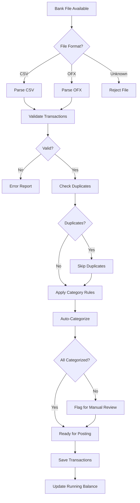
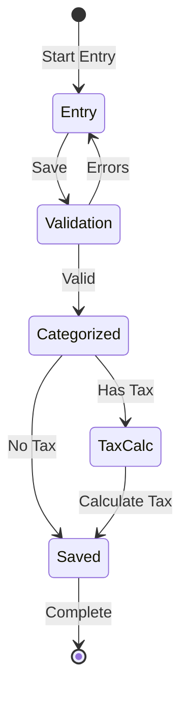
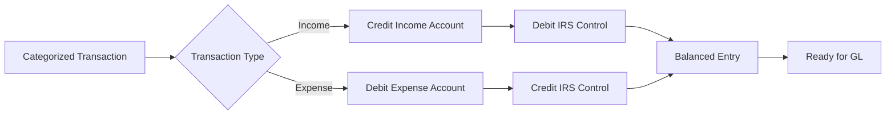
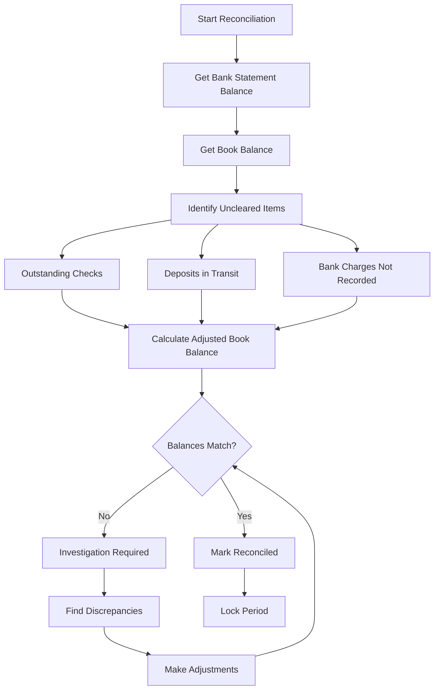
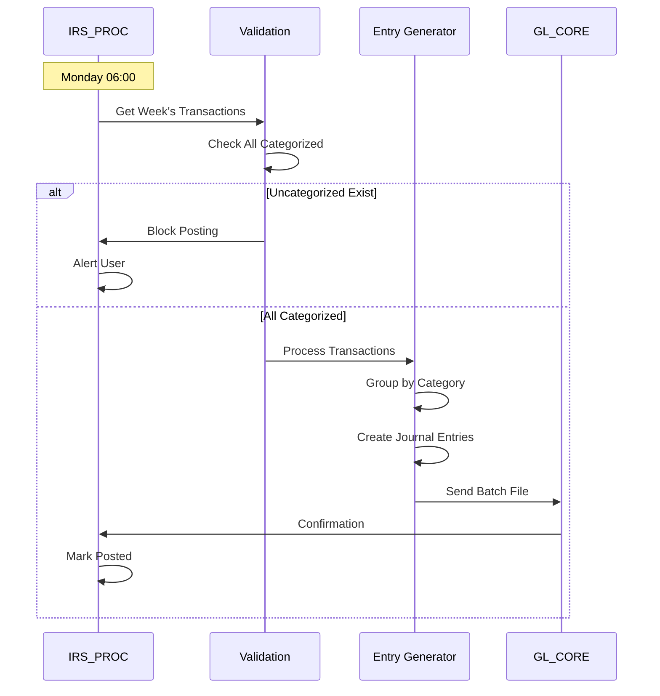
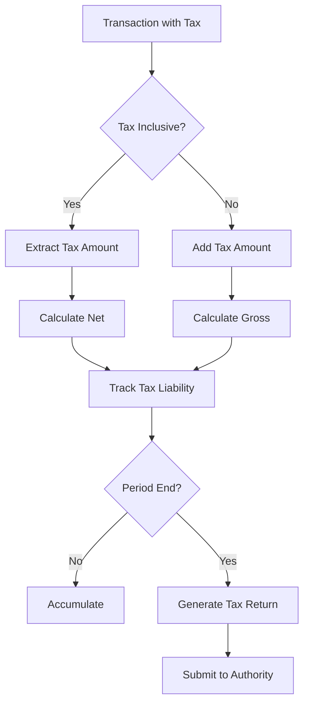
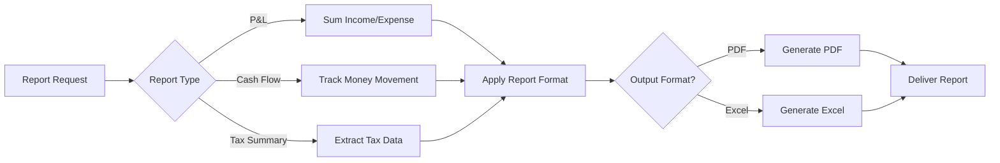
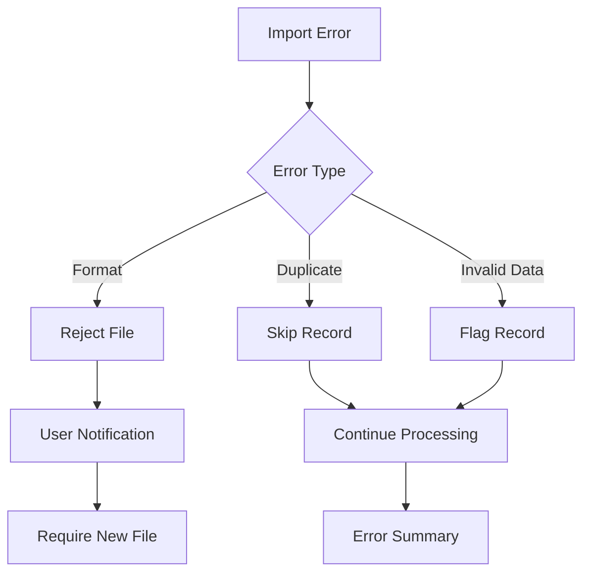
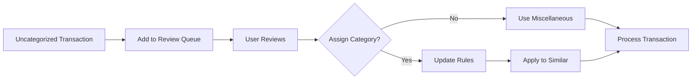
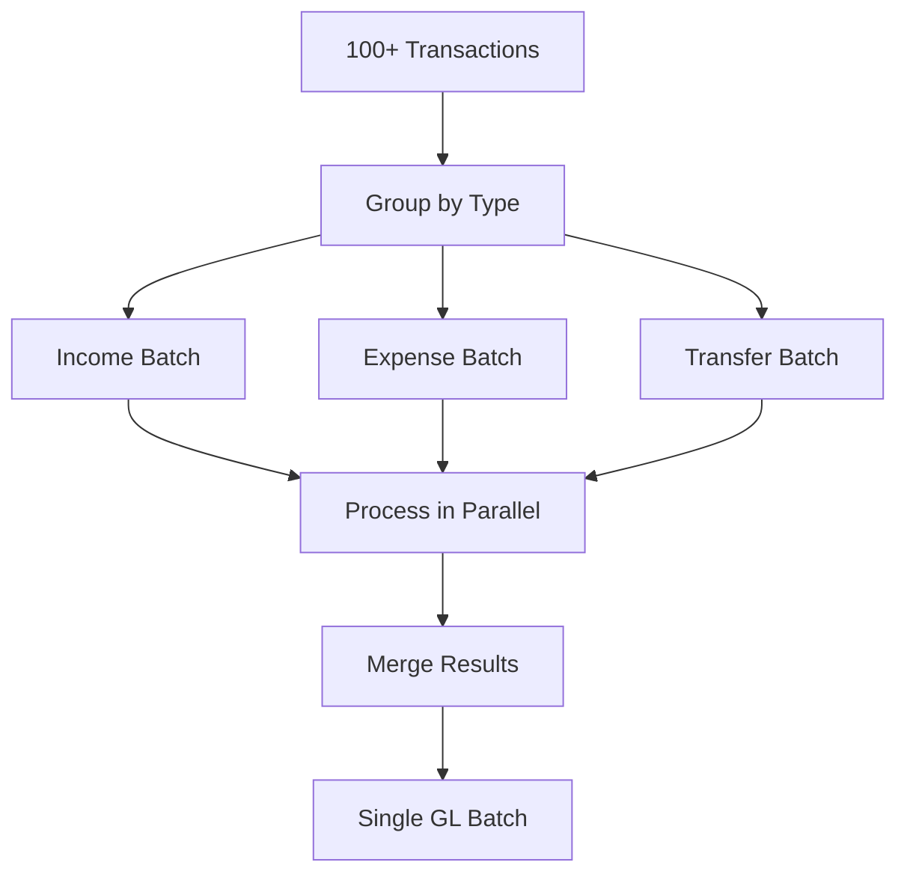

# IRS_PROC Process Flows

## Overview

The IRS_PROC subsystem follows a simplified flow designed for ease of use by non-accountants. All processes focus on converting single-entry records into proper double-entry bookkeeping.

## Major Process Flows

### 1. Bank Import and Categorization Flow

**Purpose**: Import bank transactions and automatically categorize them



**Key Rules**:
- Check against existing references to prevent duplicates
- Apply categorization rules based on description patterns
- Flag uncategorized items for user review
- Maintain running balance for reconciliation

---

### 2. Manual Transaction Entry Flow

**Purpose**: Allow direct entry of transactions not in bank feed



**Validation Steps**:
1. Date within allowed periods
2. Amount is non-zero
3. Category is valid
4. Reference is unique

---

### 3. Automatic Double-Entry Generation

**Purpose**: Convert single-entry records to balanced journal entries



**Examples**:

Income Transaction:
```
Single Entry: Sales $1,000
Double Entry: 
  DR IRS Control Account    1,000
  CR Sales Income                   1,000
```

Expense Transaction:
```
Single Entry: Rent $500
Double Entry:
  DR Rent Expense          500
  CR IRS Control Account          500
```

---

### 4. Bank Reconciliation Flow

**Purpose**: Match book records to bank statement



**Reconciliation Rules**:
- Book balance +/- timing differences = Bank balance
- All discrepancies must be explained
- Period cannot close until reconciled

---

### 5. Weekly GL Posting Flow

**Purpose**: Post accumulated transactions to General Ledger



**Posting Rules**:
- Only reconciled periods can post
- All transactions must be categorized
- Batch by GL account for efficiency
- Maintain audit trail

---

### 6. VAT/Tax Processing Flow

**Purpose**: Extract tax from gross amounts and track liability



**Tax Calculations**:
```
Tax Inclusive:
  Gross = 120.00
  Rate = 20%
  Tax = 120 × (20 ÷ 120) = 20.00
  Net = 100.00

Tax Exclusive:
  Net = 100.00
  Rate = 20%  
  Tax = 100 × 0.20 = 20.00
  Gross = 120.00
```

---

### 7. Report Generation Flow

**Purpose**: Create simplified financial reports



**Report Features**:
- Simple terminology (no accounting jargon)
- Clear categorization
- Period comparisons
- Tax summaries

---

## Error Handling Flows

### Import Error Handling



### Categorization Error Handling



---

## Integration Points

### With GL_CORE

**Weekly Posting Cycle**:
```
Sunday 23:59 - Week ends
Monday 00:00 - New week begins  
Monday 05:00 - Reconciliation check
Monday 06:00 - Generate GL entries
Monday 06:30 - Post to GL
Monday 07:00 - Confirmation received
```

### With External Systems

**Bank Integration**:
- Daily: Auto-download (if configured)
- Manual: File upload
- Format: CSV or OFX

**Tax Authority**:
- Monthly/Quarterly: Generate returns
- Format: Authority-specific XML/CSV

---

## Performance Optimization

### Bulk Processing Strategy



**Benefits**:
- Faster categorization
- Efficient GL posting
- Better error isolation

---

## User Decision Points

### Key Decisions

| Decision | Options | Impact |
|----------|---------|--------|
| Category Unknown | Assign manually or use misc | Affects reports |
| Duplicate Found | Skip or force import | Data integrity |
| Out of Balance | Investigate or adjust | Reconciliation |
| Tax Treatment | Include or exempt | Tax liability |

### Automation Settings

| Setting | Default | Options |
|---------|---------|---------|
| Auto-categorize | Enabled | On/Off |
| Duplicate handling | Skip | Skip/Import |
| GL posting | Weekly | Weekly/Monthly |
| Tax extraction | Enabled | On/Off |