# MDM Process Flows

## Overview

The MDM subsystem manages the lifecycle of all master data entities. These flows ensure data quality, consistency, and controlled access across the enterprise.

## Major Process Flows

### 1. Customer Master Lifecycle Flow

**Purpose**: Manage customer data from initial creation through archival

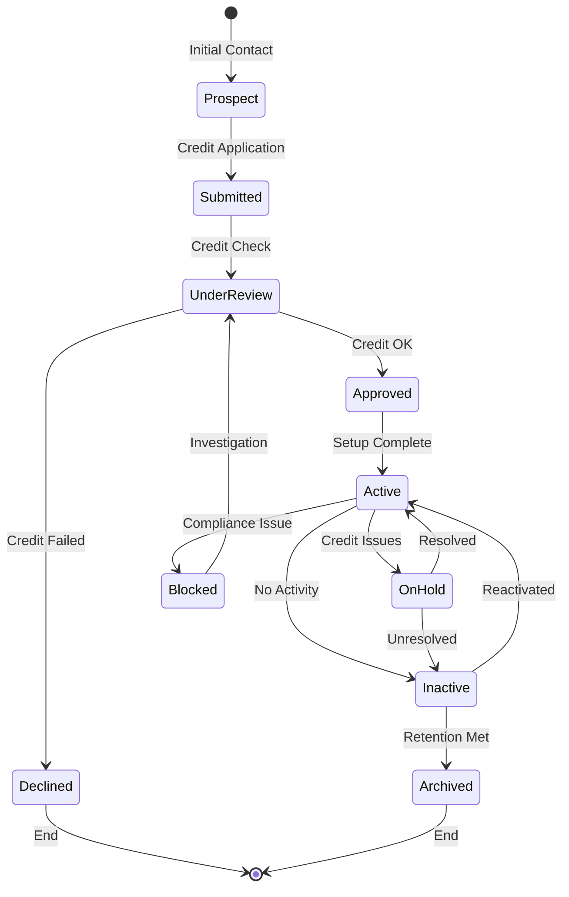

**Process Details**:

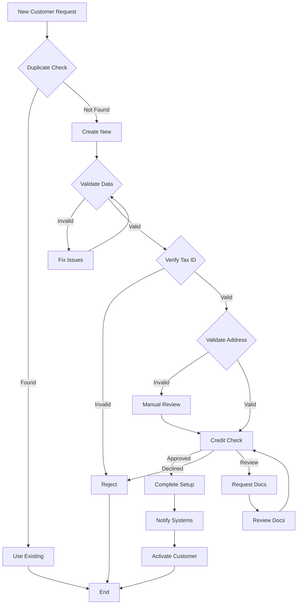

---

### 2. Vendor Master Onboarding Flow

**Purpose**: Ensure vendors meet compliance requirements before activation

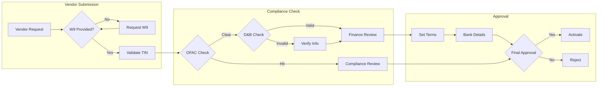

**Compliance Validation Details**:

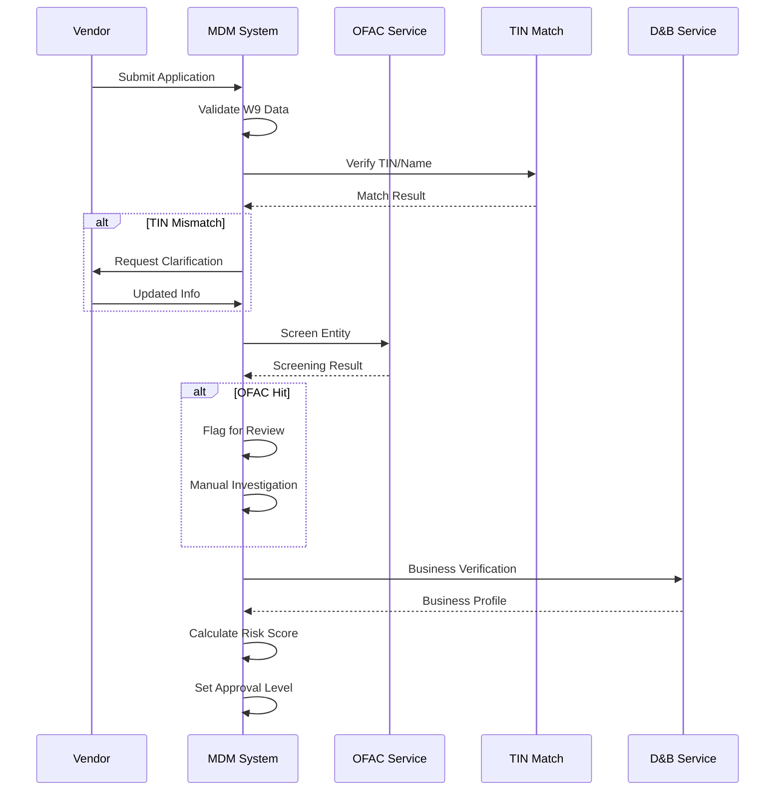

---

### 3. Item Master Management Flow

**Purpose**: Control product information lifecycle

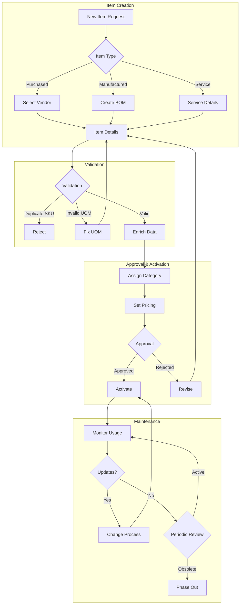

---

### 4. Chart of Accounts Maintenance Flow

**Purpose**: Maintain financial account structure with controls

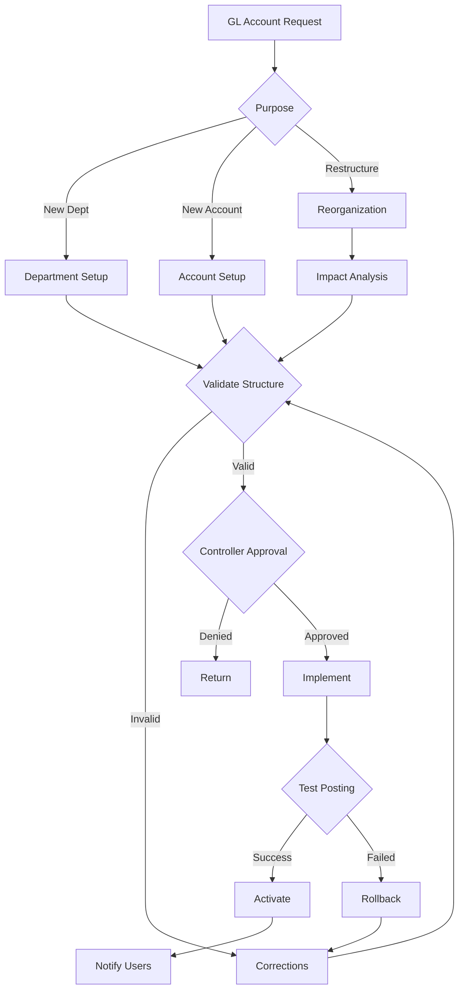

---

### 5. Data Quality Management Flow

**Purpose**: Continuous monitoring and improvement of data quality

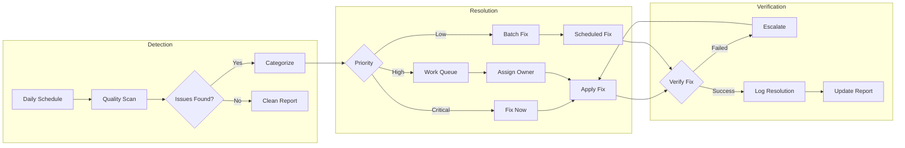

**Quality Check Examples**:

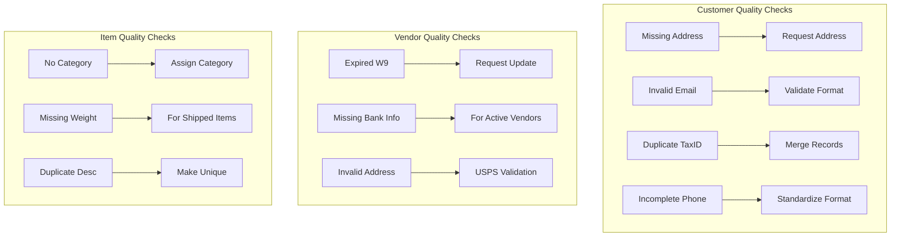

---

### 6. Code Table Management Flow

**Purpose**: Maintain system-wide reference codes

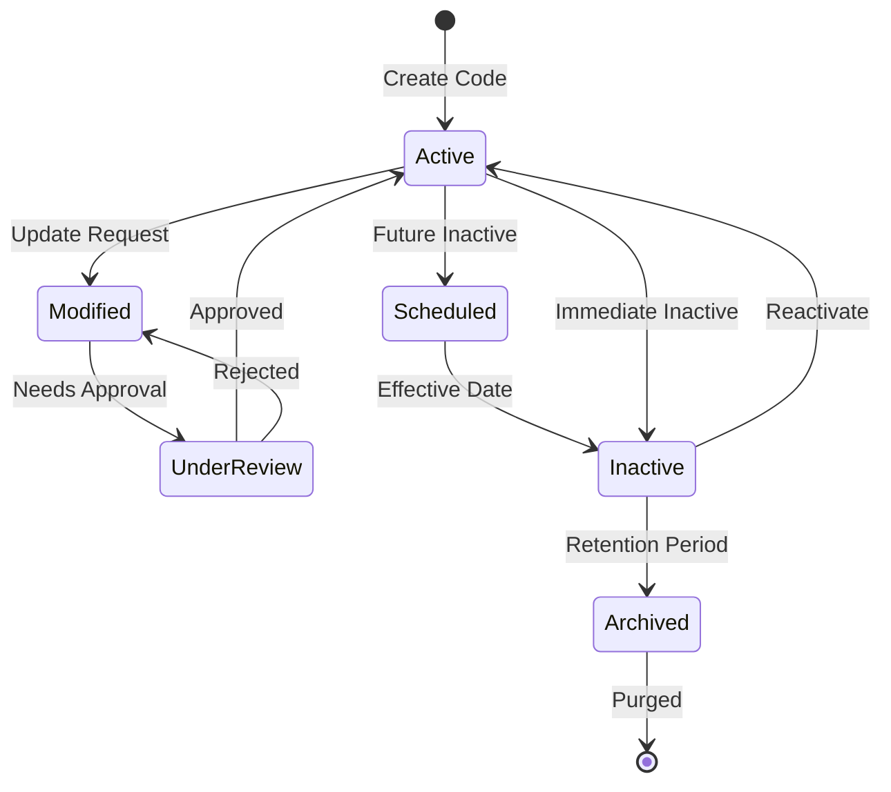

---

### 7. Master Data Search Flow

**Purpose**: Efficient search across master data

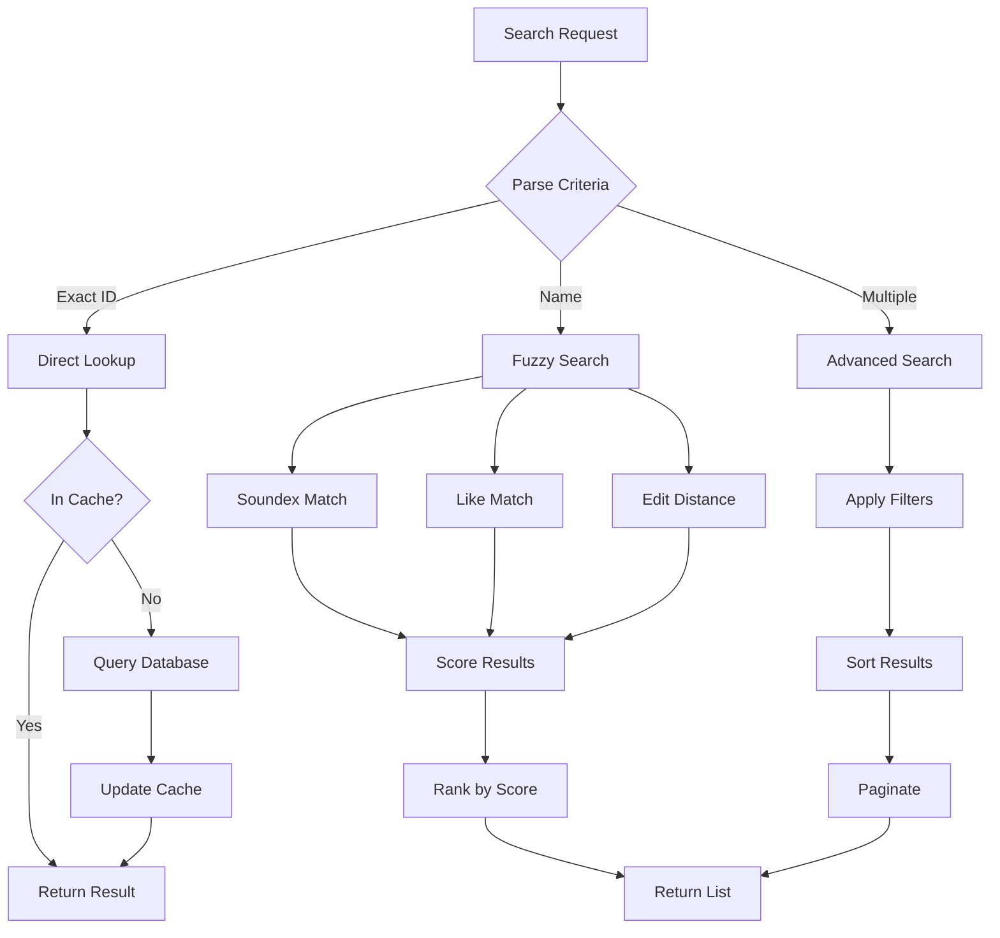

---

### 8. Cross-Reference Management Flow

**Purpose**: Maintain relationships between entities

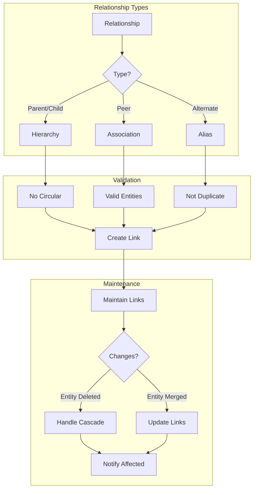

---

### 9. Data Access Control Flow

**Purpose**: Ensure authorized access to master data

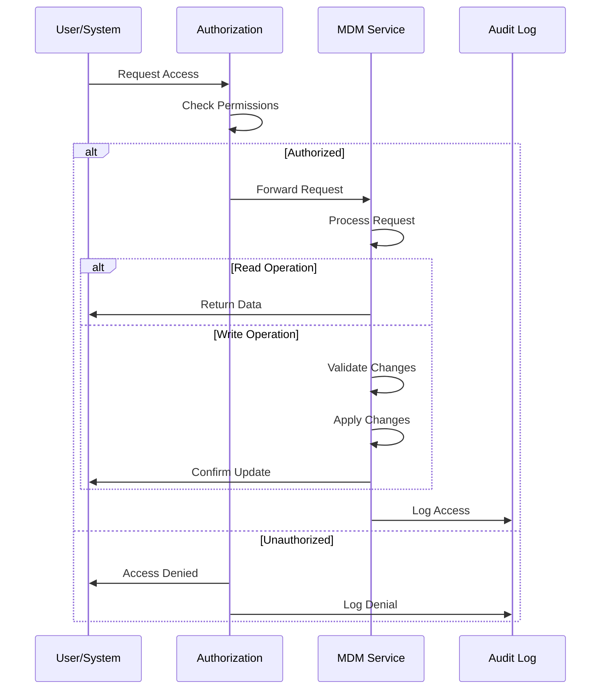

---

## Integration Points

### Real-time Data Access Pattern

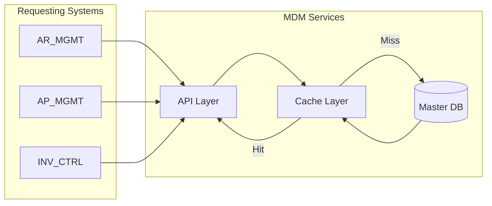

### Batch Synchronization Pattern

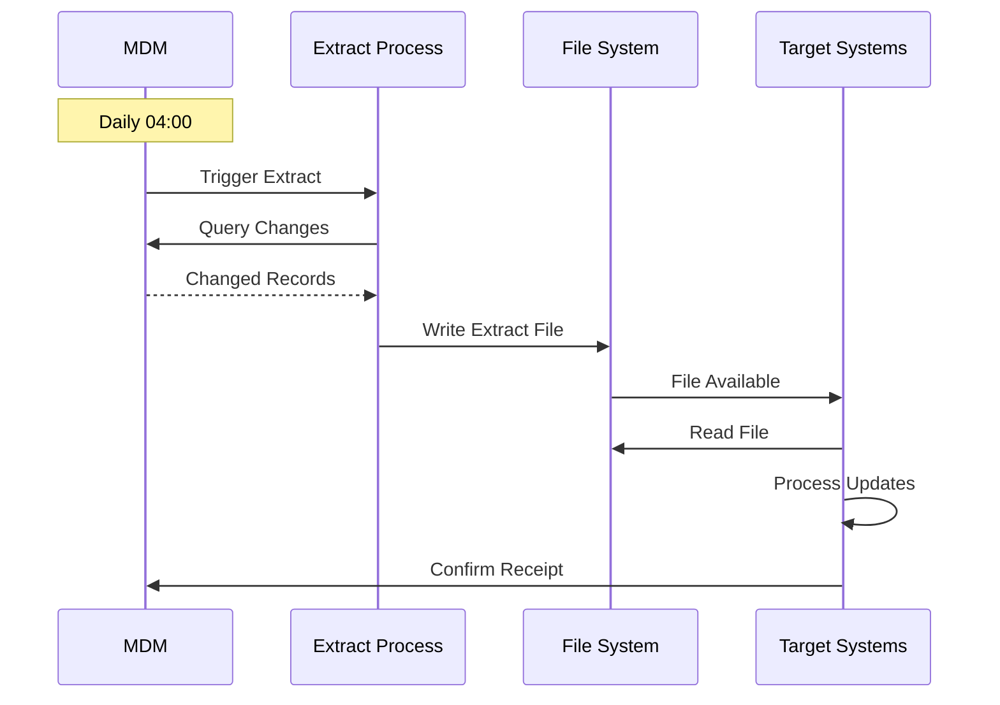

---

## Error Handling Flows

### Data Quality Error Resolution

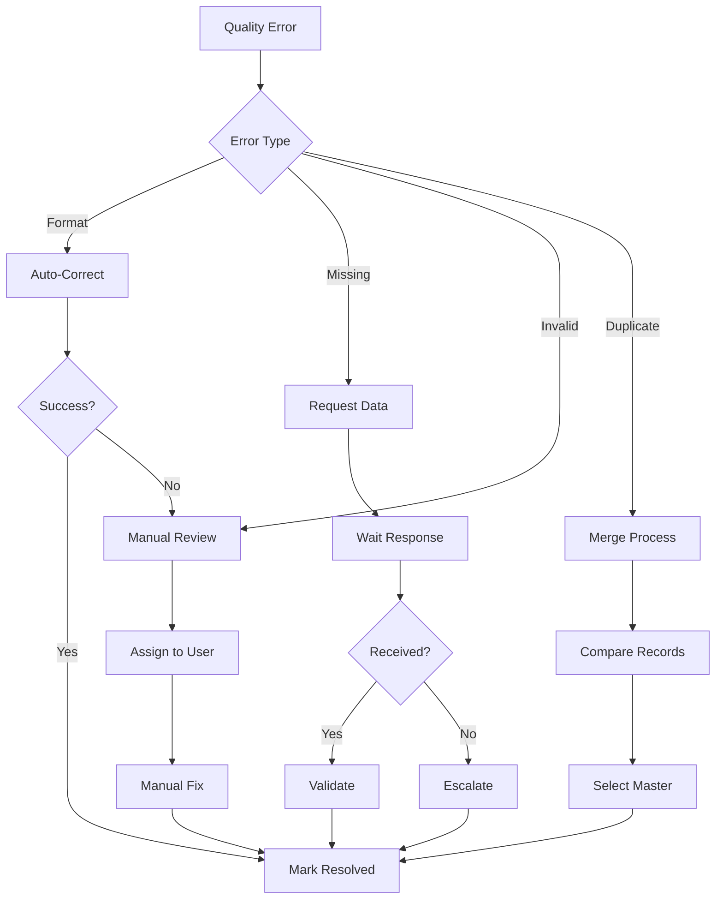

---

## Key Decision Points

### Data Governance Decisions

| Decision | Criteria | Action |
|----------|----------|--------|
| Approve new customer? | Credit check, compliance | Activate or reject |
| Allow duplicate? | Business justification | Create or merge |
| Inactivate master? | No dependencies | Inactivate or retain |
| Override quality rule? | Business need vs risk | Override or enforce |

### Performance Optimization Decisions

| Decision | Criteria | Action |
|----------|----------|--------|
| Cache data? | Access frequency > 10/hour | Add to cache |
| Index field? | Search frequency > 100/day | Create index |
| Archive data? | Last used > 2 years | Move to archive |
| Denormalize? | Join cost > 100ms | Denormalize |