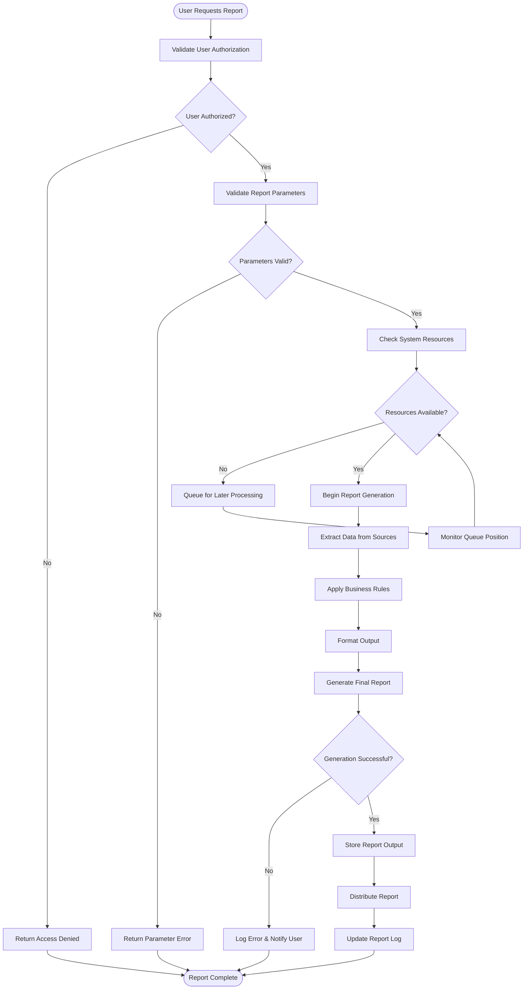
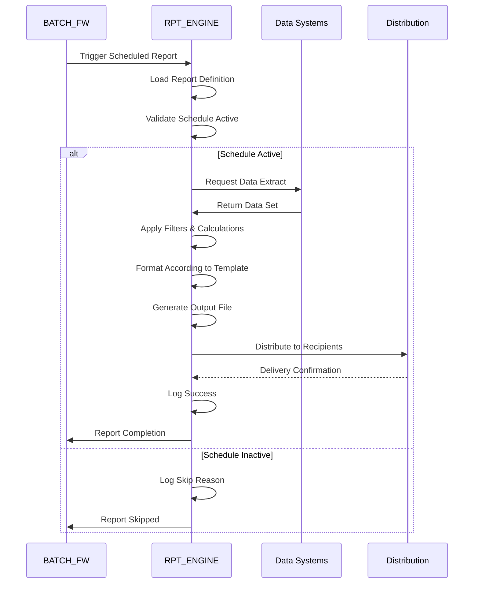
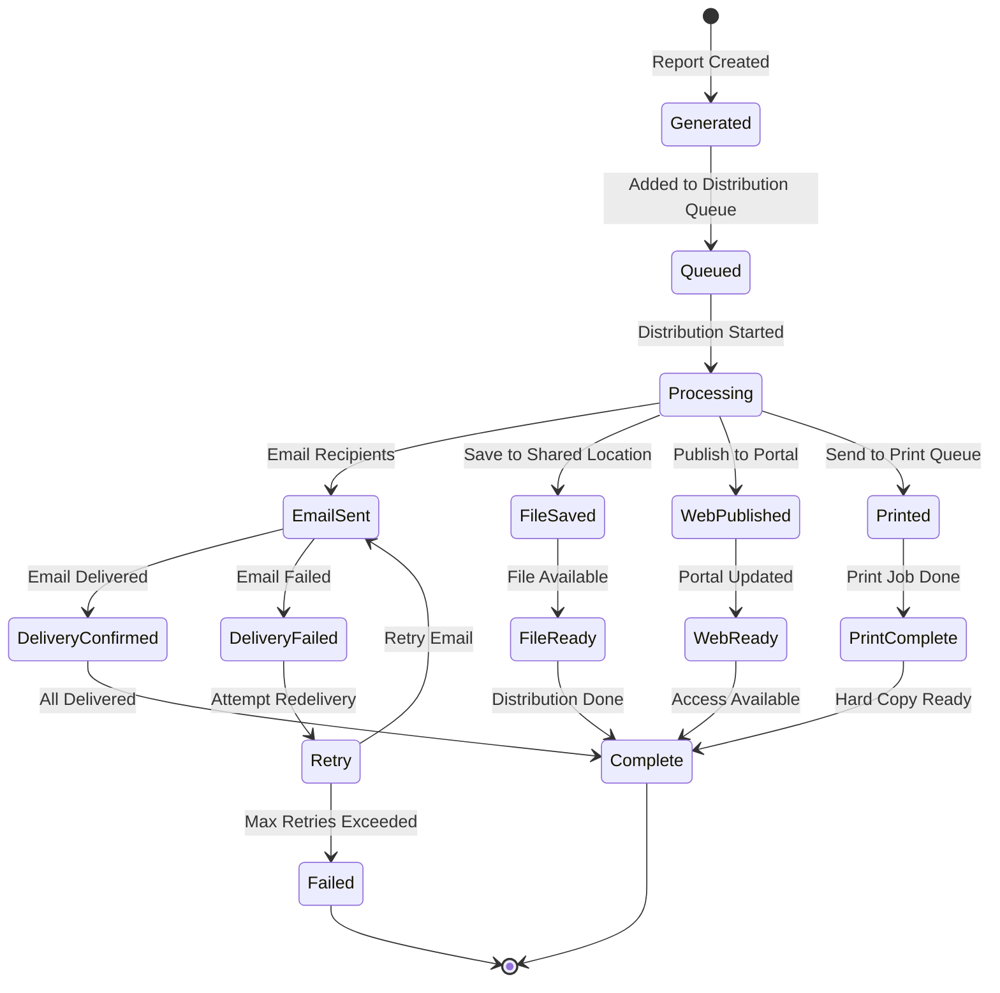
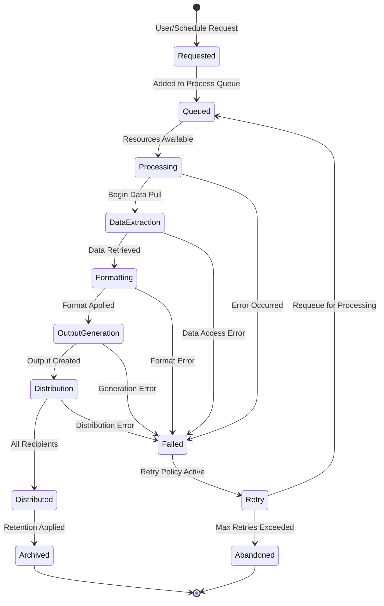
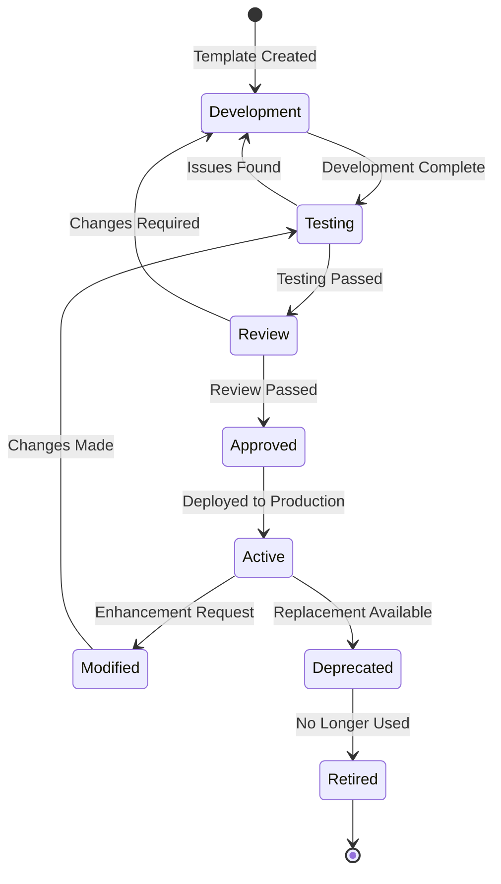

# RPT_ENGINE Subsystem - Business Flow Documentation

## Overview

This document details the key business processes and flows within the RPT_ENGINE subsystem, showing how reports are requested, generated, distributed, and managed throughout the system lifecycle.

## Process Flow Diagrams

### 1. On-Demand Report Generation Flow



### 2. Scheduled Report Processing Flow



### 3. Financial Report Month-End Flow

```mermaid
flowchart LR
    subgraph "Data Preparation"
        A[GL Month-End Complete] --> B[Validate Data Integrity]
        B --> C[Check Trial Balance]
        C --> D[Verify Period Closure]
    end
    
    subgraph "Report Generation"
        E[Generate Trial Balance] --> F[Create P&L Statement]
        F --> G[Generate Balance Sheet]
        G --> H[Produce Cash Flow]
        H --> I[Create Variance Reports]
    end
    
    subgraph "Review & Distribution"
        J[Management Review] --> K[CFO Approval]
        K --> L[Board Package Creation]
        L --> M[External Distribution]
    end
    
    D --> E
    I --> J
    M --> N[Archive Final Reports]
```



### 4. Report Distribution Workflow



## Detailed Process Descriptions

### Report Request Processing

#### Process Steps:

1. **User Authentication**
   ```
   Validate user credentials
   Check report access permissions
   Verify data filtering requirements
   Apply role-based restrictions
   ```

2. **Parameter Validation**
   ```
   Validate required parameters provided
   Check parameter data types and ranges
   Apply business rule validation
   Verify date ranges and periods
   ```

3. **Resource Allocation**
   ```
   Check system capacity
   Estimate resource requirements
   Queue if resources unavailable
   Priority-based scheduling
   ```

4. **Report Generation**
   ```
   Extract data from source systems
   Apply filters and calculations
   Format according to template
   Generate final output file
   ```

### Scheduled Report Processing

#### Process Steps:

1. **Schedule Evaluation**
   ```
   Check schedule definitions
   Validate timing and frequency
   Consider holiday calendars
   Apply business day rules
   ```

2. **Dependency Checking**
   ```
   Verify prerequisite jobs complete
   Check data availability
   Confirm source system status
   Validate period closure
   ```

3. **Batch Execution**
   ```
   Load report parameters
   Execute data extraction
   Process business calculations
   Generate formatted output
   ```

4. **Quality Assurance**
   ```
   Validate output completeness
   Check control totals
   Verify formatting consistency
   Apply data quality rules
   ```

### Financial Reporting Workflow

#### Month-End Process:

1. **Pre-Generation Validation**
   ```
   Confirm all subsidiary ledgers closed
   Verify trial balance balances
   Check for pending adjustments
   Validate period-end cutoff
   ```

2. **Core Financial Statements**
   ```
   Generate Trial Balance
   Create Profit & Loss Statement
   Produce Balance Sheet
   Generate Cash Flow Statement
   Create Notes to Financial Statements
   ```

3. **Supporting Schedules**
   ```
   Account detail schedules
   Variance analysis reports
   Budget vs actual comparisons
   Cost center performance
   ```

4. **Review and Approval**
   ```
   Management review process
   Controller sign-off
   CFO approval
   Board presentation preparation
   ```

### Report Distribution Processing

#### Distribution Methods:

1. **Email Distribution**
   ```
   Format email with report attachment
   Apply security and encryption
   Send to recipient list
   Track delivery confirmation
   Handle bounces and failures
   ```

2. **Web Portal Publishing**
   ```
   Upload to secure portal
   Apply access controls
   Update portal index
   Send notification alerts
   Log access attempts
   ```

3. **File System Storage**
   ```
   Save to designated folders
   Apply file naming conventions
   Set access permissions
   Create archive copies
   Update file catalogs
   ```

4. **Print Queue Processing**
   ```
   Format for printer specifications
   Submit to print spooler
   Track print job status
   Handle printer errors
   Confirm completion
   ```

## State Transition Diagrams

### Report Instance Lifecycle



### Report Template Lifecycle



## Business Rules in Flows

### Report Generation Rules

1. **Data Security**
   - Users can only access data they're authorized to view
   - Sensitive data automatically masked based on user role
   - Cross-company data requires special authorization
   - Financial data restricted during closing periods

2. **Performance Management**
   - Large reports automatically queued for off-peak processing
   - Resource-intensive reports limited during business hours
   - Concurrent report limit enforced per user
   - System capacity monitoring with automatic throttling

3. **Quality Control**
   - All financial reports must balance to source systems
   - Control totals validated before distribution
   - Missing data flagged with clear indicators
   - Variance thresholds trigger automatic validation

### Distribution Rules

1. **Security Requirements**
   - Confidential reports require encrypted distribution
   - External recipients limited to approved email domains
   - File downloads logged with user identification
   - Print jobs tracked for audit compliance

2. **Timing Constraints**
   - Critical reports have priority in distribution queue
   - Regulatory reports meet filing deadlines
   - Board reports distributed 24 hours before meetings
   - Management reports available by 9 AM following period

3. **Retention Policies**
   - Financial reports retained for 7 years
   - Operational reports archived after 2 years
   - Personal copies automatically deleted after 90 days
   - Audit trail maintained for all access

## Integration Points in Flows

### Source System Integration

```
Data Request → Security Validation → Query Execution → Result Formatting
│
├── Real-time data for operational reports
├── Snapshot data for financial reports
├── Historical data for trend analysis
└── Reference data for lookups
```

### Distribution Integration

```
Report Complete → Format Selection → Distribution Method → Delivery Confirmation
│
├── Email server integration
├── File server access
├── Web portal publishing
└── Print system interfaces
```

### Audit Integration

```
Report Access → Log Entry → Audit Trail → Compliance Reporting
│
├── User authentication logging
├── Parameter tracking
├── Distribution confirmation
└── Access pattern analysis
```

## Exception Handling

### Common Exceptions

1. **Data Access Issues**
   - Source system unavailable
   - Database connection failures
   - Data corruption detected
   - Missing required data

2. **Processing Errors**
   - Memory exhaustion for large reports
   - Template formatting failures
   - Calculation errors
   - Output generation failures

3. **Distribution Problems**
   - Email delivery failures
   - File system access errors
   - Network connectivity issues
   - Printer unavailability

### Resolution Procedures

1. **Automatic Recovery**
   ```
   Error Detection → Error Classification → Recovery Strategy → Retry Logic
   │
   ├── Transient errors: Automatic retry with backoff
   ├── Resource errors: Queue for later processing
   ├── Data errors: Flag for manual review
   └── System errors: Alert operations team
   ```

2. **Manual Intervention**
   ```
   Alert Generation → Investigation → Root Cause → Corrective Action
   │
   ├── Data quality issues require source correction
   ├── Template errors need development fix
   ├── System issues require infrastructure support
   └── User errors need training or procedure update
   ```

## Performance Optimization

### Caching Strategies

1. **Data Caching**
   - Reference data cached for multiple reports
   - Recent calculation results stored temporarily
   - Template definitions cached in memory
   - User permissions cached per session

2. **Output Caching**
   - Identical reports reused within time window
   - Parameterized reports cached by parameter set
   - Formatted output stored for quick retrieval
   - Distribution lists cached for efficiency

### Resource Management

1. **Memory Optimization**
   - Streaming processing for large datasets
   - Garbage collection tuning
   - Memory pool management
   - Resource cleanup procedures

2. **Processing Optimization**
   - Parallel processing for independent sections
   - Database query optimization
   - Efficient sorting and filtering
   - Template compilation caching

## Monitoring and Alerting

### Key Performance Indicators

1. **Generation Performance**
   - Average report generation time
   - Success rate percentage
   - Queue processing time
   - Resource utilization rates

2. **Distribution Effectiveness**
   - Delivery success rates
   - Average distribution time
   - User access patterns
   - Error resolution time

3. **User Satisfaction**
   - Report request frequency
   - Time to completion
   - Error rates by report type
   - User feedback scores

### Alert Conditions

1. **Performance Alerts**
   - Generation time exceeds threshold
   - Queue backlog builds up
   - Resource utilization high
   - Error rate above normal

2. **Business Alerts**
   - Critical reports delayed
   - Regulatory deadlines at risk
   - Distribution failures
   - Data integrity issues

3. **System Alerts**
   - Service unavailability
   - Storage capacity issues
   - Network connectivity problems
   - Security breach attempts