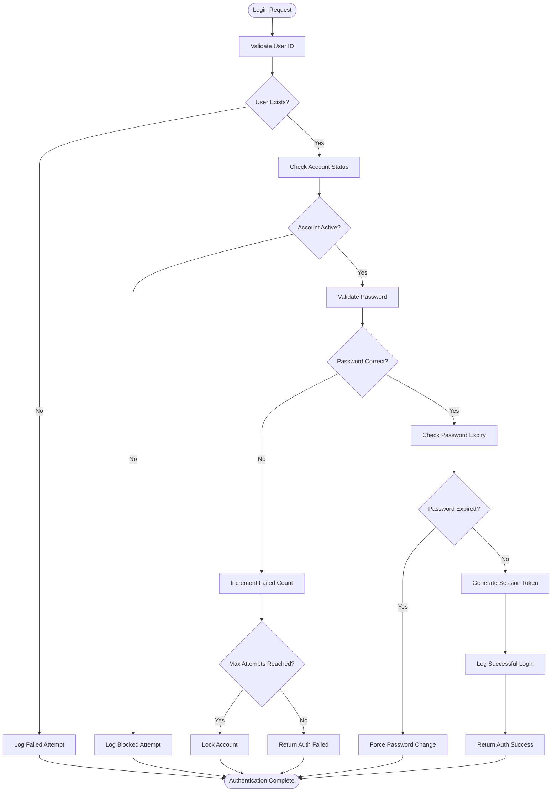
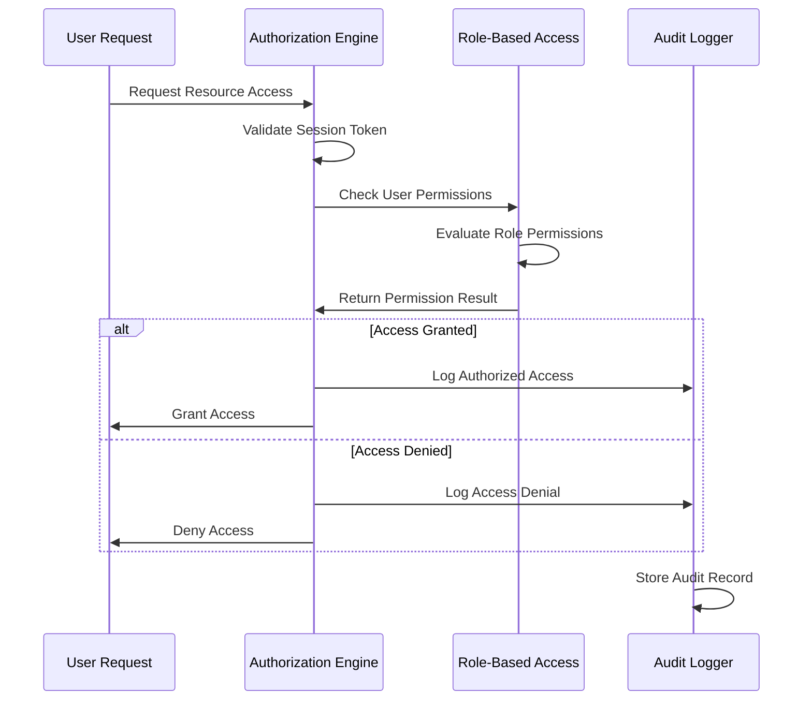
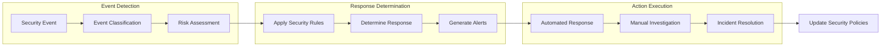

# SEC_AUDIT Subsystem - Business Flow Documentation

## Overview

This document details the security and audit flows within the SEC_AUDIT subsystem, showing how user authentication, authorization, and audit logging are managed throughout the ACAS system.

## Process Flow Diagrams

### 1. User Authentication Flow

### 2. Authorization Check Flow

### 3. Security Monitoring Flow

## Business Rules in Flows

### Authentication Rules
- **RULE_AUTH_001**: Maximum 3 failed login attempts before account lockout
- **RULE_AUTH_002**: Passwords must be changed every 90 days
- **RULE_AUTH_003**: Session timeout after 30 minutes of inactivity
- **RULE_AUTH_004**: Concurrent sessions limited to 2 per user

### Authorization Rules
- **RULE_AUTHZ_001**: Users can only access resources assigned to their role
- **RULE_AUTHZ_002**: Financial transactions require dual authorization above thresholds
- **RULE_AUTHZ_003**: Administrative functions require elevated privileges
- **RULE_AUTHZ_004**: Time-based access restrictions enforced for sensitive operations

### Audit Rules
- **RULE_AUDIT_001**: All data modifications must be logged with before/after values
- **RULE_AUDIT_002**: Failed access attempts logged with full context
- **RULE_AUDIT_003**: Audit records are tamper-proof and digitally signed
- **RULE_AUDIT_004**: Audit retention follows regulatory requirements (7 years minimum)

### Security Monitoring Rules
- **RULE_MON_001**: Unusual access patterns trigger security alerts
- **RULE_MON_002**: Multiple failed logins from same IP trigger blocking
- **RULE_MON_003**: After-hours access to sensitive data requires justification
- **RULE_MON_004**: Privileged account usage monitored continuously