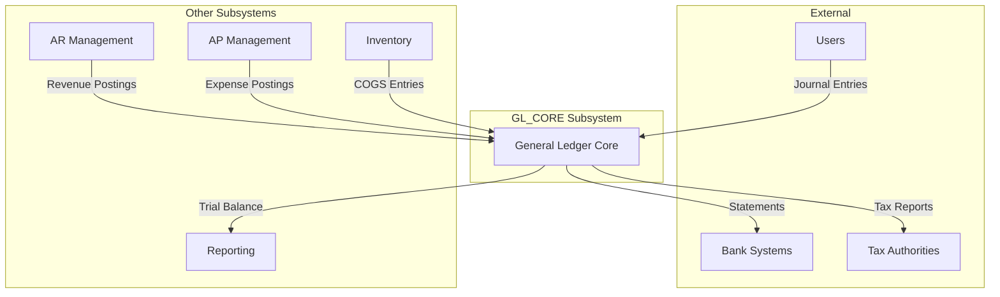
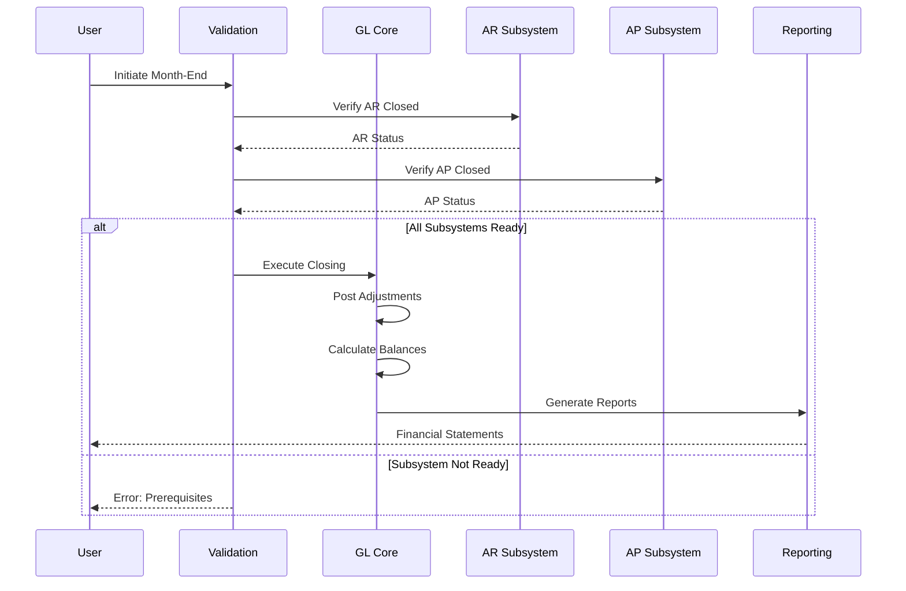
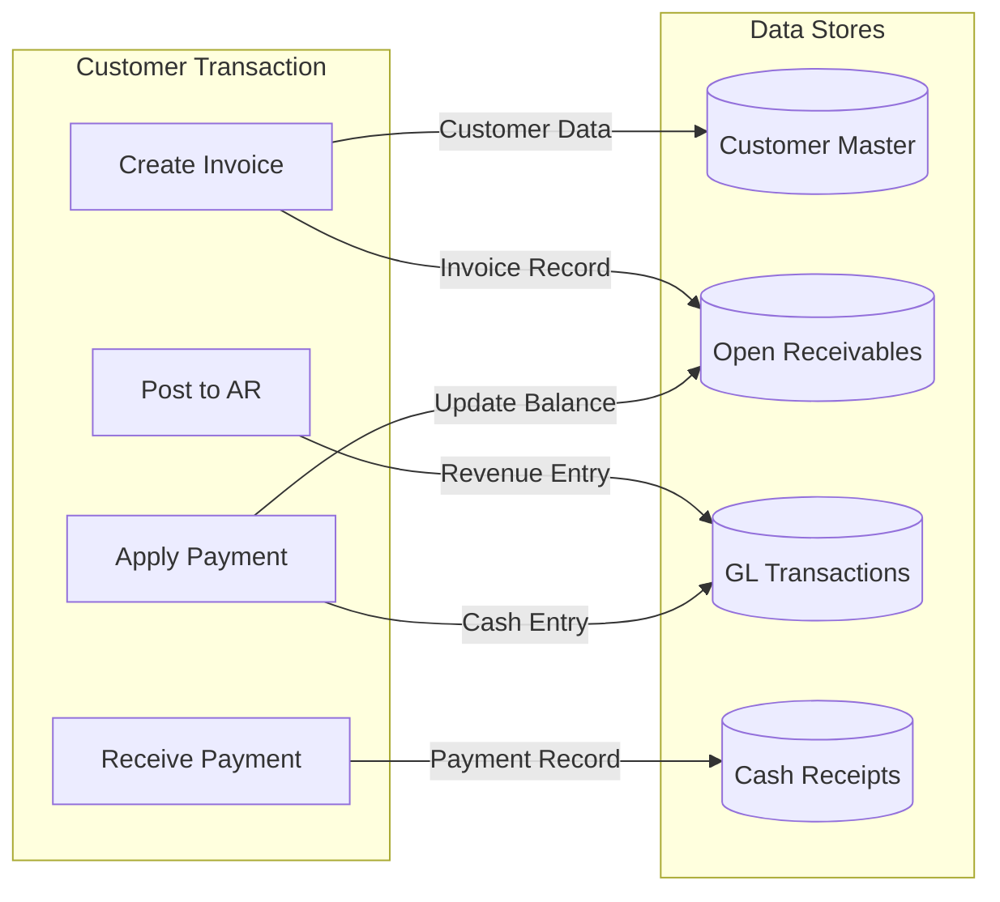
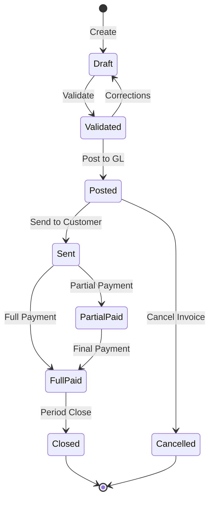

# Subsystem Identification and Deep Functional Analysis

## Context
You have access to both the original COBOL source code and the comprehensive functional documentation generated in the previous phases. Your task is to identify, isolate, and deeply analyze each subsystem within the ACAS accounting application, focusing on functional behavior and business logic rather than code-level implementation.

## Primary Objectives
1. Identify and delineate clear subsystem boundaries based on functional cohesion
2. Document each subsystem's business purpose, capabilities, and constraints
3. Create detailed flow diagrams showing subsystem interactions and data movement
4. Establish a subsystem architecture that could guide future modularization efforts

Outputs (in `documentation/subsystems/`):

Master Documentation:
- `documentation/subsystems/analysis/master_subsystems_architecture.md`
- `documentation/subsystems/analysis/subsystems_inventory.md`
- `documentation/subsystems/analysis/integration_architecture.md`
- `documentation/subsystems/analysis/data_ownership_map.md`
- `documentation/subsystems/analysis/process_allocation.md`
- `documentation/subsystems/analysis/dependency_analysis.md`

Subsystem Folders:
- `documentation/subsystems/identified_subsystems/GL_CORE/`
  - `specifications.md`
  - `interfaces.md`
  - `flows.md`
  - `diagrams.md`
- `documentation/subsystems/identified_subsystems/AR_MGMT/`
- `documentation/subsystems/identified_subsystems/AP_MGMT/`
- `documentation/subsystems/identified_subsystems/INV_CTRL/`
- `documentation/subsystems/identified_subsystems/IRS_PROC/`
- `documentation/subsystems/identified_subsystems/MDM/`
- `documentation/subsystems/identified_subsystems/RPT_ENGINE/`
- `documentation/subsystems/identified_subsystems/BATCH_FW/`
- `documentation/subsystems/identified_subsystems/INTEGRATION/`
- `documentation/subsystems/identified_subsystems/SEC_AUDIT/`
- `documentation/subsystems/identified_subsystems/DATE_UTIL/`
- `documentation/subsystems/identified_subsystems/CURR_UTIL/`
- `documentation/subsystems/identified_subsystems/FILE_SVC/`
- `documentation/subsystems/identified_subsystems/ERROR_FW/`
- [Other identified subsystems]

Analysis Artifacts:
- `documentation/subsystems/diagrams/`
  - `documentation/subsystems/diagrams/system_context.md`
  - `documentation/subsystems/diagrams/subsystem_interactions.md`
  - `documentation/subsystems/diagrams/data_flow_complete.md`
  - `documentation/subsystems/diagrams/state_transitions.md`
  - [per-subsystem diagrams]
- `documentation/subsystems/analysis/`
  - `documentation/subsystems/analysis/coupling_analysis.md`
  - `documentation/subsystems/analysis/cohesion_metrics.md`
  - `documentation/subsystems/analysis/modernization_impact.md`
  - `documentation/subsystems/analysis/risk_assessment.md`

## Phase 1: Subsystem Discovery and Boundaries

### 1.1 Review Existing Documentation
Start by analyzing the documentation in `documentation/functional/analysis/`:
- **functional_overview.md** – Overview of system purpose, business functions (GL, AR, AP, Stock, IRS), user roles, workflows, technology stack, user base, and functional coverage.
- **program_catalog.md** – Alphabetical listing of all programs with business module mapping, dependencies, and maintenance priority.
- **data_dictionary.md** – Documentation of all files and tables including fields, code meanings, and validation rules.
- **business_flow.md** – End-to-end process documentation with decision trees, accounting period processing, and year-end procedures.
- **system_architecture.md** - Program call graphs, Module structure, integration patterns
- **cobol_patterns.md** – Common COBOL coding patterns, naming conventions, program structures, and best practices.
- **migration_roadmap.md** – Modernization opportunities, risk assessment, phased approach, and technology alternatives.
- **calculation_engine.md** – Financial calculation documentation covering formulas, rounding, currency, taxes, discounts, interest, and depreciation.

Identify natural boundaries based on:
- Business domain separation
- Data ownership and access patterns
- Transaction boundaries
- User interaction patterns
- Temporal coupling (batch vs real-time)

### 1.2 Subsystem Identification Criteria
```
Define subsystems using these principles:

FUNCTIONAL COHESION:
- Groups of programs that work together for a single business purpose
- Shared data structures and files
- Common business rules and validations
- Unified error handling and recovery

LOOSE COUPLING:
- Minimal dependencies on other subsystems
- Clear interface contracts
- Asynchronous or batch-based interactions where possible
- Independent deployment potential

BUSINESS ALIGNMENT:
- Maps to organizational structure
- Reflects accounting domain boundaries
- Supports specific user roles
- Enables independent business process evolution
```

### 1.3 Expected Subsystem Candidates
```
Based on ACAS structure, identify these potential subsystems:

CORE SUBSYSTEMS:
1. General Ledger Core (GL_CORE)
2. Accounts Receivable Management (AR_MGMT)
3. Accounts Payable Management (AP_MGMT)
4. Inventory Control System (INV_CTRL)
5. Incomplete Records Processing (IRS_PROC)

SUPPORTING SUBSYSTEMS:
6. Master Data Management (MDM)
7. Report Generation Engine (RPT_ENGINE)
8. Batch Processing Framework (BATCH_FW)
9. Integration & Interfaces (INTEGRATION)
10. Security & Audit (SEC_AUDIT)

UTILITY SUBSYSTEMS:
11. Date & Calendar Management (DATE_UTIL)
12. Currency & Number Processing (CURR_UTIL)
13. File Management Services (FILE_SVC)
14. Error Handling Framework (ERROR_FW)
```

## Phase 2: Deep Functional Analysis per Subsystem

### 2.1 Subsystem Documentation Template
```markdown
# Subsystem: [SUBSYSTEM_NAME]

## Executive Summary
- **Purpose**: [Single paragraph describing why this subsystem exists]
- **Business Value**: [What business problem it solves]
- **Key Users**: [Primary user roles/departments]
- **Criticality**: [HIGH|MEDIUM|LOW with justification]

## Functional Capabilities
### Core Functions
1. [Function Name]
   - Description: [What it does]
   - Business Rules: [Key rules applied]
   - Triggers: [What initiates this function]
   - Outcomes: [Expected results]

### Business Processes Supported
- [Process 1]: [Description and business context]
- [Process 2]: [Description and business context]

## Data Domain
### Owned Entities
- [Entity Name]: [Business description]
  - Key Attributes: [List]
  - Business Identifiers: [Natural keys]
  - Lifecycle: [Creation to archival]

### Referenced Entities
- [Entity Name]: [Why needed, read-only or updates]

## Interface Contracts
### Inbound Interfaces
| Interface ID | Source | Data Type | Frequency | Business Purpose |
|-------------|--------|-----------|-----------|-----------------|

### Outbound Interfaces
| Interface ID | Target | Data Type | Frequency | Business Purpose |
|-------------|--------|-----------|-----------|-----------------|

### Internal APIs/Services
- [Service Name]: [Parameters] → [Returns]
  - Purpose: [Business function exposed]
  - Validation: [Rules applied]
  - Error Handling: [Failure scenarios]

## Business Rules Engine
### Validation Rules
- [Rule ID]: [Condition] → [Action/Rejection]

### Calculation Rules
- [Calc ID]: [Formula/Algorithm in business terms]

### Workflow Rules
- [Flow ID]: [State transitions and approvals]

## Operational Characteristics
### Processing Patterns
- **Batch Processing**: [Jobs, schedules, dependencies]
- **Real-time Processing**: [Interactive functions]
- **Peak Periods**: [When highest load occurs]

### Data Volumes
- Transaction Volume: [Daily/Monthly/Yearly]
- Data Growth Rate: [Expected expansion]
- Retention Requirements: [Legal/Business needs]

## Dependencies
### Upstream Dependencies
- [Subsystem]: [What data/service needed]

### Downstream Dependencies
- [Subsystem]: [What data/service provided]

### External Dependencies
- [System/Service]: [Integration requirements]

## Quality Attributes
### Performance Requirements
- Response Time: [Expected SLAs]
- Throughput: [Transactions per period]
- Batch Windows: [Time constraints]

### Reliability Requirements
- Availability: [Uptime expectations]
- Recovery Time: [RTO]
- Recovery Point: [RPO]

### Compliance Requirements
- [Regulation/Standard]: [How addressed]

## Evolution Potential
### Enhancement Opportunities
- [Opportunity]: [Business benefit]

### Modernization Candidates
- [Component]: [Why and how to modernize]

### Known Limitations
- [Limitation]: [Impact and workarounds]
```

## Phase 3: Subsystem Interaction Diagrams

### 3.1 Context Diagram per Subsystem


### 3.2 Functional Flow Diagrams


### 3.3 Data Flow Diagrams


### 3.4 State Transition Diagrams


## Phase 4: Integration Layer Documentation

### 4.1 Subsystem Communication Matrix
```
Create a matrix showing:
| From Subsystem | To Subsystem | Integration Type | Data Exchanged | Frequency | Protocol |
|----------------|--------------|------------------|----------------|-----------|-----------|
| AR_MGMT | GL_CORE | Batch File | Revenue Postings | Daily | File Transfer |
| AP_MGMT | GL_CORE | Direct Call | Expense Entries | Real-time | Program CALL |
```

### 4.2 Event Catalog
```
Document business events that trigger cross-subsystem interactions:

Event: INVOICE_POSTED
- Source: AR_MGMT
- Subscribers: GL_CORE, INV_CTRL, RPT_ENGINE
- Payload: Invoice header, line items, tax details
- Processing: Asynchronous batch
- Error Handling: Retry with rollback

Event: PAYMENT_RECEIVED
- Source: AR_MGMT
- Subscribers: GL_CORE, CASH_MGMT
- Payload: Payment details, applied invoices
- Processing: Near real-time
- Error Handling: Queue for manual resolution
```

## Phase 5: Subsystem Governance Model

### 5.1 Ownership and Responsibility
```
For each subsystem, define:

OWNERSHIP:
- Business Owner: [Department/Role]
- Technical Owner: [Team/Role]
- Data Steward: [Role responsible for data quality]

RESPONSIBILITIES:
- Functional Enhancement Approval
- Technical Maintenance
- Data Quality Assurance
- Interface Contract Management
- Performance Monitoring
```

### 5.2 Change Impact Analysis
```
Document how changes propagate:

CHANGE SCENARIOS:
1. New Field Addition
   - Impact on interfaces
   - Data migration requirements
   - Downstream subsystem changes
   
2. Business Rule Modification
   - Affected subsystems
   - Testing requirements
   - Rollback procedures
   
3. Performance Optimization
   - Subsystem isolation potential
   - Caching opportunities
   - Batch schedule adjustments
```

## Phase 6: Comprehensive Subsystem Report

### 6.1 Generate Master Subsystem Document
```markdown
# ACAS Subsystem Architecture

## 1. Executive Overview
- Total number of subsystems identified
- Critical path subsystems
- Integration complexity assessment
- Modernization readiness score

## 2. Subsystem Inventory
[Table with all subsystems, their purpose, and criticality]

## 3. Dependency Graph
[Visual showing all subsystem relationships]

## 4. Data Ownership Map
[Which subsystem owns which business entities]

## 5. Process Allocation
[Which business processes run in which subsystems]

## 6. Integration Architecture
[How subsystems communicate]

## 7. Evolution Roadmap
[Recommended sequence for modernization]

## Appendices
A. Detailed Subsystem Specifications
B. Interface Definitions
C. Data Flow Diagrams
D. Business Process Maps
E. Risk Assessment
```

### 6.2 Individual Subsystem Documents
```
Generate separate detailed document for each subsystem:

SUBSYSTEM_[NAME]_SPECIFICATION.md
- Complete functional specification
- All diagrams specific to this subsystem
- Interface contracts
- Test scenarios
- Migration considerations
```

## Phase 7: Validation and Quality Checks

### 7.1 Completeness Verification
```
Ensure every subsystem document includes:
- All programs from original system are allocated
- All data entities are owned by exactly one subsystem
- All business processes are fully contained or clearly split
- All interfaces are bidirectionally documented
- All critical paths are identified
- All compliance requirements are addressed
```

### 7.2 Consistency Checks
```
Verify across all subsystems:
- No duplicate functionality
- No orphaned dependencies
- Interface contracts match on both sides
- Data ownership is unambiguous
- Event flows are complete
- Error handling is comprehensive
```

## Key Principles

1. **Think in Business Terms**: Describe what the subsystem does for the business, not how the code works
2. **Focus on Boundaries**: Clearly define what's inside vs outside each subsystem
3. **Document Contracts**: Every interaction between subsystems must have a clear contract
4. **Consider Evolution**: Design subsystem boundaries that enable independent evolution
5. **Validate Completeness**: Ensure no functionality is orphaned or duplicated

## Interactive Process

Before starting the analysis:
1. Review all documents in `documentation/functional/`
2. Identify any domain-specific business rules or industry requirements
3. Understand the current pain points and modernization goals
4. Determine if there are any regulatory or compliance boundaries

Then proceed with:
- **Iteration 1**: Identify candidate subsystems based on functional cohesion
- **Iteration 2**: Validate boundaries through data ownership analysis
- **Iteration 3**: Document interfaces and integration points
- **Iteration 4**: Create comprehensive flow diagrams
- **Iteration 5**: Perform consistency checks and generate final documentation

Remember: The goal is to create a subsystem architecture that could guide future modularization, whether for microservices migration, component replacement, or system modernization. Each subsystem should be documented thoroughly enough that a team could potentially extract and reimplement it independently.

## Quality Checklist:
- [ ] Every program assigned to exactly one subsystem
- [ ] All data entities have clear ownership
- [ ] No circular dependencies between subsystems
- [ ] All interfaces documented bidirectionally
- [ ] Each subsystem can theoretically run independently
- [ ] Integration points minimized and well-defined
- [ ] Governance model complete for all subsystems